# KLASIFIKASI RUMAH TANGGA BERDASARKAN POLA KONSUMSI LISTRIK DAN KARAKTERISTIK SOSIAL EKONOMI DI DKI JAKARTA

> **Catatan repo (bukan isi naskah).** Dokumen ini adalah naskah kerja versi Markdown dari Karya Ilmiah Tugas Akhir Rafli Hibriansyah Siregar, Politeknik Statistika STIS. Naskah resmi tetap dokumen `.docx`. Istilah mengikuti `Kamus_Istilah_Polstat_STIS.md` (Project TA). Gambar dan tabel dinomori berurutan lintas bab (Gambar 1, 2, …; Tabel 1, 2, …). Gambar 1–16 dan logo STIS tersimpan di folder `gambar/` (per bab).

---

## Halaman Pertama Draf Sidang

> **Catatan repo (bukan isi naskah).** Halaman ini hanya untuk draf yang diunggah ke SIPADU dan diserahkan kepada pembimbing serta penguji sebelum sidang (Pedoman D-III, Lampiran 20). Halaman ini **tidak** dimasukkan ke buku final pascasidang. Susunan penguji: Pedoman memakai format Pembimbing/Moderator + Penguji I + Penguji II (bobot nilai 40/30/30), sedangkan SIPADU mencantumkan Bu Fitri sebagai Penguji 1. Di sini Pak Yaya ditulis sebagai Penguji I dan Pak Azka sebagai Penguji II; cocokkan dengan pengumuman jadwal sidang.

DRAFT UJIAN/SIDANG TUGAS AKHIR

POLITEKNIK STATISTIKA STIS

TAHUN AKADEMIK 2025/2026

| | | |
|---|---|---|
| NAMA | : | RAFLI HIBRIANSYAH SIREGAR |
| NIM | : | 112313326 |
| TINGKAT | : | III |
| PEMBIMBING | : | Dr. Fitri Kartiasih, S.S.T., S.E., M.Si. |
| MODERATOR | : | Dr. Fitri Kartiasih, S.S.T., S.E., M.Si. |
| PENGUJI I | : | Yaya Setiadi, S.S.T., M.M. |
| PENGUJI II | : | Dr. Azka Ubaidillah, SST., M.Si. |

JADWAL UJIAN/SIDANG

| | | |
|---|---|---|
| HARI | : | Rabu |
| TANGGAL | : | 14 Oktober 2026 |
| SESI | : | 3 |
| WAKTU | : | 11.00–12.00 WIB |
| RUANGAN | : | 321 |

---

## Halaman Sampul

> **Catatan repo (bukan isi naskah).** Format mengikuti Pedoman D-III Bab IV (Format Penulisan Bagian Awal): judul kapital TNR 14 pt, spasi 2; nama dan NIM kapital TNR 12 pt; nama prodi kapital TNR 12 pt **tanpa baris peminatan**; logo hitam-putih 5 cm × 5 cm; tiga baris terakhir kapital TNR 14 pt, spasi 1,5.

KLASIFIKASI RUMAH TANGGA BERDASARKAN POLA KONSUMSI LISTRIK DAN KARAKTERISTIK SOSIAL EKONOMI DI DKI JAKARTA

RAFLI HIBRIANSYAH SIREGAR

112313326

PROGRAM STUDI STATISTIKA PROGRAM DIPLOMA III

Deskripsi logo (catatan konversi, bukan isi naskah)

Lambang berbentuk lingkaran, hitam-putih (versi sampul dari Rafli, Sesi AX). Cincin luar bertuliskan "POLITEKNIK STATISTIKA" di atas dan "STIS" di bawah, dengan emblem pilar dan ornamen simetris di tengah. Dipakai pada halaman sampul dan halaman judul sebagai identitas institusi.

POLITEKNIK STATISTIKA STIS

JAKARTA

2026

---

## Halaman Judul

> **Catatan repo (bukan isi naskah).** Sebutan halaman ini **TUGAS AKHIR** (Pedoman D-III Bab IV, Halaman Judul butir 2), bukan "SKRIPSI" (templat D-IV) dan bukan "KARYA ILMIAH TUGAS AKHIR" (naskah kerja sebelumnya). Halaman judul tidak memuat baris program studi.

KLASIFIKASI RUMAH TANGGA BERDASARKAN POLA KONSUMSI LISTRIK DAN KARAKTERISTIK SOSIAL EKONOMI DI DKI JAKARTA

TUGAS AKHIR

Diajukan sebagai Salah Satu Syarat untuk Memperoleh Sebutan

Ahli Madya Statistika pada Politeknik Statistika STIS

Oleh:

RAFLI HIBRIANSYAH SIREGAR

112313326

POLITEKNIK STATISTIKA STIS

JAKARTA

2026

---

## Halaman Pernyataan

> **Catatan repo (bukan isi naskah).** Tanggal = tanggal ujian; ditandatangani di atas meterai Rp10.000 (Pedoman D-III, Halaman Pernyataan; komentar sekretaris mahasiswa pada templat).

PERNYATAAN

Tugas Akhir dengan Judul

KLASIFIKASI RUMAH TANGGA BERDASARKAN POLA KONSUMSI LISTRIK DAN KARAKTERISTIK SOSIAL EKONOMI DI DKI JAKARTA

Oleh:

RAFLI HIBRIANSYAH SIREGAR

112313326

adalah benar-benar hasil penelitian sendiri dan bukan hasil plagiat atau hasil karya orang lain. Jika di kemudian hari diketahui ternyata tugas akhir ini hasil plagiat atau hasil karya orang lain, penulis bersedia tugas akhir ini dinyatakan tidak sah dan sebutan Ahli Madya Statistika dicabut atau dibatalkan.

Jakarta, 14 Oktober 2026

*(meterai Rp10.000 dan tanda tangan)*

Rafli Hibriansyah Siregar

---

## Halaman Pengesahan

> **Catatan repo (bukan isi naskah).** Tanda tangan pembimbing dan penguji memakai tinta hitam (Pedoman D-III, Halaman Pengesahan). Nama dan NIP Pak Azka diambil dari templat Prodi (tercetak sebagai Ketua Prodi D-IV). Nama Ketua Prodi D-III serta NIP Pak Yaya, Bu Fitri, dan Ketua Prodi D-III disalin dari `.docx` (7 Oktober 2026).

KLASIFIKASI RUMAH TANGGA BERDASARKAN POLA KONSUMSI LISTRIK DAN KARAKTERISTIK SOSIAL EKONOMI DI DKI JAKARTA

Oleh:

RAFLI HIBRIANSYAH SIREGAR

112313326

Tim Penguji

| Penguji I | Penguji II |
|---|---|
| *(tanda tangan)* | *(tanda tangan)* |
| Yaya Setiadi, S.S.T., M.M. | Dr. Azka Ubaidillah, SST., M.Si. |
| NIP 197305281995121001 | NIP 198202072004121001 |

Mengetahui/Menyetujui

| Ketua Program Studi Statistika Program Diploma III | Pembimbing |
|---|---|
| *(tanda tangan)* | *(tanda tangan)* |
| Dr. Rudi Salam, SST., M.Si. | Dr. Fitri Kartiasih, S.S.T., S.E., M.Si. |
| NIP 197810021999121001 | NIP 198004012003122003 |

---

## Pernyataan Hak Cipta

> **Catatan repo (bukan isi naskah).** Teks mengikuti Pedoman D-III Lampiran 19 ("karya tulis ini"), bukan templat D-IV ("karya tulis, hasil analisis, perancangan, basis data, program, dan artefak hasil skripsi ini"). Butir 2 di Pedoman versi Markdown terpotong setelah kata "seluruh"; lanjutannya dilengkapi mengikuti pola templat. Cocokkan dengan PDF Pedoman halaman 115.

© Hak Cipta milik Politeknik Statistika STIS, Tahun 2026

Hak Cipta dilindungi undang-undang

1. Dilarang mengutip sebagian atau seluruh karya tulis ini tanpa mencantumkan atau menyebutkan sumbernya.
   a. Pengutipan hanya untuk kepentingan pendidikan, penelitian, penulisan karya ilmiah, penyusunan laporan, penulisan kritik atau tinjauan suatu masalah.
   b. Pengutipan tidak merugikan kepentingan yang wajar Politeknik Statistika STIS.
2. Dilarang mengumpulkan dan memperbanyak sebagian atau seluruh karya tulis ini dalam bentuk apa pun tanpa seizin Politeknik Statistika STIS.

---

## PRAKATA

> **Catatan repo (bukan isi naskah).** Isi Prakata disalin dari `.docx` (7 Oktober 2026). Tiga hal sengaja dibuat berbeda dari `.docx`: gelar Pak Azka disamakan dengan Halaman Pengesahan (templat Prodi); nama prodi ditulis "Program Studi Statistika Program Diploma III"; "materiel" (baku) menggantikan "material". Butir 5 masih menulis "adik" saja; Rafli anak kedua dari tiga bersaudara, jadi cek apakah "kakak" perlu ditambahkan.

Syukur Alhamdulillah penulis panjatkan ke hadirat Allah Swt. karena berkat pertolongan-Nya tugas akhir yang berjudul "Klasifikasi Rumah Tangga Berdasarkan Pola Konsumsi Listrik dan Karakteristik Sosial Ekonomi di DKI Jakarta" dapat terselesaikan. Penulis juga mengucapkan terima kasih kepada:

1. Bapak Yunarso Anang Sulistiadi, Ph.D., selaku Direktur Politeknik Statistika STIS;
2. Bapak Dr. Rudi Salam, SST., M.Si., selaku Ketua Program Studi Statistika Program Diploma III Politeknik Statistika STIS;
3. Ibu Dr. Fitri Kartiasih, S.S.T., S.E., M.Si., selaku dosen pembimbing yang telah bersedia meluangkan waktu dan membimbing dengan penuh kesabaran;
4. Bapak Yaya Setiadi, S.S.T., M.M., dan Bapak Dr. Azka Ubaidillah, SST., M.Si., selaku dosen penguji atas koreksi dan saran yang disampaikan;
5. Bapak, ibu, dan adik serta keluarga besar penulis yang telah memberikan dukungan secara moril dan materiel; serta
6. semua pihak yang telah memberikan dukungan dalam penulisan tugas akhir ini.

Saran dan kritik sangat penulis harapkan demi perbaikan tugas akhir ini. Akhirnya, semoga tugas akhir ini bermanfaat bagi banyak pihak.

Jakarta, Oktober 2026

Rafli Hibriansyah Siregar

---

## ABSTRAK

RAFLI HIBRIANSYAH SIREGAR, "Klasifikasi Rumah Tangga Berdasarkan Pola Konsumsi Listrik dan Karakteristik Sosial Ekonomi di DKI Jakarta".

[ISIAN: jumlah halaman bagian awal, angka romawi kecil]+[ISIAN: jumlah halaman isi dan lampiran] halaman

> **Catatan repo (bukan isi naskah).** Baris jumlah halaman diisi dari `.docx` final dengan format seperti "vii+86 halaman" (Pedoman D-III, Lampiran 8). Isi abstrak maksimal 200 kata dengan spasi 1,5; draf ini 196 kata. Seluruh angka diambil dari 5.1 Kesimpulan.

Energi listrik yang terjual kepada rumah tangga di Provinsi DKI Jakarta cenderung meningkat selama 2018–2025, tetapi angka agregat tersebut belum menunjukkan kelompok rumah tangga yang berbeda pola konsumsinya, sementara kebijakan efisiensi energi masih dirumuskan secara berlaku umum. Penelitian ini bertujuan mendeskripsikan konsumsi listrik dan kondisi sosial ekonomi rumah tangga, mengelompokkan rumah tangga berdasarkan pola konsumsi listrik dan karakteristik sosial ekonomi, serta menganalisis perbedaan karakteristik antarklaster. Data yang digunakan adalah mikrodata Susenas Maret 2025 sebanyak 5.001 rumah tangga. Pengelompokan dilakukan dengan metode *K-Means* atas konsumsi listrik, pengeluaran nonmakanan selain listrik, dan lama sekolah kepala rumah tangga, sedangkan perbedaan antarklaster diuji dengan uji *chi-square* terkoreksi Rao–Scott dan uji Kruskal–Wallis berbasis desain survei. Hasil penelitian menunjukkan bahwa rata-rata tertimbang konsumsi listrik sebesar 369,61 kWh per bulan dengan sebaran yang menceng ke kanan. Rumah tangga terbagi menjadi dua klaster dengan struktur yang lemah (rata-rata koefisien *silhouette* 0,3640). Klaster 2, yang mewakili 39,89 persen rumah tangga, memiliki rata-rata konsumsi listrik sekitar 3,46 kali Klaster 1 serta kepemilikan AC, kepemilikan lemari es, dan luas lantai yang lebih tinggi secara signifikan, sedangkan ukuran rumah tangga tidak berbeda signifikan. Program efisiensi energi disarankan dibedakan menurut klaster, dengan sasaran efisiensi peralatan pendingin pada kelompok berkonsumsi tinggi.

Kata kunci: konsumsi listrik rumah tangga, analisis klaster, *K-Means*, Susenas, DKI Jakarta

---

## DAFTAR ISI

- PRAKATA
- ABSTRAK
- DAFTAR ISI
- DAFTAR TABEL
- DAFTAR GAMBAR
- DAFTAR LAMPIRAN
- BAB I PENDAHULUAN
  - 1.1 Latar Belakang
  - 1.2 Identifikasi Masalah
  - 1.3 Tujuan Penelitian
  - 1.4 Keterbatasan Penelitian
  - 1.5 Sistematika Penulisan
- BAB II KAJIAN PUSTAKA
  - 2.1 Landasan Teori
  - 2.2 Penelitian Terkait
  - 2.3 Kerangka Pikir
  - 2.4 Hipotesis Penelitian
- BAB III METODOLOGI
  - 3.1 Ruang Lingkup Penelitian
  - 3.2 Metode Pengumpulan Data
  - 3.3 Definisi Operasional
  - 3.4 Metode Analisis
- BAB IV HASIL DAN PEMBAHASAN
  - 4.1 Gambaran Umum Konsumsi Listrik dan Karakteristik Sosial Ekonomi Rumah Tangga
  - 4.2 Pembentukan Klaster Rumah Tangga
  - 4.3 Perbedaan Karakteristik Sosial Ekonomi Antarklaster
- BAB V KESIMPULAN DAN SARAN
  - 5.1 Kesimpulan
  - 5.2 Saran
- DAFTAR PUSTAKA
- LAMPIRAN
- RIWAYAT HIDUP

## DAFTAR TABEL

| No. | Judul tabel |
|---|---|
| Tabel 1 | Penelitian Terkait |
| Tabel 2 | Definisi Operasional Variabel Penelitian |
| Tabel 3 | Statistik Deskriptif Variabel Penelitian, DKI Jakarta, Maret 2025 (n = 5.001) |
| Tabel 4 | Nilai WCSS dan Rata-Rata Koefisien *Silhouette* menurut Jumlah Klaster, DKI Jakarta, Maret 2025 (n = 5.001) |
| Tabel 5 | Ukuran dan *Centroid* Klaster pada Skala *Z-score*, DKI Jakarta, Maret 2025 |
| Tabel 6 | Muatan Variabel Pembentuk Klaster pada Dua Komponen Utama |
| Tabel 7 | Profil Tertimbang Rumah Tangga menurut Klaster |
| Tabel 8 | Profil Variabel Penciri menurut Klaster |
| Tabel 9 | Uji Beda dan Ukuran Asosiasi Variabel Penciri Antarklaster |

## DAFTAR GAMBAR

| No. | Judul gambar |
|---|---|
| Gambar 1 | Rasio Elektrifikasi menurut Provinsi, 2024 |
| Gambar 2 | Rata-Rata Pengeluaran Listrik per Kapita Sebulan menurut Provinsi, 2025 |
| Gambar 3 | (a) Komposisi Pelanggan Listrik menurut Sektor di DKI Jakarta, 2025, dan (b) Distribusi Konsumsi Listrik (kWh) menurut Sektor di DKI Jakarta, 2025 |
| Gambar 4 | Energi Listrik Terjual kepada Pelanggan Rumah Tangga di Provinsi DKI Jakarta, 2018–2025 |
| Gambar 5 | Kerangka Pikir Penelitian |
| Gambar 6 | Diagram Alur Metode Analisis |
| Gambar 7 | Distribusi Konsumsi Listrik Rumah Tangga, DKI Jakarta, Maret 2025 |
| Gambar 8 | Pengeluaran Nonmakanan selain Listrik dan Konsumsi Listrik Rumah Tangga, DKI Jakarta, Maret 2025 |
| Gambar 9 | Kurva *Elbow* untuk Penentuan Jumlah Klaster, DKI Jakarta, Maret 2025 |
| Gambar 10 | Rata-Rata Koefisien *Silhouette* menurut Jumlah Klaster, DKI Jakarta, Maret 2025 |
| Gambar 11 | Visualisasi Klaster Rumah Tangga pada Dua Komponen Utama, DKI Jakarta, Maret 2025 |
| Gambar 12 | Rata-Rata Tertimbang Konsumsi Listrik Rumah Tangga menurut Klaster |
| Gambar 13 | Sebaran Konsumsi Listrik Rumah Tangga menurut Klaster |
| Gambar 14 | Pengeluaran Nonmakanan selain Listrik dan Konsumsi Listrik menurut Klaster |
| Gambar 15 | Komposisi Tertimbang Pendidikan Kepala Rumah Tangga menurut Klaster |
| Gambar 16 | Proporsi Kepemilikan AC menurut Klaster |

## DAFTAR LAMPIRAN

| No. | Judul lampiran |
|---|---|
| Lampiran 1 | Hasil Pembandingan Spesifikasi Variabel Pembentuk dan Transformasi |

---

# BAB I PENDAHULUAN

## 1.1 Latar Belakang

Visi Indonesia 2045 menempatkan pembangunan ekonomi berkelanjutan sebagai salah satu dari empat pilar pencapaian visi. Pada pilar tersebut, perekonomian ditopang antara lain oleh ketahanan pangan, energi, dan air yang kuat, disertai komitmen menjaga lingkungan hidup bagi keberlanjutan pembangunan (Kementerian PPN/Bappenas, 2019). Dokumen yang sama mencatat bahwa pemanasan global dan perubahan iklim mengganggu ekosistem serta dapat menurunkan pendapatan petani dan nelayan, sedangkan udara yang tercemar dapat menyebabkan gangguan kesehatan. Untuk menurunkan emisi, peningkatan efisiensi energi dimasukkan sebagai salah satu strategi pembangunan rendah karbon (Kementerian PPN/Bappenas, 2019). Arah tersebut dilanjutkan dalam Rencana Pembangunan Jangka Menengah Nasional (RPJMN) 2025–2029, yang memuat swasembada energi untuk memperkuat ketahanan dan kemandirian energi pada Prioritas Nasional 2 serta penyelarasan kehidupan yang harmonis dengan lingkungan alam pada Prioritas Nasional 8 (Kementerian PPN/Bappenas, 2025).

Dalam dimensi pembangunan berkelanjutan, energi diarahkan untuk dijadikan modal pembangunan, sementara cara penyediaannya, mulai dari eksplorasi, eksploitasi, hingga distribusi, menimbulkan dampak buruk terhadap lingkungan (Kementerian PPN/Bappenas, 2019, hlm. 84–85). Sektor ketenagalistrikan nasional sangat bergantung pada bahan bakar fosil, terutama batu bara, yang pada tahun 2015 membentuk 90 persen bauran pembangkitan nasional dan 91 persen bauran pembangkitan sistem Jawa–Bali (Handayani et al., 2017, hlm. 1021). Ketergantungan yang tinggi terhadap sumber energi fosil dalam mendukung aktivitas pembangunan berimplikasi langsung pada peningkatan emisi gas rumah kaca nasional yang mencapai 1.360,35 juta ton CO₂e pada tahun 2023 (Badan Pusat Statistik & Kementerian PPN/Bappenas, 2025). Laporan Inventarisasi GRK dan MPV Tahun 2024 mencatat target pengurangan emisi sebesar 31,89 persen dengan kemampuan sendiri sebagaimana ditetapkan dalam Enhanced NDC tahun 2022, serta menempatkan efisiensi energi sebagai salah satu dari lima kelompok aksi mitigasi sektor energi (Kementerian Lingkungan Hidup dan Kehutanan, 2024). Artinya, pengendalian konsumsi energi di sisi pengguna akhir merupakan bagian dari upaya mencapai target tersebut. Kualitas lingkungan hidup tidak cukup diperkuat dari sisi hulu produksi saja, tetapi juga melalui pengendalian konsumsi yang sistematis demi mendukung komitmen iklim nasional.

Listrik sebagai tulang punggung infrastruktur energi modern berperan dalam mendukung sasaran swasembada energi pada Prioritas Nasional 2 RPJMN 2025–2029, yang diarahkan untuk memperkuat ketahanan dan kemandirian energi dalam memenuhi kebutuhan energi nasional (Kementerian PPN/Bappenas, 2025). Pengelolaan sektor ini makin mendesak karena konsumsi listrik per kapita nasional terus meningkat hingga mencapai 1.411 kWh per kapita pada tahun 2024 (Badan Pusat Statistik & Kementerian PPN/Bappenas, 2025). Meskipun aksesibilitas energi sudah hampir menyeluruh dengan capaian rasio elektrifikasi nasional sebesar 99,83 persen pada tahun 2024 (Badan Pusat Statistik & Kementerian PPN/Bappenas, 2025), Rancangan Teknokratik RPJMN 2025–2029 masih mencatat akses energi yang belum merata dan berkualitas serta efisiensi pengusahaan dan pemanfaatan energi yang belum berjalan baik sebagai isu strategis sektor energi (Kementerian PPN/Bappenas, 2024, hlm. 69). Tantangan tersebut diperkuat oleh prediksi lonjakan permintaan energi di wilayah perkotaan yang meningkat tajam seiring dengan dinamika sosial ekonomi masyarakat (Takata et al., 2025). Potret sebaran akses energi tersebut disajikan pada Gambar 1.

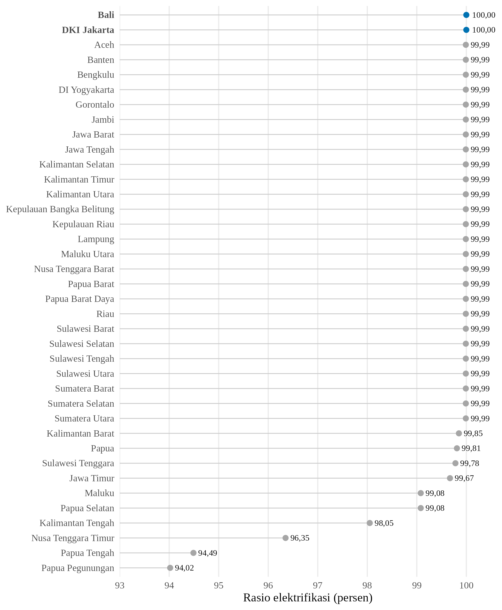

**Gambar 1 Rasio Elektrifikasi menurut Provinsi, 2024**

Sumber: Badan Pusat Statistik & Kementerian PPN/Bappenas (2025), dengan data Kementerian Energi dan Sumber Daya Mineral (Diolah)

Deskripsi Gambar 1 (catatan konversi, bukan isi naskah)

**Deskripsi Gambar 1 (Sesi AX).** Dibuat ulang dengan `Script R Gambar Bab I.R`, Bagian 3; angka seluruh provinsi tercatat di skrip tersebut beserta sumbernya. *Dot plot* mendatar 38 provinsi, diurutkan dari rasio tertinggi; sumbu-X "Rasio elektrifikasi (persen)" 93–100. Dua provinsi yang mencapai 100,00, yaitu Bali dan DKI Jakarta, diberi warna biru dan label tebal, sejalan dengan paragraf setelah gambar yang menyebut keduanya; provinsi lain abu-abu. Dua terendah: Papua Pegunungan 94,02 dan Papua Tengah 94,49.

**Koreksi.** Gambar lama menulis Papua Tengah 99,49; sumber (Gambar 7.1 publikasi Indikator TPB Indonesia 2025, data Kementerian ESDM) menulis 94,49.

Berdasarkan Gambar 1, Provinsi DKI Jakarta dan Provinsi Bali merupakan wilayah yang telah mencapai rasio elektrifikasi sebesar 100 persen, melampaui capaian nasional yang berada pada angka 99,83 persen (Badan Pusat Statistik & Kementerian PPN/Bappenas, 2025). Secara spasial, wilayah dengan karakteristik metropolitan berfungsi sebagai pusat pertumbuhan ekonomi yang didorong oleh variabel konsumsi dan investasi (Christono & Putri, 2021). Sebagai pusat perekonomian nasional, DKI Jakarta mencatatkan nilai Produk Domestik Regional Bruto (PDRB) atas dasar harga berlaku tertinggi di antara seluruh provinsi di Indonesia pada tahun 2025 (Badan Pusat Statistik, 2026, hlm. 41), yang berimplikasi pada tingginya permintaan energi listrik (Prastika, 2023). Persentase penduduk daerah perkotaan di Provinsi DKI Jakarta hasil proyeksi penduduk mencapai 100 persen, termasuk pada tahun 2025 (Badan Pusat Statistik, 2014). Kondisi wilayah yang sepenuhnya perkotaan tersebut juga memicu fenomena *Urban Heat Island* (UHI), yaitu peningkatan suhu udara di pusat kota yang mendorong kebutuhan energi listrik lebih besar sebagai strategi adaptasi termal masyarakat (Siswanto et al., 2023). Dampak ekonomi dari karakteristik metropolitan tersebut terlihat pada besarnya pengeluaran listrik rumah tangga yang disajikan pada Gambar 2.

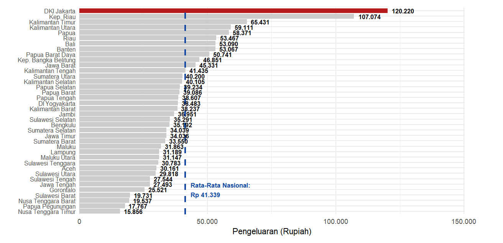

**Gambar 2 Rata-Rata Pengeluaran Listrik per Kapita Sebulan menurut Provinsi, 2025**

Sumber: Badan Pusat Statistik (2025a), Tabel 8.5 (Diolah)

Deskripsi Gambar 2 (catatan konversi, bukan isi naskah)

**Deskripsi Gambar 2.**

**Bentuk visual.** *Bar chart* horizontal terurut menurun, 38 provinsi. Sumbu-X berjudul **"Pengeluaran (Rupiah)"** dengan tanda sumbu 0; 50.000; 100.000; 150.000. Batang **DKI Jakarta** diwarnai **merah tua** dan jauh lebih panjang daripada batang lain; seluruh batang lainnya berwarna **abu-abu**. Terdapat **garis vertikal putus-putus berwarna biru** yang memotong grafik sebagai penanda rata-rata nasional, dengan anotasi teks biru dua baris: **"Rata-Rata Nasional: Rp 41.339"**. Setiap batang diberi label angka di ujung kanannya. Sebagian besar provinsi berada di sebelah kiri garis acuan (di bawah rata-rata nasional).

**Angka yang terbaca dari gambar:**

| Provinsi | Pengeluaran listrik per kapita per bulan (Rp) |
|---|---|
| DKI Jakarta | 120.220 |
| Kepulauan Riau | 107.074 |
| Kalimantan Timur | 65.431 |
| Kalimantan Utara | 59.111 |
| Papua | 58.371 |
| Riau | 53.467 |
| Bali | 53.090 |
| Banten | 53.067 |
| Papua Barat Daya | 50.741 |
| Kep. Bangka Belitung | 46.851 |
| Jawa Barat | 45.331 |
| Kalimantan Tengah | 41.435 |
| Sumatera Utara | 40.200 |
| Kalimantan Selatan | 40.105 |
| Papua Selatan | 39.234 |
| Papua Barat | 39.086 |
| Papua Tengah | 38.607 |
| DI Yogyakarta | 38.483 |
| Kalimantan Barat | 38.237 |
| Jambi | 36.951 |
| Sulawesi Selatan | 35.291 |
| Bengkulu | 35.192 |
| Sumatera Selatan | 34.039 |
| Jawa Timur | 34.036 |
| Sumatera Barat | 33.550 |
| Maluku | 31.863 |
| Lampung | 31.189 |
| Maluku Utara | 31.147 |
| Sulawesi Tenggara | 30.783 |
| Aceh | 30.161 |
| Sulawesi Utara | 29.818 |
| Sulawesi Tengah | 27.544 |
| Jawa Tengah | 27.493 |
| Gorontalo | 25.521 |
| Sulawesi Barat | 19.731 |
| Nusa Tenggara Barat | 19.537 |
| Papua Pegunungan | 17.767 |
| Nusa Tenggara Timur | 15.856 |

Garis acuan: **Rata-rata nasional Rp41.339 per kapita per bulan.**

**Makna dalam konteks dokumen.** Grafik memperlihatkan besarnya beban ekonomi konsumsi listrik di DKI Jakarta — Rp120.220 per kapita per bulan, hampir tiga kali rata-rata nasional. Nilai tersebut memperkuat alasan pemilihan DKI Jakarta sebagai wilayah studi konsumsi listrik rumah tangga.

Gambar 2 menunjukkan bahwa rata-rata pengeluaran listrik per kapita di DKI Jakarta mencapai Rp120.220 per bulan, tertinggi di antara seluruh provinsi. Angka ini hampir tiga kali rata-rata nasional yang sebesar Rp41.339 per bulan (Badan Pusat Statistik, 2025a). Dari sisi lingkungan, tingginya penggunaan listrik di DKI Jakarta juga berdampak pada emisi tidak langsung. Laporan Inventarisasi Profil Emisi dan Pelaporan Penurunan Emisi Gas Rumah Kaca Provinsi DKI Jakarta menunjukkan bahwa pada tahun 2024 emisi tidak langsung dari penggunaan listrik mencapai 34.509 Gg CO₂e, lebih tinggi dibandingkan total emisi langsung sebesar 30.322 Gg CO₂e. Jika emisi langsung dan tidak langsung digabungkan, penggunaan listrik menjadi kontributor utama emisi GRK DKI Jakarta dengan porsi sebesar 53 persen. Laporan tersebut juga menjelaskan bahwa kondisi ini sejalan dengan karakteristik DKI Jakarta sebagai wilayah dengan banyak bangunan rumah tangga dan komersial yang memiliki konsumsi listrik lebih besar dibandingkan konsumsi bahan bakar lain (Dinas Lingkungan Hidup Provinsi DKI Jakarta, 2024). Oleh karena itu, pengendalian emisi di DKI Jakarta tidak cukup diarahkan pada pembakaran bahan bakar langsung, tetapi juga perlu menyentuh konsumsi listrik di tingkat pengguna akhir. Pemakaian listrik di DKI Jakarta menurut sektor pelanggan disajikan pada Gambar 3.

| (a) Komposisi Pelanggan | (b) Distribusi Konsumsi |
|---|---|
| 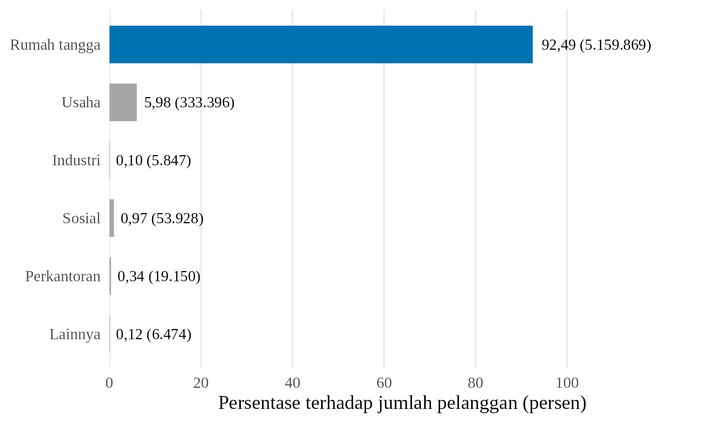 | 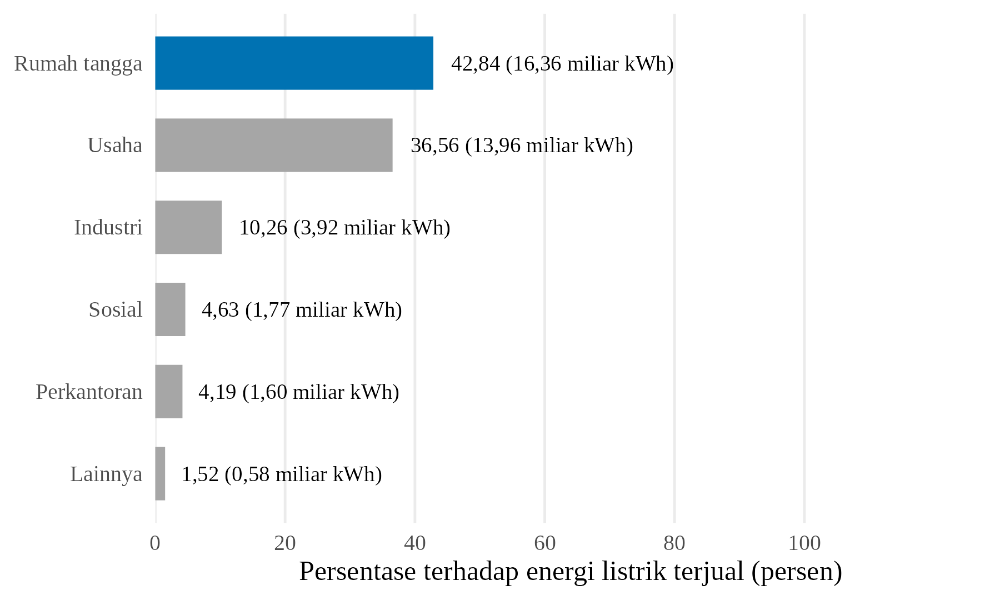 |

**Gambar 3 (a) Komposisi Pelanggan Listrik menurut Sektor di DKI Jakarta, 2025, dan (b) Distribusi Konsumsi Listrik (kWh) menurut Sektor di DKI Jakarta, 2025**

Sumber: Badan Pusat Statistik Provinsi DKI Jakarta (2026), Tabel 6.4 dan 6.5, dengan data PT PLN (Persero) Distribusi DKI Jakarta dan Tangerang (Diolah)

Deskripsi Gambar 3 (catatan konversi, bukan isi naskah)

**Deskripsi Gambar 3 (Sesi AX).** Dibuat ulang dengan `Script R Gambar Bab I.R`, Bagian 4, dari Tabel 6.4 dan 6.5 *Provinsi DKI Jakarta dalam Angka 2026* (kolom Gabungan). Bentuk *treemap* diganti diagram batang mendatar; urutan sektor dan warna sama pada kedua panel (rumah tangga biru, sektor lain abu-abu). Label: persen (nilai).

| Sektor | Pelanggan | % pelanggan | kWh terjual (miliar) | % kWh |
|---|---|---|---|---|
| Rumah tangga | 5.159.869 | 92,49 | 16,36 | 42,84 |
| Usaha | 333.396 | 5,98 | 13,96 | 36,56 |
| Industri | 5.847 | 0,10 | 3,92 | 10,26 |
| Sosial | 53.928 | 0,97 | 1,77 | 4,63 |
| Perkantoran | 19.150 | 0,34 | 1,60 | 4,19 |
| Lainnya | 6.474 | 0,12 | 0,58 | 1,52 |

Persentase dihitung terhadap baris Jumlah/Total tabel sumber (5.578.664 pelanggan; 38.195.558.854 kWh).

Berdasarkan Gambar 3, rumah tangga merupakan kelompok pelanggan listrik paling dominan di DKI Jakarta. Pada tahun 2025, sektor rumah tangga mencakup 5.159.869 pelanggan atau setara dengan 92,49 persen dari total pelanggan listrik di Provinsi DKI Jakarta. Dengan jumlah pelanggan sebanyak itu, rumah tangga juga menjadi sektor dengan konsumsi listrik agregat terbesar, yaitu 16,36 miliar kWh atau sekitar 42,84 persen dari total konsumsi listrik di DKI Jakarta. Nilai tersebut lebih tinggi dibandingkan sektor usaha sebesar 13,96 miliar kWh, sektor industri sebesar 3,92 miliar kWh, sektor sosial sebesar 1,77 miliar kWh, dan sektor perkantoran sebesar 1,60 miliar kWh (Badan Pusat Statistik Provinsi DKI Jakarta, 2026). Kondisi ini menunjukkan bahwa sektor rumah tangga memiliki posisi penting dalam pengelolaan permintaan listrik di wilayah perkotaan. Namun, besarnya konsumsi listrik rumah tangga secara agregat tidak berarti bahwa seluruh rumah tangga memiliki karakteristik konsumsi yang seragam. Variasi konsumsi listrik rumah tangga dapat dipengaruhi oleh perbedaan tingkat kesejahteraan, jumlah anggota rumah tangga, pendidikan kepala rumah tangga, karakteristik hunian, serta kepemilikan perangkat elektronik seperti *air conditioner* (AC) (Kubota et al., 2014; Nazer & Handra, 2016; Ali et al., 2021; De Cian et al., 2025). Secara teoretis, kondisi tersebut sejalan dengan konsep *energy ladder* yang menjelaskan bahwa peningkatan kesejahteraan dapat mendorong penggunaan energi modern dan meningkatkan intensitas pemakaian listrik melalui kepemilikan aset elektronik (van der Kroon et al., 2013; Nazer & Handra, 2016). Karena itu, data agregat per sektor belum cukup untuk memahami pola konsumsi listrik rumah tangga secara mendalam. Pemetaan berbasis mikrodata rumah tangga diperlukan agar perbedaan karakteristik konsumsi listrik dapat dikenali lebih spesifik dan dapat menopang kebijakan efisiensi energi yang lebih tepat sasaran.

## 1.2 Identifikasi Masalah

Perkembangan beban konsumsi listrik rumah tangga di DKI Jakarta menunjukkan bahwa persoalan energi domestik di wilayah ini tidak dapat lagi dipahami hanya melalui indikator rata-rata wilayah. Gambar 4 memperlihatkan bahwa energi listrik yang terjual kepada pelanggan rumah tangga di DKI Jakarta cenderung meningkat selama periode 2018–2025, sehingga listrik makin menjadi kebutuhan penting bagi rumah tangga. Namun, angka agregat tersebut belum mampu menjelaskan bagaimana variasi konsumsi listrik terjadi pada tingkat rumah tangga. Dengan kata lain, tingginya rata-rata pengeluaran listrik di DKI Jakarta masih menyisakan pertanyaan mengenai apakah seluruh rumah tangga memiliki pola konsumsi yang relatif seragam, atau justru terbentuk kelompok-kelompok rumah tangga dengan karakteristik konsumsi yang berbeda.

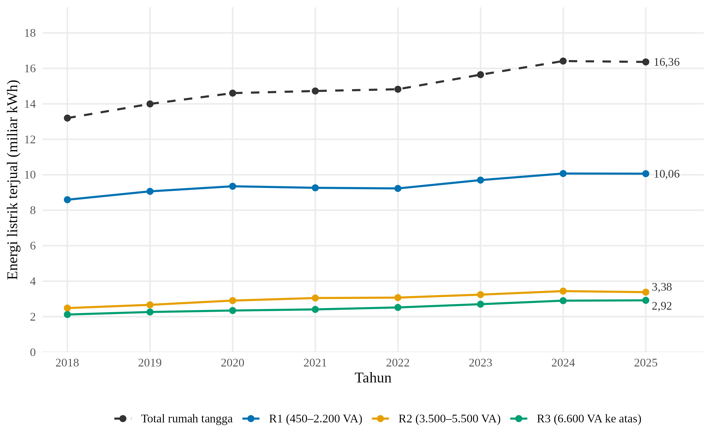

**Gambar 4 Energi Listrik Terjual kepada Pelanggan Rumah Tangga di Provinsi DKI Jakarta, 2018–2025**

Sumber: Badan Pusat Statistik Provinsi DKI Jakarta (2019, 2020, 2021, 2022, 2023, 2024, 2025, 2026), tabel Jumlah Daya (kWh) Listrik menurut Golongan Tarif dan Cabang di Provinsi DKI Jakarta (Diolah)

Deskripsi Gambar 4 (catatan konversi, bukan isi naskah)

**Deskripsi Gambar 4 (Sesi AX).** Dibuat ulang dengan `Script R Gambar Bab I.R`, Bagian 5, dari Tabel 6.5 *Provinsi DKI Jakarta dalam Angka* edisi 2019–2026 (kolom Gabungan; edisi tahun t memuat data tahun t−1). Grafik garis empat seri; sumbu tegak "Energi listrik terjual (miliar kWh)", 0–18. Seluruh tahun lolos pemeriksaan jumlah baris tabel terhadap baris Jumlah/Total.

| Tahun | R1 | R2 | R3 | Total rumah tangga |
|---|---|---|---|---|
| 2018 | 8,59 | 2,48 | 2,12 | 13,20 |
| 2019 | 9,07 | 2,67 | 2,26 | 14,00 |
| 2020 | 9,35 | 2,91 | 2,35 | 14,60 |
| 2021 | 9,27 | 3,05 | 2,41 | 14,72 |
| 2022 | 9,23 | 3,07 | 2,52 | 14,82 |
| 2023 | 9,70 | 3,24 | 2,70 | 15,64 |
| 2024 | 10,07 | 3,44 | 2,90 | 16,41 |
| 2025 | 10,06 | 3,38 | 2,92 | 16,36 |

Satuan miliar kWh. R3 = 6.600 VA ditambah >200 kVA (baris >200 kVA baru ada mulai data 2024). Edisi 2019 mencetak R2 sebagai ">2,2 kVA – 6.600 VA".

Secara empiris, variasi konsumsi listrik rumah tangga dipengaruhi oleh karakteristik sosial ekonomi yang berbeda-beda. Kubota et al. (2014) menunjukkan bahwa konsumsi energi rumah tangga di Jakarta dipengaruhi oleh karakteristik hunian dan kepemilikan perangkat pendingin, sedangkan Nazer dan Handra (2016) menegaskan bahwa kemampuan ekonomi rumah tangga berhubungan dengan konsumsi energi modern. Ali et al. (2021) juga menunjukkan bahwa ukuran rumah tangga dan tingkat pendidikan turut berkaitan dengan tingkat konsumsi listrik rumah tangga. Temuan-temuan tersebut mengindikasikan bahwa rumah tangga di DKI Jakarta tidak dapat diperlakukan sebagai kelompok yang homogen karena kemampuan ekonomi, kebutuhan domestik, dan pola penggunaan energinya berbeda-beda. Di wilayah metropolitan seperti Jakarta, persoalan ini makin kompleks karena kebutuhan listrik tidak hanya dipengaruhi oleh faktor ekonomi, tetapi juga oleh tekanan lingkungan perkotaan.

Di sisi lain, penelitian tentang konsumsi energi rumah tangga di Indonesia belum banyak yang secara khusus memetakan heterogenitas rumah tangga di DKI Jakarta. Takata et al. (2025) memang telah mengkaji klasifikasi pola gaya hidup dan hubungannya dengan konsumsi energi, tetapi fokusnya terbatas pada hunian apartemen. Kondisi ini menyisakan ruang eksplorasi untuk rumah tangga pada pemukiman umum di DKI Jakarta yang memiliki karakteristik sosial ekonomi, kondisi hunian, dan akses terhadap perangkat listrik yang lebih beragam. Dengan demikian, masih terdapat kesenjangan penelitian, yaitu belum tersedianya pemetaan yang komprehensif mengenai kelompok-kelompok rumah tangga di DKI Jakarta berdasarkan pola konsumsi listrik dan karakteristik sosial ekonomi.

Ketiadaan pemetaan tersebut berimplikasi pada kebijakan manajemen sisi permintaan (*demand-side management*) yang belum dapat dibedakan menurut kelompok rumah tangga. Rencana Umum Energi Nasional, misalnya, merumuskan kegiatan efisiensi energi dalam bentuk yang berlaku umum, yaitu penerapan SNI atas peralatan pemanfaat energi di sektor rumah tangga serta sosialisasi dan edukasi hemat energi melalui media elektronik dan media sosial untuk meningkatkan kesadaran pelaku usaha dan masyarakat (Presiden Republik Indonesia, 2017, Lampiran I, hlm. 96, 99). Padahal, rumah tangga tidak menanggapi upaya penghematan energi dengan cara yang sama. Mills dan Schleich (2012, Bagian 6) menemukan bahwa rumah tangga berpendidikan rendah terutama terdorong menghemat listrik karena alasan finansial, sedangkan rumah tangga berpendidikan tinggi lebih terdorong oleh alasan lingkungan, sehingga program penghematan perlu disesuaikan dengan kelompok sasarannya. Agar efektif, kebijakan efisiensi energi perlu didasarkan pada pemahaman yang lebih rinci tentang kelompok rumah tangga yang konsumsinya relatif tinggi, kelompok yang sudah efisien, dan kelompok yang berpotensi rentan karena keterbatasan adaptasi pendinginan. Pemahaman seperti ini membutuhkan pendekatan statistik yang mampu mengelompokkan rumah tangga berdasarkan kemiripan karakteristiknya. Penelitian ini menggunakan analisis klaster untuk mengidentifikasi dan memetakan kelompok rumah tangga di DKI Jakarta berdasarkan pola konsumsi listrik dan karakteristik sosial ekonomi, sehingga diperoleh profil rumah tangga yang lebih jelas sebagai dasar perumusan kebijakan efisiensi energi yang tepat sasaran.

## 1.3 Tujuan Penelitian

Berdasarkan uraian latar belakang dan identifikasi masalah di atas, tujuan penelitian ini adalah sebagai berikut:

1. Mendeskripsikan profil konsumsi listrik serta kondisi sosial ekonomi rumah tangga di Provinsi DKI Jakarta Tahun 2025.
2. Mengidentifikasi dan mengelompokkan rumah tangga di Provinsi DKI Jakarta berdasarkan pola konsumsi listrik dan karakteristik sosial ekonomi.
3. Menganalisis perbedaan karakteristik sosial ekonomi pada setiap klaster rumah tangga yang terbentuk di Provinsi DKI Jakarta Tahun 2025.

## 1.4 Keterbatasan Penelitian

Penelitian ini menggunakan data sekunder berupa mikrodata Survei Sosial Ekonomi Nasional (Susenas) Maret 2025 dengan cakupan wilayah Provinsi DKI Jakarta dan unit observasi rumah tangga sampel Susenas Maret 2025. Klaster dibentuk dari tiga variabel, yaitu konsumsi listrik rumah tangga, pengeluaran nonmakanan selain listrik, dan lama sekolah kepala rumah tangga (KRT), sehingga pengelompokan hanya mencerminkan perbedaan antarrumah tangga pada ketiga dimensi tersebut. Lima variabel lainnya, yaitu ukuran rumah tangga, kepemilikan *air conditioner* (AC), kepemilikan lemari es, luas lantai tempat tinggal, dan golongan daya terpasang, tidak dipakai dalam perhitungan jarak dan berperan sebagai variabel penciri pada tahap *profiling*. Kepemilikan AC juga dipakai sebagai salah satu kriteria dalam memilih spesifikasi variabel pembentuk, sehingga perbedaan kepemilikan AC antarklaster tidak sepenuhnya bebas dari proses pembentukan klaster. Selain itu, klaster dibentuk tanpa penimbang sehingga pusat klaster dan keanggotaan setiap rumah tangga ditentukan oleh rumah tangga sampel; penimbang Susenas baru diterapkan pada tahap pelaporan komposisi dan profil klaster.

Keterbatasan utama penelitian ini terletak pada penggunaan data sekunder Susenas yang tidak menyediakan informasi teknis secara rinci mengenai konsumsi energi rumah tangga, seperti durasi penggunaan, daya spesifik, dan intensitas pemakaian peralatan elektronik, termasuk AC. Selain itu, penelitian ini juga tidak mengukur secara langsung kondisi termal hunian atau paparan panas pada tingkat rumah tangga. Oleh karena itu, hasil analisis klaster yang diperoleh merupakan pendekatan proksi berdasarkan pola pengeluaran listrik dan karakteristik sosial ekonomi rumah tangga, bukan hasil observasi teknis langsung terhadap konsumsi energi per peralatan maupun pengukuran langsung terhadap kebutuhan pendinginan rumah tangga.

Keterbatasan berikutnya melekat pada cara konsumsi listrik rumah tangga diperoleh. Isian konsumsi listrik dalam satuan kWh tidak tersedia pada mikrodata Susenas Maret 2025 untuk Provinsi DKI Jakarta, sehingga konsumsi listrik diperoleh dari konversi pengeluaran listrik bulanan terhadap tarif tenaga listrik menurut golongan daya terpasang (Kementerian Energi dan Sumber Daya Mineral, 2024). Konversi tersebut memuat tiga penyederhanaan. Pertama, Susenas merekam daya terpasang dalam tiga kategori, sedangkan peraturan tarif memuat tujuh golongan tarif rumah tangga, sehingga seluruh rumah tangga pada kategori 1.300 VA ke atas dikonversi dengan tarif golongan R-1/1.300 VA sebesar Rp1.444,70 per kWh, termasuk rumah tangga yang sebenarnya berada pada golongan R-2 atau R-3 dengan tarif Rp1.699,53 per kWh (PT PLN (Persero), 2025). Kedua, golongan 450 VA dan 900 VA dikenai dua skema, yaitu tarif reguler berlapis tiga blok disertai biaya beban bulanan dan tarif prabayar bernilai tunggal, sedangkan Susenas tidak mencatat skema yang berlaku bagi tiap rumah tangga, sehingga tarif prabayar dipakai bagi kedua golongan tersebut. Ketiga, peraturan yang sama membedakan golongan R-1/900 VA bersubsidi bagi rumah tangga miskin dan tidak mampu dari golongan R-1/900 VA-RTM bertarif Rp1.352 per kWh (PT PLN (Persero), 2025), sedangkan Susenas tidak memuat keterangan yang memungkinkan pembedaan tersebut, sehingga seluruh rumah tangga 900 VA dikonversi dengan tarif bersubsidi. Pada penyederhanaan pertama dan ketiga, rumah tangga yang dikonversi dengan tarif lebih rendah daripada tarif yang sebenarnya berlaku memperoleh konsumsi listrik hasil konversi yang lebih tinggi daripada konsumsi aktualnya.

Konversi tersebut juga mensyaratkan setiap rumah tangga memiliki golongan tarif yang sah. Sebanyak 78 rumah tangga, yang terdiri atas 66 rumah tangga pengguna listrik PT PLN (Persero) tanpa meteran dan 12 rumah tangga pengguna listrik non-PLN, tidak memenuhi syarat tersebut sehingga dikeluarkan dari analisis. Oleh karena itu, kesimpulan penelitian ini berlaku bagi rumah tangga bermeteran PT PLN (Persero) di Provinsi DKI Jakarta, bukan bagi seluruh rumah tangga di provinsi tersebut.

Sebagian rumah tangga pada golongan bersubsidi memiliki konsumsi listrik hasil konversi yang melampaui batas atas kapasitas meterannya. Batas atas tersebut diperoleh dengan menganggap daya terpasang terpakai penuh selama 24 jam setiap hari sepanjang 30 hari, dengan angka daya dalam satuan watt sebagaimana dicatat kuesioner Susenas, yaitu 450 × 24 × 30 = 324.000 watt-jam atau 324 kWh bagi golongan 450 VA dan 900 × 24 × 30 = 648.000 watt-jam atau 648 kWh bagi golongan 900 VA. Keadaan tersebut ditemukan pada 226 dari 553 rumah tangga golongan 450 VA, atau 40,87 persen, dan pada 64 dari 1.573 rumah tangga golongan 900 VA, atau 4,07 persen. Penyebabnya tidak dapat dipastikan dari mikrodata Susenas. Ada tiga kemungkinan, yaitu golongan daya yang terekam tidak sesuai dengan keadaan sebenarnya, rumah tangga yang sebenarnya dikenai tarif nonsubsidi, dan pembelian token listrik untuk lebih dari satu bulan yang tercatat sebagai pengeluaran sebulan terakhir. Ketiga kemungkinan tersebut sama-sama membuat konsumsi listrik hasil konversi lebih tinggi daripada konsumsi sebenarnya: dua kemungkinan pertama karena tarif yang dipakai dalam konversi lebih rendah daripada tarif yang berlaku, sedangkan kemungkinan ketiga karena pengeluaran yang dikonversi mencakup pemakaian lebih dari satu bulan. Observasi tersebut tetap diikutsertakan tanpa koreksi karena tidak terdapat dasar yang sah untuk menetapkan nilai penggantinya. *Winsorizing* pada persentil ke-1 dan ke-99 serta transformasi logaritma natural menekan pengaruh nilai ekstrem terhadap perhitungan jarak, tetapi tidak mengoreksi observasi tersebut sepanjang nilainya berada di bawah persentil ke-99.

Terakhir, penelitian ini menggunakan data *cross-section* pada satu periode pengamatan. Hasilnya menggambarkan kondisi rumah tangga di DKI Jakarta pada tahun 2025 dan tidak dimaksudkan untuk menjelaskan perubahan perilaku konsumsi listrik rumah tangga antarwaktu. Oleh sebab itu, interpretasi hasil diarahkan pada pemetaan heterogenitas rumah tangga pada satu periode, bukan pada dinamika konsumsi listrik secara longitudinal.

## 1.5 Sistematika Penulisan

Tugas Akhir ini disusun secara sistematis sesuai dengan Pedoman Penyusunan Tugas Akhir Politeknik Statistika STIS. Penulisan diawali dengan Bagian Awal yang memuat halaman sampul, halaman judul, halaman pernyataan, halaman pengesahan, pernyataan hak cipta, prakata, abstrak, daftar isi, daftar tabel, daftar gambar, dan daftar lampiran. Selanjutnya, isi Tugas Akhir ini disusun ke dalam lima bab utama, kemudian diakhiri dengan daftar pustaka, lampiran, dan riwayat hidup penulis.

Bab I Pendahuluan memuat latar belakang, identifikasi masalah, tujuan penelitian, keterbatasan penelitian, dan sistematika penulisan. Bab ini menjelaskan urgensi penelitian mengenai konsumsi listrik rumah tangga di DKI Jakarta, menguraikan masalah yang melatarbelakangi penelitian, menetapkan tujuan yang ingin dicapai, serta menjelaskan batasan penelitian yang digunakan.

Bab II Kajian Pustaka memuat landasan teori dan penelitian terkait yang relevan dengan topik penelitian. Pada bab ini dipaparkan teori-teori yang mendasari penelitian, baik teori mengenai metode analisis klaster maupun teori substansi yang berkaitan dengan konsumsi listrik rumah tangga dan karakteristik sosial ekonomi. Selain itu, bab ini juga memuat kajian penelitian terdahulu, kerangka pikir penelitian, serta hipotesis penelitian apabila diperlukan sesuai dengan karakter penelitian yang dilakukan.

Bab III Metodologi memuat ruang lingkup penelitian, metode pengumpulan data, definisi operasional, dan metode analisis. Bab ini menjelaskan cakupan penelitian, sumber data yang digunakan, definisi operasional setiap variabel penelitian, serta tahapan analisis yang diterapkan untuk mencapai tujuan penelitian, mulai dari tahap persiapan data hingga proses pembentukan klaster dan evaluasi hasil pengelompokan.

Bab IV Hasil dan Pembahasan memuat hasil pengolahan data yang disajikan dalam bentuk tabel dan/atau gambar, serta pembahasan yang diarahkan untuk menjawab tujuan penelitian. Pada bab ini dipaparkan gambaran umum profil konsumsi listrik dan karakteristik sosial ekonomi rumah tangga di DKI Jakarta, hasil pembentukan klaster rumah tangga, serta interpretasi terhadap karakteristik masing-masing klaster yang terbentuk.

Bab V Kesimpulan dan Saran memuat kesimpulan yang diperoleh dari hasil penelitian serta saran yang dapat diberikan berdasarkan temuan penelitian. Kesimpulan disusun sesuai dengan tujuan penelitian, sedangkan saran diarahkan pada implikasi penelitian bagi pengembangan studi selanjutnya maupun bagi pihak-pihak yang berkepentingan dalam kebijakan efisiensi energi rumah tangga.

Bagian Akhir memuat Daftar Pustaka, Lampiran hasil analisis, dan Riwayat Hidup penulis sebagai kelengkapan administratif dan pendukung data dalam Tugas Akhir ini.

---

# BAB II KAJIAN PUSTAKA

## 2.1 Landasan Teori

**Analisis Multivariat**

Analisis multivariat merupakan sekumpulan metode statistika yang digunakan ketika beberapa pengukuran dilakukan secara simultan pada setiap objek atau unit pengamatan. Dalam analisis ini, variabel-variabel tidak dipandang secara terpisah, melainkan dipelajari secara bersama karena umumnya saling berkaitan dan secara kolektif menjelaskan suatu fenomena. Rencher (2002) menjelaskan bahwa analisis multivariat digunakan ketika beberapa variabel diamati pada setiap objek, sedangkan Johnson dan Wichern (2014) menekankan bahwa pendekatan ini penting untuk menyederhanakan data, menemukan pola, melakukan pengelompokan, prediksi, dan pengujian hipotesis secara serentak. Pendekatan ini relevan bagi penelitian ini karena pola konsumsi listrik rumah tangga tidak dipengaruhi oleh satu variabel saja, tetapi oleh kombinasi beberapa karakteristik sosial ekonomi rumah tangga.

**Analisis Klaster**

Analisis klaster merupakan salah satu teknik dalam analisis multivariat yang bertujuan mengelompokkan objek ke dalam beberapa klaster berdasarkan tingkat kemiripan karakteristiknya. Objek yang berada dalam klaster yang sama memiliki homogenitas internal yang tinggi, sedangkan objek dari klaster yang berbeda memiliki karakteristik yang berbeda secara jelas. Everitt et al. (2011) menjelaskan bahwa *cluster analysis* pada dasarnya adalah metode numerik untuk menemukan kelompok dalam data, sedangkan Rencher (2002) menyatakan bahwa analisis klaster dapat dilakukan melalui pendekatan hierarki maupun partisi. Dalam penelitian ini, analisis klaster digunakan untuk memetakan rumah tangga ke dalam kelompok-kelompok yang memiliki pola konsumsi listrik dan karakteristik sosial ekonomi yang serupa, sehingga heterogenitas rumah tangga di DKI Jakarta dapat dipahami secara lebih sistematis.

**Ukuran Kemiripan dan Standardisasi Data**

Pembentukan klaster memerlukan ukuran kemiripan (jarak) antarobjek. Untuk data kuantitatif, ukuran jarak yang paling umum digunakan adalah jarak Euclidean, yaitu jarak geometrik antardua titik dalam ruang berdimensi $p$ (Everitt et al., 2011, hlm. 49). Jarak Euclidean antara objek ke-$i$ dan objek ke-$k$ dinyatakan sebagai:

$$d(\mathbf{x}_i,\mathbf{x}_k)=\sqrt{\sum_{j=1}^{p}(x_{ij}-x_{kj})^2} \tag{2.1}$$

dengan:

- $d(\mathbf{x}_i,\mathbf{x}_k)$ = jarak Euclidean antara objek ke-$i$ dan objek ke-$k$,
- $p$ = jumlah variabel,
- $x_{ij}$ = nilai variabel ke-$j$ pada objek ke-$i$,
- $x_{kj}$ = nilai variabel ke-$j$ pada objek ke-$k$.

Rencher (2002) menempatkan pembahasan *distance between vectors* sebagai dasar penting dalam analisis multivariat, sedangkan Johnson dan Wichern (2014) menunjukkan bahwa *K-Means* lazim menggunakan jarak Euclidean dalam proses alokasi objek ke klaster.

Namun, jarak Euclidean sensitif terhadap perbedaan satuan dan skala antarvariabel. Jika variabel-variabel memiliki rentang yang sangat berbeda, maka variabel dengan skala terbesar dapat mendominasi perhitungan jarak. Everitt et al. (2011, hlm. 67) menyatakan bahwa ketika seluruh variabel diukur pada skala kontinu tetapi dalam satuan yang berbeda, solusi yang paling sering disarankan adalah menstandardisasi setiap variabel menjadi bervarians satu sebelum analisis. Bila simpangan baku yang dipakai dihitung dari seluruh objek yang dikelompokkan, teknik tersebut dikenal sebagai *z-scoring* atau skor baku (Everitt et al., 2011, hlm. 67), yaitu:

$$z_{ij}=\frac{x_{ij}-\bar{x}_j}{s_j} \tag{2.2}$$

dengan:

- $z_{ij}$ = nilai variabel ke-$j$ pada objek ke-$i$ setelah standardisasi,
- $x_{ij}$ = nilai asli variabel ke-$j$ pada objek ke-$i$,
- $\bar{x}_j$ = rata-rata variabel ke-$j$,
- $s_j$ = simpangan baku variabel ke-$j$.

Dalam penelitian ini, standardisasi diperlukan karena variabel pembentuk klaster memiliki satuan yang berbeda, yaitu kWh, rupiah, dan tahun. Dengan standardisasi, setiap variabel memberikan kontribusi yang seimbang dalam proses pembentukan klaster.

**Metode Nonhierarki *K-Means***

Metode *K-Means* merupakan metode nonhierarki yang membagi objek ke dalam sejumlah klaster yang telah ditentukan sebelumnya. Istilah *K-Means* diperkenalkan oleh MacQueen (1967, hlm. 281) untuk proses mempartisi populasi berdimensi banyak ke dalam $k$ himpunan berdasarkan sampel, yang cenderung menghasilkan partisi dengan ragam dalam kelas yang rendah. Johnson dan Wichern (2014) menyatakan bahwa *K-Means* mengalokasikan setiap objek ke klaster yang memiliki centroid atau rata-rata terdekat. Rencher (2002) juga menjelaskan bahwa metode ini dimulai dengan memilih sejumlah *seed* awal, kemudian setiap objek dialokasikan ke klaster terdekat, dan centroid diperbarui secara iteratif hingga tidak ada perbaikan lebih lanjut. Everitt et al. (2011) menambahkan bahwa algoritme *K-Means* pada dasarnya merupakan algoritme optimisasi yang berupaya meminimalkan variasi dalam klaster.

Secara umum, langkah-langkah metode *K-Means* adalah sebagai berikut:

1. Menentukan jumlah klaster $K$.
2. Menentukan centroid awal atau seed.
3. Mengalokasikan setiap objek ke klaster dengan centroid terdekat.
4. Menghitung ulang centroid berdasarkan rata-rata anggota klaster.
5. Mengulangi langkah 3 dan 4 hingga tidak ada lagi perpindahan objek atau perubahan centroid menjadi sangat kecil.

Centroid klaster ke-$k$ dinyatakan sebagai:

$$\bar{\mathbf{x}}_k=\frac{1}{n_k}\sum_{i\in C_k}\mathbf{x}_i \tag{2.3}$$

dengan:

- $\bar{\mathbf{x}}_k$ = centroid klaster ke-$k$,
- $n_k$ = banyaknya objek pada klaster ke-$k$,
- $C_k$ = himpunan objek pada klaster ke-$k$,
- $\mathbf{x}_i$ = vektor pengamatan objek ke-$i$.

Tujuan utama *K-Means* adalah meminimalkan jumlah kuadrat dalam klaster atau *within-cluster sum of squares* (WCSS), yang dapat ditulis sebagai:

$$WCSS=\sum_{k=1}^{K}\sum_{i\in C_k}\left\lVert\mathbf{x}_i-\bar{\mathbf{x}}_k\right\rVert^2 \tag{2.4}$$

Nilai WCSS yang semakin kecil menunjukkan bahwa objek-objek dalam suatu klaster semakin dekat dengan centroid klasternya, sehingga klaster yang terbentuk semakin homogen. Secara konseptual, Everitt et al. (2011, hlm. 114) menjelaskan bahwa kriteria ini merupakan perluasan jumlah kuadrat dalam kelompok ke data banyak variabel, yaitu minimisasi *trace*(**W**) atau jumlah dari jumlah kuadrat dalam kelompok pada seluruh variabel, dan bahwa minimisasi tersebut ekuivalen dengan meminimalkan jumlah kuadrat jarak Euclidean setiap objek terhadap rata-rata kelompoknya.

**Penentuan Jumlah Klaster**

Penetapan jumlah klaster merupakan persoalan mendasar dalam metode nonhierarki karena nilai K harus ditentukan sebelum proses alokasi objek berlangsung. Rencher (2002) menunjukkan bahwa pada metode nonhierarki jumlah klaster perlu ditetapkan atau dipilih sebelum interpretasi akhir dilakukan, sementara Johnson dan Wichern (2014) mencatat bahwa jumlah klaster pada metode nonhierarki dapat ditentukan terlebih dahulu maupun ditetapkan melalui prosedur tertentu sebagai bagian dari proses klasterisasi. Keduanya menegaskan keharusan penetapan tersebut tanpa menguraikan prosedur pemilihannya secara khusus. 

Persoalan ini umumnya dijawab melalui kriteria evaluasi internal, yaitu ukuran yang menilai kualitas struktur pengelompokan berdasarkan data itu sendiri tanpa memerlukan informasi kelompok yang sebenarnya. Dua kriteria yang lazim digunakan untuk menentukan jumlah klaster pada *K-Means* adalah metode *elbow* dan koefisien *silhouette* (Hassan et al., 2021, hlm. 91).

Metode *elbow* bertumpu pada perilaku WCSS sebagai fungsi dari jumlah klaster. Everitt et al. (2011) menjelaskan bahwa dalam penerapan metode nonhierarki, jumlah kelompok yang sesuai dapat diperkirakan dengan memplot nilai kriteria klaster terhadap jumlah kelompok dan mengamati perubahan besar pada kurva. Titik ketika penurunan WCSS mulai melandai dan membentuk pola siku (*elbow*) menandakan bahwa penambahan klaster berikutnya tidak lagi memberikan perbaikan homogenitas yang berarti, sehingga jumlah klaster dipilih berdasarkan keseimbangan antara homogenitas internal dan kesederhanaan struktur pengelompokan.

Kriteria ini memiliki dua keterbatasan yang saling berkaitan. Pertama, nilai WCSS menurun secara monoton seiring bertambahnya jumlah klaster sehingga tidak dapat diperlakukan sebagai fungsi objektif yang diminimalkan secara langsung; penilaiannya bergantung pada pembacaan bentuk kurva, yang menjadi ambigu ketika penurunan berlangsung landai tanpa titik patah yang tegas (Hassan et al., 2021, hlm. 93). Kedua, WCSS semata-mata merekam kedekatan objek terhadap centroid klasternya sendiri dan tidak memuat informasi mengenai jarak antarklaster, padahal kualitas pengelompokan ditentukan oleh kekompakan internal sekaligus keterpisahan antarkelompok (Rousseeuw, 1987, hlm. 55).

Rousseeuw (1987) memperkenalkan koefisien *silhouette* sebagai ukuran yang memuat kedua dimensi tersebut secara serentak. Ukuran ini menilai ketepatan penempatan setiap objek dengan membandingkan kedekatannya terhadap anggota klasternya sendiri dan kedekatannya terhadap klaster tetangga terdekat. Untuk objek ke-$i$, didefinisikan $a(i)$ sebagai rata-rata jarak objek ke-$i$ terhadap seluruh objek lain dalam klaster yang sama, dan $b(i)$ sebagai nilai terkecil dari rata-rata jarak objek ke-$i$ terhadap seluruh objek pada klaster lain, sehingga koefisien *silhouette* dirumuskan sebagai:

$$s(i)=\frac{b(i)-a(i)}{\max\{a(i),\,b(i)\}} \tag{2.5}$$

dengan:

- $s(i)$ = koefisien *silhouette* objek ke-$i$,
- $a(i)$ = rata-rata jarak objek ke-$i$ terhadap objek lain dalam klaster yang sama,
- $b(i)$ = rata-rata jarak terkecil objek ke-$i$ terhadap objek pada klaster lain.

Nilai $s(i)$ terbatas pada rentang −1 hingga 1. Nilai yang mendekati 1 menunjukkan objek berada jauh lebih dekat dengan anggota klasternya sendiri dibandingkan klaster tetangga, nilai di sekitar 0 menandakan objek berada pada perbatasan dua klaster, sedangkan nilai negatif mengindikasikan objek kemungkinan lebih sesuai ditempatkan pada klaster lain (Rousseeuw, 1987, hlm. 56). Kualitas struktur pengelompokan secara keseluruhan dinilai melalui rata-rata koefisien *silhouette* seluruh objek (*average silhouette width*):

$$\bar{s}=\frac{1}{n}\sum_{i=1}^{n} s(i) \tag{2.6}$$

dengan $\bar{s}$ menyatakan rata-rata koefisien *silhouette* dan $n$ menyatakan banyaknya objek. Kaufman dan Rousseeuw (1990) memandang klasifikasi yang memadai dicirikan oleh rata-rata koefisien *silhouette* di atas 0,5, sedangkan rata-rata di bawah 0,2 ditafsirkan sebagai ketiadaan struktur klaster yang berarti (Everitt et al., 2011, hlm. 129). Nilai di antara kedua ambang tersebut belum dapat digolongkan sebagai klasifikasi yang memadai, sehingga hasil pengelompokan perlu ditafsirkan secara hati-hati.

Kedua kriteria tersebut bersifat komplementer: metode *elbow* membaca pola penurunan variasi dalam klaster, sedangkan koefisien *silhouette* mengukur kekuatan pemisahan antarklaster pada setiap kandidat jumlah klaster. Atas dasar itu, penelitian ini menggunakan keduanya secara bersamaan dalam menetapkan jumlah klaster.

***Profiling* Klaster**

Klaster yang dihasilkan algoritme pengelompokan pada dasarnya hanya berupa label keanggotaan numerik, sehingga perlu diterjemahkan secara substantif agar bermakna secara analitis. Everitt et al. (2011) menyatakan bahwa tahap interpretasi dapat memerlukan penyajian grafis dan statistik deskriptif, sekaligus mengingatkan bahwa uji statistik baku seperti analisis ragam tidak tepat dipakai untuk membandingkan variabel pembentuk antarklaster, karena teknik pengelompokan dengan sendirinya telah memaksimalkan perbedaan antarklaster pada variabel tersebut. Dari peringatan ini, informasi dalam karakterisasi klaster dapat dibedakan menjadi dua jenis. Variabel pembentuk menggambarkan dimensi yang memisahkan klaster, tetapi perbedaannya tidak dapat dipakai sebagai bukti keberadaan kelompok. Sebaliknya, variabel yang tidak ikut membentuk klaster memuat informasi yang tidak dilihat algoritme, sehingga kesesuaian polanya dengan klaster yang terbentuk lebih bermakna untuk dibaca. Oleh karena itu, setiap klaster diprofilkan melalui dua kelompok variabel, yaitu tiga variabel pembentuk berupa konsumsi listrik rumah tangga, pengeluaran nonmakanan selain listrik, dan lama sekolah KRT, serta lima variabel penciri berupa ukuran rumah tangga, kepemilikan *air conditioner* (AC), kepemilikan lemari es, luas lantai tempat tinggal, dan golongan daya terpasang.

***Energy Ladder***

*Energy ladder* menjelaskan bahwa rumah tangga cenderung mengalami transisi penggunaan energi seiring dengan peningkatan kesejahteraan. Dalam formulasi klasiknya, rumah tangga diasumsikan bergerak dari sumber energi tradisional ke energi transisi, lalu menuju energi modern yang lebih bersih, nyaman, dan efisien, seperti listrik dan LPG (van der Kroon et al., 2013). Dengan demikian, tingkat kesejahteraan berhubungan dengan peluang rumah tangga untuk menggunakan energi modern secara lebih intensif. Hubungan ini penting karena konsumsi energi rumah tangga pada dasarnya tidak hanya ditentukan oleh kebutuhan dasar, tetapi juga oleh kemampuan ekonomi untuk mengakses layanan energi yang lebih berkualitas. van der Kroon et al. (2013) menegaskan bahwa *energy ladder* merupakan model yang umum digunakan untuk menjelaskan pilihan energi rumah tangga, meskipun dalam praktiknya hubungan antara pendapatan dan pilihan energi tidak selalu sesederhana perpindahan satu arah dari energi tradisional menuju energi modern. Temuan tersebut juga sejalan dengan Leach (1992) yang menekankan bahwa transisi energi rumah tangga dipengaruhi oleh urbanisasi, akses terhadap energi modern, dan perubahan kebutuhan layanan energi.

Meskipun demikian, teori *energy ladder* dalam penelitian ini tidak dipahami secara kaku sebagai perpindahan sempurna dari satu jenis energi ke jenis energi lain. van der Kroon et al. (2013) menunjukkan bahwa dalam banyak kasus rumah tangga justru menggunakan kombinasi beberapa sumber energi secara bersamaan (*fuel stacking*), sehingga perubahan pola konsumsi energi tidak selalu berbentuk substitusi penuh. Dalam konteks rumah tangga perkotaan Indonesia, Nazer dan Handra (2016) juga menunjukkan bahwa konsep *energy ladder* dan *fuel stacking* sama-sama relevan untuk menjelaskan konsumsi energi rumah tangga. Studi tersebut menemukan bahwa elastisitas pendapatan terhadap konsumsi energi modern bernilai positif, yang berarti peningkatan pendapatan diikuti oleh peningkatan konsumsi energi modern. Dengan demikian, dalam penelitian ini *energy ladder* digunakan sebagai landasan teori utama untuk menjelaskan bahwa perbedaan tingkat kesejahteraan rumah tangga akan berkaitan dengan perbedaan intensitas penggunaan energi modern, termasuk listrik, serta kemampuan rumah tangga untuk memiliki dan menggunakan perangkat listrik.

Pendekatan tersebut relevan untuk konteks DKI Jakarta sebagai wilayah metropolitan dengan akses listrik yang sudah sangat tinggi. Pada kondisi seperti ini, isu utamanya bukan lagi sekadar akses terhadap energi modern, melainkan bagaimana perbedaan kesejahteraan rumah tangga menghasilkan perbedaan intensitas pemanfaatan energi modern antarrumah tangga. Oleh karena itu, *energy ladder* tetap sesuai digunakan sebagai teori utama dalam penelitian ini, karena mampu menjelaskan keterkaitan antara kondisi sosial ekonomi dan pola konsumsi listrik rumah tangga.

***Urban Heat Island* dan *Adaptation Cooling Deficit***

Selain dipengaruhi oleh kondisi sosial ekonomi, konsumsi listrik rumah tangga perkotaan juga dipengaruhi oleh kondisi lingkungan termal. Dalam konteks metropolitan seperti Jakarta, fenomena *Urban Heat Island* (UHI) menyebabkan suhu kawasan perkotaan lebih tinggi dibandingkan wilayah sekitarnya. Siswanto et al. (2023) menunjukkan bahwa Jakarta metropolitan mengalami penguatan fenomena UHI, dan penyebaran kawasan terbangun serta kepadatan aktivitas perkotaan berkontribusi terhadap peningkatan suhu di wilayah ini. Kondisi tersebut penting karena suhu tinggi menurunkan kenyamanan termal rumah tangga, dan penurunan tersebut dapat diimbangi sebagian atau seluruhnya melalui peningkatan konsumsi listrik untuk pendinginan (De Cian et al., 2025, hlm. 7), sehingga kebutuhan listrik rumah tangga di wilayah perkotaan juga dipengaruhi oleh tekanan iklim perkotaan.

Dalam situasi tersebut, kepemilikan dan penggunaan perangkat pendingin, terutama *air conditioner* (AC), menjadi salah satu bentuk adaptasi rumah tangga terhadap tekanan panas. De Cian et al. (2025) menunjukkan bahwa penggunaan AC meningkatkan konsumsi listrik rumah tangga, sedangkan Pavanello et al. (2021) menekankan bahwa adopsi pendinginan aktif di negara berkembang dipengaruhi oleh pendapatan dan suhu yang disesuaikan dengan kelembapan. Dengan kata lain, rumah tangga yang memiliki kapasitas ekonomi lebih tinggi cenderung memiliki peluang lebih besar untuk mengadopsi AC sebagai bentuk adaptasi terhadap kondisi panas perkotaan.

Namun, kemampuan rumah tangga untuk beradaptasi terhadap tekanan panas tidak bersifat merata. Pavanello et al. (2021) memperkenalkan konsep *adaptation cooling deficit*, yaitu kondisi ketika rumah tangga sebenarnya membutuhkan pendinginan, tetapi tidak memiliki kemampuan ekonomi yang memadai untuk memenuhinya. Dalam konteks ini, rumah tangga berpengeluaran rendah dapat menghadapi paparan panas yang sama dengan rumah tangga lain, tetapi tidak mampu menggunakan pendinginan aktif secara cukup. Oleh karena itu, isu pendinginan rumah tangga di wilayah metropolitan bukan hanya persoalan efisiensi energi, tetapi juga menyangkut ketimpangan kemampuan adaptasi termal. Dalam penelitian ini, konsep *adaptation cooling deficit* digunakan sebagai konsep pendukung untuk membantu membaca makna substantif dari kepemilikan AC dalam proses *profiling* klaster rumah tangga.

**Determinan Sosial Ekonomi Konsumsi Listrik Rumah Tangga**

Konsumsi listrik rumah tangga pada dasarnya dipengaruhi oleh interaksi faktor ekonomi, demografi, karakteristik hunian, dan kondisi lingkungan. Dalam konteks rumah tangga perkotaan di Indonesia, kemampuan ekonomi rumah tangga merupakan faktor penting yang memengaruhi konsumsi energi rumah tangga. Nazer dan Handra (2016) menunjukkan bahwa pendapatan rumah tangga merupakan faktor penentu utama konsumsi energi rumah tangga, di samping faktor non-ekonomi seperti jumlah anggota rumah tangga. Dalam penelitian tersebut, pendapatan rumah tangga bahkan diproksi menggunakan pengeluaran rumah tangga tahunan, yang menunjukkan bahwa pengeluaran dapat digunakan sebagai indikator kesejahteraan dalam menjelaskan konsumsi energi rumah tangga. Pilihan tersebut relevan bagi penelitian berbasis Susenas. Informasi konsumsi untuk periode pendek, seperti sebulan, sebagaimana lazim dikumpulkan survei rumah tangga, lebih mungkin mewakili tingkat kesejahteraan umum rumah tangga dibandingkan informasi pendapatan untuk periode yang sama, yang lebih bergejolak (Haughton & Khandker, 2009, hlm. 24). Di negara berkembang, pengeluaran juga lebih mudah diukur daripada pendapatan, yang sebagian besar berasal dari usaha sendiri (Haughton & Khandker, 2009, hlm. 30).

Selain faktor ekonomi, ukuran rumah tangga juga penting karena berkaitan dengan skala kebutuhan domestik. Rumah tangga dengan anggota lebih banyak cenderung membutuhkan energi lebih besar untuk penerangan, penggunaan peralatan rumah tangga, dan kenyamanan termal. Ali et al. (2021) menunjukkan bahwa tingkat pendapatan, tingkat pendidikan, dan ukuran rumah tangga memiliki hubungan positif dengan konsumsi listrik rumah tangga, dan karakteristik hunian seperti tipe rumah dan jumlah ruang juga berkaitan dengan tingkat konsumsi listrik. Temuan tersebut menguatkan bahwa konsumsi listrik rumah tangga tidak hanya ditentukan oleh kemampuan ekonomi, tetapi juga oleh kebutuhan domestik dan kondisi tempat tinggal.

Pendidikan kepala rumah tangga juga dapat diposisikan sebagai faktor penting karena merefleksikan modal manusia, pengetahuan, preferensi, dan keputusan adopsi teknologi rumah tangga. Menurut *human capital theory* yang dikemukakan Becker (1964), kualitas sumber daya manusia berpengaruh terhadap produktivitas dan kemampuan memperoleh pendapatan, sehingga turut menentukan kemampuan rumah tangga memenuhi kebutuhan dasar, termasuk energi (Sari & Triani, 2026, hlm. 1087). Mills dan Schleich (2012, Bagian 2.1) menambahkan bahwa pendidikan menurunkan biaya memperoleh informasi dan cenderung berkaitan dengan sikap yang lebih peduli lingkungan, sedangkan hasil analisis mereka pada rumah tangga di sebelas negara Eropa menunjukkan bahwa pendidikan berhubungan positif dengan adopsi teknologi hemat energi dan pengetahuan mengenai penggunaan energi (Mills & Schleich, 2012, Bagian 5). Ali et al. (2021) menunjukkan bahwa pendidikan berhubungan positif dengan konsumsi listrik rumah tangga, sedangkan Pavanello et al. (2021) menunjukkan bahwa rumah tangga dengan tingkat pendidikan lebih tinggi cenderung memiliki kemungkinan adopsi AC yang lebih besar. Dalam konteks penelitian ini, pendidikan kepala rumah tangga dipahami sebagai faktor yang dapat membedakan perilaku konsumsi listrik melalui jalur preferensi kenyamanan, adopsi teknologi, dan pola penggunaan perangkat rumah tangga. Dari determinan tersebut, kapasitas ekonomi dan pendidikan kepala rumah tangga dipakai sebagai dimensi sosial ekonomi pembentuk klaster, dengan kapasitas ekonomi diwakili oleh pengeluaran nonmakanan selain listrik. Ukuran rumah tangga dan karakteristik hunian tidak dihilangkan dari analisis, melainkan diperiksa sebagai variabel penciri setelah klaster terbentuk.

## 2.2 Penelitian Terkait

**Tabel 1 Penelitian Terkait**

| No. | Penulis | Judul Penelitian | Metode | Hasil Utama |
|---|---|---|---|---|
| 1 | Kubota, Surahman, dan Higashi (2014) | A Comparative Analysis of Household Energy Consumption in Jakarta and Bandung | Analisis faktor, analisis klaster, dan regresi linear berganda | Menunjukkan bahwa konsumsi energi rumah tangga di Jakarta lebih tinggi dibandingkan Bandung, dan penggunaan AC menjadi salah satu faktor penting yang membedakan konsumsi energi rumah tangga di kedua kota. |
| 2 | Takata, Kubota, Pratiwi, dan Sani (2025) | Classification of Daily Lifestyle Patterns and Their Relationships with Household Energy Consumption in Apartment Buildings: A Case Study of Indonesia | *Hierarchical clustering* dan regresi logistik | Berhasil mengelompokkan pola gaya hidup penghuni apartemen di Indonesia dan menunjukkan bahwa pola mobilitas harian berhubungan dengan variasi konsumsi energi rumah tangga, termasuk adanya indikasi *rebound effect* pada penggunaan AC setelah penghuni kembali ke rumah. |
| 3 | Oktasandira (2025) | Analisis Klaster Pelanggan Listrik Berdasarkan Perilaku Konsumsi di Kota Sukabumi Menggunakan Metode K-Means Clustering | *K-Means clustering* dengan metode *elbow* dan koefisien *silhouette* | Menghasilkan tiga klaster pelanggan listrik dengan karakteristik konsumsi yang berbeda dan menunjukkan bahwa segmentasi pelanggan dapat digunakan sebagai dasar penyusunan kebijakan efisiensi energi. |
| 4 | Pasaribu, Wulandari, dan Wulandari (2024) | Pengelompokan Indikator Kemiskinan di Kabupaten/Kota Aceh Tahun 2021 Menggunakan Analisis Klaster | *Average linkage* dan *K-Means* | Menunjukkan bahwa *K-Means* menghasilkan pengelompokan yang lebih rinci dibandingkan metode hierarki pada data indikator sosial ekonomi, sehingga relevan sebagai referensi metodologis untuk penelitian berbasis data BPS. |
| 5 | Nazer dan Handra (2016) | Analisis Konsumsi Energi Rumah Tangga Perkotaan di Indonesia | Regresi linear berganda | Menunjukkan bahwa pendapatan atau pengeluaran rumah tangga merupakan determinan utama konsumsi energi rumah tangga perkotaan di Indonesia, disertai pengaruh faktor rumah tangga lain seperti jumlah anggota rumah tangga. |
| 6 | Ali et al. (2021) | Critical Determinants of Household Electricity Consumption in a Rapidly Growing City | Regresi bertahap | Menunjukkan bahwa konsumsi listrik rumah tangga dipengaruhi oleh karakteristik sosial ekonomi dan karakteristik fisik rumah, seperti ukuran rumah, jumlah ruang, tingkat pendapatan, dan tingkat pendidikan. |
| 7 | Siswanto et al. (2023) | Spatio-Temporal Characteristics of Urban Heat Island of Jakarta Metropolitan | Analisis spasio-temporal berbasis citra satelit dan data in situ | Menunjukkan bahwa wilayah Jakarta metropolitan mengalami fenomena *Urban Heat Island* yang cukup kuat, sehingga meningkatkan relevansi pembahasan kebutuhan pendinginan rumah tangga di wilayah perkotaan. |
| 8 | Pavanello et al. (2021) | Air-Conditioning and the Adaptation Cooling Deficit in Emerging Economies | Model logit dan proyeksi | Menunjukkan adanya *adaptation cooling deficit* di negara berkembang, yaitu kondisi ketika rumah tangga membutuhkan pendinginan tetapi tidak mampu mengakses atau mengoperasikan AC secara memadai. |
| 9 | De Cian et al. (2025) | The Impact of Air Conditioning on Residential Electricity Consumption across World Countries | *Discrete-continuous choice framework* | Menunjukkan bahwa kepemilikan AC meningkatkan konsumsi listrik rumah tangga secara signifikan, dengan dampak rata-rata sekitar 36–57 persen bergantung pada konteks wilayah dan karakteristik rumah tangga. |

Berdasarkan Tabel 1, penelitian terdahulu dapat dikelompokkan ke dalam tiga arus utama. Pertama, penelitian yang secara langsung membahas konsumsi energi rumah tangga dan pengelompokan pola konsumsi, seperti Kubota et al. (2014), Takata et al. (2025), dan Oktasandira (2025). Penelitian-penelitian tersebut menunjukkan bahwa konsumsi energi rumah tangga bersifat heterogen dan dapat dibedakan berdasarkan karakteristik tertentu, baik karakteristik hunian, gaya hidup, maupun perilaku konsumsi listrik. Namun, Kubota et al. (2014) lebih menekankan perbandingan dua kota, Takata et al. (2025) berfokus pada penghuni apartemen, sedangkan Oktasandira (2025) berfokus pada pelanggan listrik berbasis data utilitas, bukan rumah tangga dengan karakteristik sosial ekonomi berbasis Susenas.

Kedua, terdapat penelitian yang menekankan determinan sosial ekonomi konsumsi energi rumah tangga, seperti Nazer dan Handra (2016) serta Ali et al. (2021). Kedua penelitian ini menguatkan bahwa pengeluaran atau pendapatan, ukuran rumah tangga, pendidikan, dan karakteristik hunian merupakan faktor penting yang berhubungan dengan konsumsi listrik rumah tangga. Meskipun demikian, pendekatan yang digunakan masih didominasi oleh analisis regresi, sehingga belum secara langsung menghasilkan tipologi rumah tangga berbasis pola konsumsi listrik dan karakteristik sosial ekonomi.

Ketiga, terdapat penelitian yang menjelaskan konteks termal perkotaan dan kebutuhan pendinginan rumah tangga, seperti Siswanto et al. (2023), Pavanello et al. (2021), dan De Cian et al. (2025). Penelitian-penelitian tersebut memperlihatkan bahwa fenomena *Urban Heat Island*, adopsi AC, dan *adaptation cooling deficit* berpengaruh terhadap kebutuhan energi rumah tangga, terutama di wilayah perkotaan. Namun, penelitian-penelitian tersebut tidak secara khusus memetakan kelompok rumah tangga di DKI Jakarta berdasarkan pola konsumsi listrik dan karakteristik sosial ekonominya.

Dengan demikian, terdapat ruang penelitian yang masih terbuka. Penelitian terdahulu telah membahas konsumsi listrik rumah tangga dari sisi perbandingan wilayah, gaya hidup penghuni apartemen, determinan sosial ekonomi, maupun konteks pendinginan perkotaan. Akan tetapi, belum banyak penelitian yang secara khusus mengklasifikasikan rumah tangga di Provinsi DKI Jakarta menggunakan mikrodata Susenas berdasarkan pola konsumsi listrik dan karakteristik sosial ekonomi secara bersamaan. Oleh karena itu, penelitian ini diarahkan untuk mengisi kekosongan tersebut melalui pendekatan analisis klaster, sehingga dapat diperoleh tipologi rumah tangga yang lebih relevan sebagai dasar perumusan kebijakan efisiensi energi yang lebih tepat sasaran.

## 2.3 Kerangka Pikir

Pola konsumsi listrik rumah tangga di DKI Jakarta tidak bersifat homogen. Perbedaan kesejahteraan menghasilkan perbedaan intensitas pemanfaatan energi modern sebagaimana dijelaskan teori *energy ladder*, sementara tekanan panas perkotaan menjadikan pendinginan ruang bagian dari kebutuhan listrik rumah tangga akibat fenomena *Urban Heat Island*. Kedua kondisi tersebut tidak dialami secara seragam, karena kemampuan rumah tangga memenuhi kebutuhan listrik dan pendinginannya bergantung pada kapasitas ekonomi dan modal manusia yang dimilikinya.

Atas dasar itu, pengelompokan rumah tangga dibangun dari tiga dimensi. Konsumsi listrik rumah tangga merepresentasikan intensitas pemakaian energi modern, pengeluaran nonmakanan selain listrik merepresentasikan kapasitas ekonomi rumah tangga, dan tingkat pendidikan kepala rumah tangga merepresentasikan modal manusia yang berkaitan dengan adopsi teknologi. Komponen listrik dikeluarkan dari pengeluaran nonmakanan agar informasi yang sama tidak terhitung dua kali dalam penentuan kemiripan antarrumah tangga.

Lima variabel lain berperan sebagai penciri, yaitu ukuran rumah tangga, kepemilikan *air conditioner* (AC), kepemilikan lemari es, luas lantai tempat tinggal, dan golongan daya terpasang. Variabel penciri tidak ikut menentukan keanggotaan klaster, tetapi dipakai untuk membaca karakter klaster yang terbentuk. Pemisahan peran ini berpengaruh pada cara hasil dibaca. Perbedaan antarklaster pada variabel pembentuk tidak dapat dijadikan bukti yang berdiri sendiri, karena klaster memang dibentuk untuk memisahkan rumah tangga pada variabel tersebut. Sebaliknya, perbedaan pada variabel penciri merupakan informasi yang tidak dilihat algoritme saat klaster dibentuk. Kepemilikan AC mendapat perhatian khusus sebagai bentuk adaptasi rumah tangga terhadap tekanan panas yang adopsinya lebih tinggi pada rumah tangga berpendapatan dan berpendidikan lebih tinggi serta berhunian lebih baik (Pavanello et al., 2021). Dua penciri lainnya dibaca dengan batasan. Golongan daya terpasang ikut menentukan tarif pada konversi konsumsi listrik, sehingga tidak diperlakukan sebagai pembanding bebas. Ukuran rumah tangga ditempatkan sebagai penciri agar klaster terbentuk dari dimensi konsumsi, kapasitas ekonomi, dan pendidikan, sedangkan besar kecilnya rumah tangga diperiksa setelah klaster terbentuk.

Melalui alur tersebut, profil klaster yang dihasilkan dipakai untuk memberikan indikasi mengenai kelompok rumah tangga yang berpotensi mengalami *adaptation cooling deficit*, yaitu kondisi ketika rumah tangga menghadapi kebutuhan pendinginan tetapi memiliki keterbatasan dalam mengakses pendinginan aktif secara memadai. Kerangka pikir ini menjadi dasar logis bagi penggunaan analisis klaster dalam penelitian ini untuk memetakan heterogenitas rumah tangga di DKI Jakarta sebagai dasar perumusan kebijakan efisiensi energi yang lebih tepat sasaran.

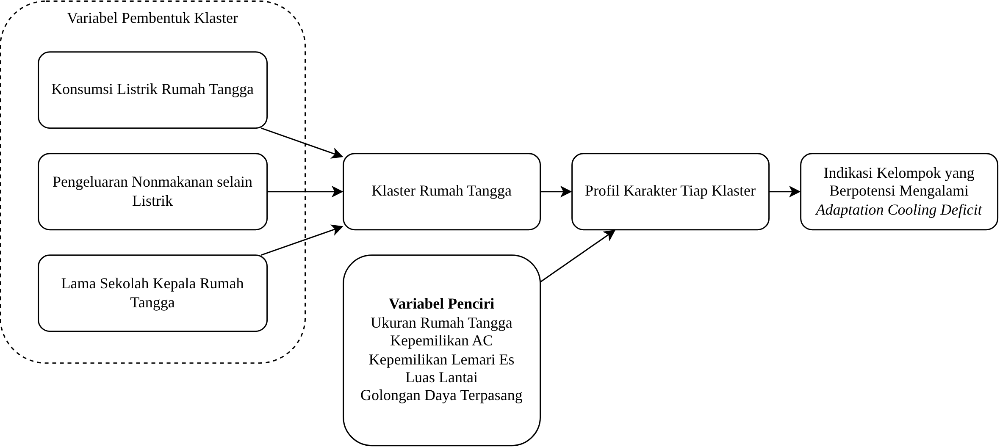

**Gambar 5 Kerangka Pikir Penelitian**

Catatan Gambar 5 (catatan kerja, bukan isi naskah)

Sumber draw.io: `gambar/bab-2/gambar-05-kerangka-pikir.drawio` (dapat dibuka dan diubah di app.diagrams.net); salinan `gambar/bab-2/gambar-05-kerangka-pikir.drawio.svg` juga memuat sumber yang sama. Sesi AX: label variabel pembentuk ketiga diganti dari "Pendidikan Kepala Rumah Tangga" menjadi "Lama Sekolah Kepala Rumah Tangga" agar sama dengan Tabel 2 (Definisi Operasional). Kotak akhir *adaptation cooling deficit* dipertahankan (Opsi A; pasangannya ada di 4.3 dan 5.1).

## 2.4 Hipotesis Penelitian

Hipotesis dirumuskan hanya pada variabel penciri. Perbedaan antarklaster pada variabel pembentuk tidak dirumuskan sebagai hipotesis karena keanggotaan klaster justru ditentukan oleh variabel tersebut, sehingga hasil pengujiannya tidak dapat dijadikan bukti (Everitt et al., 2011). Arah hipotesis disandarkan pada dua temuan empiris. Pavanello et al. (2021) menemukan bahwa di Brasil, India, Indonesia, dan Meksiko, adopsi AC lebih tinggi pada rumah tangga berpendapatan dan berpendidikan lebih tinggi serta berhunian lebih baik. Di India dan Indonesia, pendidikan dan kualitas hunian yang berkorelasi dengan kesejahteraan rumah tangga juga lebih kuat berkaitan dengan adopsi lemari es dan AC. Kubota et al. (2014) menemukan bahwa di Jakarta, konsumsi energi untuk AC sebagai penyumbang utama konsumsi listrik rumah tangga dapat dijelaskan oleh luas lantai dan pendapatan rumah tangga, sedangkan peningkatan pendapatan berkaitan dengan luas lantai yang lebih besar. Berdasarkan landasan teori, penelitian terkait, dan kerangka pikir tersebut, hipotesis penelitian dirumuskan sebagai berikut:

Klaster rumah tangga di Provinsi DKI Jakarta Tahun 2025 dengan konsumsi listrik yang lebih tinggi ditandai oleh proporsi kepemilikan AC dan lemari es yang lebih tinggi serta luas lantai tempat tinggal yang lebih besar dibandingkan klaster lainnya.

---

# BAB III METODOLOGI

## 3.1 Ruang Lingkup Penelitian

Penelitian ini berfokus pada klasifikasi rumah tangga di Provinsi DKI Jakarta Tahun 2025 berdasarkan pola konsumsi listrik dan karakteristik sosial ekonomi. Sumber data utama adalah mikrodata Survei Sosial Ekonomi Nasional (Susenas) Maret 2025 (Badan Pusat Statistik, 2025b). Unit observasi sekaligus unit analisis dalam penelitian ini adalah rumah tangga sampel Susenas Maret 2025 di Provinsi DKI Jakarta, dengan cakupan wilayah seluruh kabupaten dan kota administrasi di provinsi tersebut.

Analisis dibatasi pada rumah tangga pengguna listrik PT PLN (Persero) bermeteran. Pembatasan ini diperlukan karena konsumsi listrik diperoleh dari konversi pengeluaran listrik terhadap tarif menurut golongan daya terpasang, sedangkan rumah tangga pengguna listrik PT PLN (Persero) tanpa meteran dan pengguna listrik non-PLN tidak memiliki golongan tarif yang sah. Variabel pembentuk klaster dibatasi pada tiga variabel, yaitu konsumsi listrik rumah tangga, pengeluaran nonmakanan selain listrik, dan lama sekolah KRT. Lima variabel lainnya, yaitu ukuran rumah tangga, kepemilikan *air conditioner* (AC), kepemilikan lemari es, luas lantai tempat tinggal, dan golongan daya terpasang, tidak ikut membentuk klaster dan digunakan sebagai variabel penciri pada tahap *profiling*.

Hasil pengelompokan diarahkan untuk menggambarkan heterogenitas rumah tangga di wilayah metropolitan DKI Jakarta dan memberikan indikasi mengenai kelompok rumah tangga yang berpotensi mengalami *adaptation cooling deficit*, yaitu keadaan rumah tangga yang membutuhkan pendinginan tetapi tidak mampu memperoleh AC (Pavanello et al., 2021). Penelitian ini tidak mengukur paparan suhu pada tingkat rumah tangga. Karena itu, indikasi tersebut dibaca dari rendahnya kepemilikan AC dan kapasitas ekonomi pada klaster yang terbentuk, bukan sebagai pengukuran langsung atas *adaptation cooling deficit*.

## 3.2 Metode Pengumpulan Data

Jenis data yang digunakan dalam penelitian ini adalah data *cross-section*, sedangkan sumber datanya adalah data sekunder berupa mikrodata Susenas Maret 2025 Provinsi DKI Jakarta yang diterbitkan oleh Badan Pusat Statistik (BPS) (Badan Pusat Statistik, 2025b). Karena menggunakan data sekunder, penelitian ini tidak mengumpulkan data langsung di lapangan. Data diperoleh melalui studi dokumentasi terhadap mikrodata Susenas Maret 2025 beserta *layout* dan keterangan variabel yang menyertainya, sehingga proses pengumpulan datanya mengikuti rancangan survei Susenas yang dilaksanakan oleh BPS.

Variabel penelitian diperoleh dari dua kelompok data dalam mikrodata Susenas Maret 2025. Kelompok pertama adalah data Kuesioner Kor (VSEN25.K), yang terdiri atas keterangan individu dan keterangan rumah tangga. Dari keterangan individu diambil hubungan dengan kepala rumah tangga (R403) untuk mengenali KRT, serta jenjang pendidikan tertinggi yang sedang atau pernah diikuti KRT (R613). Dari keterangan rumah tangga diambil banyaknya anggota rumah tangga (R301), luas lantai tempat tinggal (R1604), sumber penerangan utama (R1616), golongan daya terpasang pada meteran pertama (R1616B1), serta kepemilikan lemari es (R1801B) dan AC (R1801C). Kelompok kedua adalah data Kuesioner Konsumsi dan Pengeluaran (VSEN25.KP) Blok IV.2, yang memuat pengeluaran listrik sebulan terakhir (R234) dan pengeluaran nonmakanan sebulan. Selain variabel tersebut, digunakan pula penimbang rumah tangga yang tersedia pada mikrodata untuk menghasilkan angka deskriptif dan profil klaster yang menggambarkan populasi rumah tangga di Provinsi DKI Jakarta. Kedua kelompok data digabungkan menurut pengenal rumah tangga.

## 3.3 Definisi Operasional

Definisi operasional variabel menjembatani konsep pola konsumsi listrik dan karakteristik sosial ekonomi rumah tangga dengan pengukuran empiris pada mikrodata Susenas Maret 2025. Variabel penelitian dibagi menjadi dua kelompok menurut perannya dalam analisis. Kelompok pertama adalah variabel pembentuk klaster, yaitu variabel yang dipakai untuk menghitung jarak antarrumah tangga pada tahap pengelompokan. Kelompok kedua adalah variabel penciri, yaitu variabel yang tidak ikut membentuk klaster tetapi dipakai untuk membaca karakter klaster yang terbentuk pada tahap *profiling*.

Tiga variabel digunakan sebagai pembentuk klaster, yaitu konsumsi listrik rumah tangga, pengeluaran nonmakanan selain listrik, dan lama sekolah kepala rumah tangga (KRT). Konsumsi listrik rumah tangga diperoleh dari konversi pengeluaran listrik sebulan terakhir terhadap tarif tenaga listrik yang berlaku bagi golongan daya terpasang rumah tangga. Karena diperoleh melalui konversi, variabel ini dibaca sebagai ukuran relatif pemakaian listrik antarrumah tangga, bukan sebagai hasil pencatatan meteran. Pengeluaran nonmakanan selain listrik dipakai sebagai proksi kemampuan belanja rumah tangga di luar kebutuhan pangan. Komponen listrik dikeluarkan dari variabel ini agar informasi yang sama tidak masuk dua kali ke dalam perhitungan jarak. Lama sekolah KRT dinyatakan dalam tahun sekolah ekuivalen yang dikonversi dari jenjang pendidikan tertinggi yang sedang atau pernah diikuti, dengan mengacu pada tabel konversi lama sekolah berdasarkan ijazah terakhir yang digunakan Badan Pusat Statistik dalam penghitungan rata-rata lama sekolah (Badan Pusat Statistik Kota Yogyakarta, 2026). Konsumsi listrik dan pengeluaran nonmakanan selain listrik ditransformasi ke dalam bentuk ln(1 + x) sebelum distandardisasi.

Lima variabel digunakan sebagai penciri, yaitu ukuran rumah tangga, kepemilikan *air conditioner* (AC), kepemilikan lemari es, luas lantai tempat tinggal, dan golongan daya terpasang. Ukuran rumah tangga ditempatkan sebagai penciri sehingga klaster terbentuk dari dimensi konsumsi listrik, kapasitas ekonomi, dan pendidikan, sedangkan besar kecilnya rumah tangga diperiksa setelah klaster terbentuk. Golongan daya terpasang berperan ganda, yaitu sebagai penciri sekaligus sebagai dasar penetapan tarif pada konversi konsumsi listrik. Keterkaitan tersebut membuat golongan daya dibaca sebagai deskripsi karakteristik kelistrikan klaster, bukan sebagai pembanding bebas bagi hasil pengelompokan. Pengeluaran listrik rumah tangga tidak dipakai sebagai pembentuk maupun penciri, melainkan sebagai dasar konversi konsumsi listrik dan disajikan pada analisis deskriptif. Rincian definisi operasional seluruh variabel disajikan pada Tabel 2.

**Tabel 2 Definisi Operasional Variabel Penelitian**

| No. | Variabel | Definisi Operasional | Kode Variabel Susenas Maret 2025 | Satuan/Skala Ukur | Peran dalam Analisis |
|---|---|---|---|---|---|
| 1 | Konsumsi Listrik Rumah Tangga (X₁) | Pengeluaran listrik sebulan terakhir dibagi tarif tenaga listrik menurut golongan daya terpasang, yaitu Rp415,00/kWh (450 VA), Rp605,00/kWh (900 VA), dan Rp1.444,70/kWh (1.300 VA ke atas); digunakan dalam bentuk ln(1 + x) | VSEN25.KP, Blok IV.2 R234; VSEN25.K, R1616B1 | kWh per bulan; rasio | Pembentuk klaster |
| 2 | Pengeluaran Nonmakanan Selain Listrik (X₂) | Total pengeluaran nonmakanan sebulan dikurangi pengeluaran listrik; selisih bernilai negatif diperlakukan sebagai data tidak valid; digunakan dalam bentuk ln(1 + x) | VSEN25.KP, Blok IV.2 subtotal nonmakanan dikurangi R234 | Rupiah per bulan; rasio | Pembentuk klaster |
| 3 | Lama Sekolah KRT (X₃) | Lama sekolah ekuivalen KRT, dikonversi dari jenjang pendidikan tertinggi yang sedang atau pernah diikuti; KRT yang tidak pernah bersekolah bernilai 0 tahun | VSEN25.K, R613 (KRT: R403 = 1) | Tahun; rasio | Pembentuk klaster |
| 4 | Pengeluaran Listrik Rumah Tangga | Nilai pengeluaran rumah tangga untuk pembayaran tagihan listrik atau pembelian token listrik sebulan terakhir | VSEN25.KP, Blok IV.2 R234 | Rupiah per bulan; rasio | Dasar konversi X₁ dan analisis deskriptif |
| 5 | Ukuran Rumah Tangga | Banyaknya anggota rumah tangga | VSEN25.K, R301 | Orang; rasio | Penciri |
| 6 | Kepemilikan AC | Rumah tangga memiliki AC | VSEN25.K, R1801C | Biner (1 = memiliki; 0 = tidak memiliki) | Penciri |
| 7 | Kepemilikan Lemari Es | Rumah tangga memiliki lemari es/kulkas | VSEN25.K, R1801B | Biner (1 = memiliki; 0 = tidak memiliki) | Penciri |
| 8 | Luas Lantai | Luas lantai bangunan tempat tinggal | VSEN25.K, R1604 | m²; rasio | Penciri |
| 9 | Golongan Daya Terpasang | Daya terpasang pada meteran 1, khusus rumah tangga pengguna listrik PT PLN (Persero) bermeteran | VSEN25.K, R1616B1 | Ordinal: 450 VA; 900 VA; 1.300 VA atau lebih (kuesioner mencatat dalam satuan watt) | Penciri (deskriptif) dan dasar penetapan tarif X₁ |

Sumber: Badan Pusat Statistik (2025b) (Diolah); tarif tenaga listrik mengacu pada Kementerian Energi dan Sumber Daya Mineral (2024) dan PT PLN (Persero) (2025).

## 3.4 Metode Analisis

Metode analisis disusun mengikuti urutan ketiga tujuan penelitian. Tujuan pertama, yaitu mendeskripsikan profil konsumsi listrik serta kondisi sosial ekonomi rumah tangga, dijawab dengan analisis deskriptif setelah data melalui persiapan data. Tujuan kedua, yaitu mengelompokkan rumah tangga berdasarkan pola konsumsi listrik dan karakteristik sosial ekonomi, dijawab melalui penetapan variabel pembentuk dan standardisasi data, penetapan ukuran jarak, penentuan jumlah klaster, dan pengelompokan dengan metode *K-Means*. Tujuan ketiga, yaitu menganalisis perbedaan karakteristik sosial ekonomi antarklaster, dijawab melalui *profiling* klaster, yaitu deskripsi kedua klaster pada variabel pembentuk dan variabel penciri, lalu pengujian hipotesis pada variabel penciri. Dengan susunan ini, analisis deskriptif mendahului analisis inferensia, sedangkan pengujian hipotesis ditempatkan paling akhir karena memerlukan klaster yang sudah terbentuk. Alur tahapan analisis disajikan pada Gambar 6.

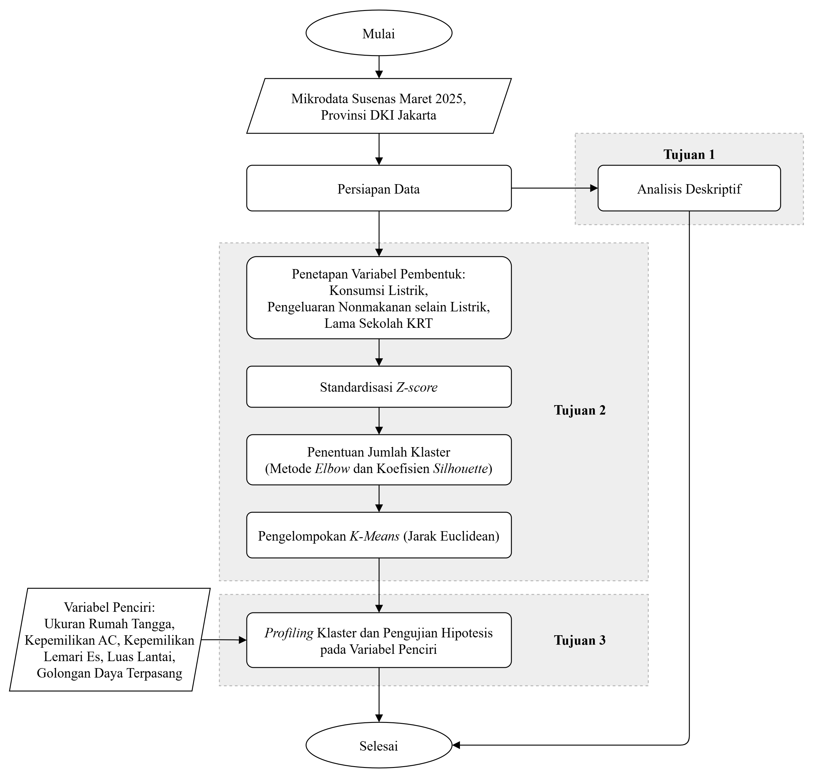

**Gambar 6 Diagram Alur Metode Analisis**

Spesifikasi untuk menggambar ulang Gambar 6 (catatan kerja, bukan isi naskah)

| No. | Bentuk | Teks di dalam kotak | Bagian naskah |
|---|---|---|---|
| 1 | Elips | Mulai | — |
| 2 | Jajar genjang (data) | Mikrodata Susenas Maret 2025, Provinsi DKI Jakarta | 3.2 |
| 3 | Persegi panjang | Persiapan Data | 3.4 Persiapan Data |
| 4 | Persegi panjang (cabang) | Analisis Deskriptif | 3.4 Analisis Deskriptif |
| 5 | Persegi panjang | Penetapan Variabel Pembentuk: Konsumsi Listrik, Pengeluaran Nonmakanan selain Listrik, Lama Sekolah KRT | 3.4 Penetapan Variabel Pembentuk |
| 6 | Persegi panjang | Standardisasi *Z-score* | 3.4 Penetapan Variabel Pembentuk |
| 7 | Persegi panjang | Penentuan Jumlah Klaster (Metode *Elbow* dan Koefisien *Silhouette*) | 3.4 Penentuan Jumlah Klaster |
| 8 | Persegi panjang | Pengelompokan *K-Means* (Jarak Euclidean) | 3.4 Ukuran Jarak; Pengelompokan dengan Metode *K-Means* |
| 9 | Persegi panjang | *Profiling* Klaster dan Pengujian Hipotesis pada Variabel Penciri | 3.4 *Profiling* Klaster |
| 10 | Jajar genjang (data), di samping kotak 9 | Variabel Penciri: Luas Lantai, Kepemilikan AC, Kepemilikan Lemari Es, Golongan Daya Terpasang, Ukuran Rumah Tangga | 3.3 |
| 11 | Elips | Selesai | — |

| Panah dari | Ke | Catatan |
|---|---|---|
| 1 → 2 → 3 | — | Jalur utama |
| 3 | 4 | Cabang deskriptif, keluar dari kotak 3 |
| 4 | 11 | Cabang deskriptif berakhir di Selesai (boleh bergabung dengan panah dari kotak 9) |
| 3 → 5 → 6 → 7 → 8 → 9 → 11 | — | Jalur klaster |
| 10 | 9 | Satu-satunya masuknya variabel penciri; tidak ada panah dari kotak 10 ke kotak 5–8 |

| Penanda tujuan (kurung kurawal atau latar abu-abu muda di sisi kanan) | Mencakup kotak |
|---|---|
| Tujuan 1 | 4 |
| Tujuan 2 | 5–8 |
| Tujuan 3 | 9 |

| Aturan gambar | Isi |
|---|---|
| Warna | Hitam-putih; latar penanda tujuan abu-abu muda |
| Tata letak | Vertikal atas ke bawah |
| Notasi | Pakai nama variabel, bukan X₁–X₃ |
| Istilah asing | *Elbow*, *Silhouette*, *Profiling* ditulis miring |
| Sumber di bawah gambar | Wajib dicantumkan; ikuti format sumber Gambar 5 |
| Catatan revisi | Kotak "Pemeriksaan Pemisahan Klaster pada Variabel Pembentuk" sudah dihapus (Sesi AS); gambar sudah digambar ulang (Sesi AU), sumber draw.io: `gambar/bab-3/gambar-06-diagram-alur.drawio` |

**Persiapan Data**

Persiapan data bertujuan mengubah mikrodata Susenas Maret 2025 menjadi satu himpunan data berunit rumah tangga yang siap dianalisis. Persiapan ini mencakup lima langkah, yaitu integrasi data, konversi pengeluaran listrik menjadi konsumsi listrik, pembentukan variabel turunan lain, pembersihan data, serta transformasi variabel.

Integrasi data dilakukan dengan menggabungkan tiga sumber, yaitu data keterangan individu, data keterangan rumah tangga, dan data konsumsi dan pengeluaran Blok IV.2. Penggabungan memakai pengenal unik rumah tangga yang dibentuk dari kombinasi kode wilayah dan nomor urut rumah tangga. Keterangan pendidikan diambil dari data individu dengan menyaring anggota rumah tangga berstatus kepala rumah tangga, kemudian dilekatkan pada catatan rumah tangga yang bersangkutan. Cakupan analisis dibatasi pada rumah tangga di Provinsi DKI Jakarta, dan penggabungan tersebut menghasilkan 5.079 rumah tangga.

Isian konsumsi listrik dalam satuan kWh pada mikrodata Susenas Maret 2025 tidak terisi pada rumah tangga sampel di Provinsi DKI Jakarta, sedangkan isian pengeluaran listrik bulanan tersedia dan bernilai positif pada seluruh rumah tangga. Oleh karena itu, konsumsi listrik diperoleh dengan membagi pengeluaran listrik bulanan rumah tangga terhadap tarif tenaga listrik yang berlaku bagi golongan daya terpasangnya, yaitu Rp415,00 per kWh untuk golongan 450 VA dan Rp605,00 per kWh untuk golongan 900 VA sebagaimana tercantum pada Lampiran II Peraturan Menteri Energi dan Sumber Daya Mineral Nomor 7 Tahun 2024 (Kementerian Energi dan Sumber Daya Mineral, 2024), serta Rp1.444,70 per kWh untuk golongan 1.300 VA ke atas sebagaimana tercantum pada Penetapan Tarif Tenaga Listrik PT PLN (Persero) Periode Triwulan I Tahun 2025 dengan keterangan tarif tetap (PT PLN (Persero), 2025). Kategori daya terpasang pada kuesioner Susenas Maret 2025 dicatat dalam satuan watt (Badan Pusat Statistik, 2025b), sedangkan kedua ketetapan tarif tersebut menyatakan golongan daya dalam satuan volt-ampere (VA). Setiap kategori kuesioner dicocokkan dengan golongan tarif yang berbatas daya sama, dan naskah ini selanjutnya menuliskan golongan daya dalam satuan VA. Penetapan triwulanan tersebut tidak mencantumkan golongan R-1/TR 450 VA maupun R-1/TR 900 VA bersubsidi, sehingga tarif kedua golongan itu mengikuti Lampiran II Peraturan Menteri. Penetapan tarif menurut golongan daya menghindarkan hasil konversi dari bias sistematis yang timbul bila seluruh rumah tangga diperlakukan menghadapi tarif yang sama, sekaligus memungkinkan rasio pengeluaran listrik antarkelompok berbeda dari rasio konsumsinya.

Dua penyederhanaan melekat pada prosedur tersebut. Pertama, Lampiran II Peraturan Menteri menetapkan dua skema bagi golongan 450 VA dan 900 VA, yaitu tarif reguler berlapis tiga blok disertai biaya beban bulanan dan tarif prabayar bernilai tunggal, sedangkan Susenas tidak mencatat skema yang berlaku bagi tiap rumah tangga, sehingga penelitian ini memakai tarif prabayar bagi kedua golongan tersebut. Kedua, Susenas merekam daya terpasang dalam tiga kategori, sedangkan penetapan tarif memuat tujuh golongan tarif rumah tangga, sehingga kategori 1.300 VA ke atas yang mencakup golongan R-1/1.300 VA, R-1/2.200 VA, R-2/TR, dan R-3/TR–TM diperlakukan seluruhnya pada tarif R-1/1.300 VA. Kedua penyederhanaan tersebut dimuat kembali sebagai butir keterbatasan penelitian.

Langkah berikutnya adalah membentuk variabel turunan lain. Pengeluaran nonmakanan selain listrik dihitung dengan mengurangkan pengeluaran listrik dari total pengeluaran nonmakanan sebulan, dan selisih bernilai negatif diperlakukan sebagai data tidak valid. Pemisahan ini menghindarkan tumpang tindih langsung antara variabel konsumsi listrik dan indikator kapasitas ekonomi rumah tangga, sehingga keduanya berperan sebagai dimensi yang berbeda dalam pembentukan klaster.

Pendidikan KRT dikonversi ke dalam tahun sekolah ekuivalen dengan mengacu pada tabel konversi lama sekolah berdasarkan ijazah terakhir yang digunakan Badan Pusat Statistik, yaitu 0 tahun untuk tidak memiliki ijazah, 6 tahun untuk SD/SDLB/MI/Paket A, 9 tahun untuk SMP/SMPLB/MTs/Paket B, 12 tahun untuk SMA/SMLB/MA/SMK/Paket C, 14 tahun untuk D1/D2, 15 tahun untuk D3/Sarjana Muda, 16 tahun untuk D4/S1, dan 18 tahun untuk S2/S3 (Badan Pusat Statistik Kota Yogyakarta, 2026). Dalam penghitungan rata-rata lama sekolah, nilai konversi tersebut diterapkan pada ijazah terakhir dan dikombinasikan dengan kelas terakhir yang pernah atau sedang diduduki (Badan Pusat Statistik Kota Yogyakarta, 2026). Keterangan ijazah tertinggi dan kelas tertinggi tidak tersedia pada data yang diperoleh, sehingga nilai konversi diterapkan langsung pada jenjang pendidikan tertinggi yang sedang atau pernah diikuti KRT. Akibatnya, KRT yang tidak menamatkan jenjang pendidikannya memperoleh nilai setara lulusan jenjang tersebut, sehingga lama sekolah yang dihasilkan cenderung lebih tinggi daripada lama sekolah menurut ketentuan Badan Pusat Statistik. Jenjang yang tidak tercantum dalam tabel konversi, yaitu satuan pendidikan muadalah dan pendidikan diniyah formal, madrasah aliyah kejuruan, serta program profesi, disetarakan dengan jenjang formal padanannya. Program profesi diberi nilai 16 tahun sebagaimana S1 karena program profesi ditempuh setelah program sarjana. Penyetaraan ini hanya menyangkut tujuh KRT.

Rumah tangga yang tidak tersambung pada meteran PT PLN (Persero) tidak memiliki golongan tarif yang sah, sehingga konsumsi listriknya tidak dapat diperoleh melalui prosedur di atas. Sebanyak 78 rumah tangga berada pada keadaan tersebut dan dikeluarkan dari analisis, sehingga jumlah rumah tangga yang dianalisis menjadi 5.001 dengan sebaran golongan daya 553 rumah tangga pada 450 VA, 1.573 rumah tangga pada 900 VA, dan 2.875 rumah tangga pada 1.300 VA ke atas. Pembersihan berikutnya dilakukan dengan kriteria kelengkapan dan kewajaran nilai. Rumah tangga dipertahankan dalam analisis apabila memiliki penimbang yang sah bernilai positif, nilai pengeluaran listrik dan konsumsi listrik yang tidak hilang serta tidak negatif, total pengeluaran nonmakanan bernilai positif, pengeluaran nonmakanan selain listrik tidak negatif, ukuran rumah tangga bernilai positif, keterangan pendidikan kepala rumah tangga tersedia, dan keterangan kepemilikan *air conditioner* bernilai biner. Kepala rumah tangga dengan kode jenjang pendidikan 0, yaitu kode yang tidak tercantum dalam daftar kategori jenjang pendidikan, diperlakukan sebagai tidak pernah bersekolah sehingga diberi nilai 0 tahun. Seluruh 5.001 rumah tangga tersebut memenuhi kriteria pembersihan, sehingga tidak ada rumah tangga yang dikeluarkan pada tahap ini.

Transformasi variabel dilakukan dalam dua tahap berurutan. Tahap pertama adalah *winsorizing* pada persentil ke-1 dan ke-99, yaitu penggantian nilai di bawah persentil ke-1 dengan nilai persentil ke-1 dan nilai di atas persentil ke-99 dengan nilai persentil ke-99. Nama perlakuan ini merujuk pada penduga *Winsorized*, yaitu penduga yang mengganti nilai ekstrem dengan nilai terdekat berikutnya (Dixon, 1960, hlm. 385). Perlakuan ini diterapkan pada konsumsi listrik, pengeluaran listrik, pengeluaran nonmakanan, pengeluaran nonmakanan selain listrik, serta ukuran rumah tangga. Langkah ini diambil sebagai pengaman karena *K-Means* memilih partisi yang meminimumkan jumlah kuadrat jarak setiap pengamatan terhadap *centroid* klasternya, yaitu *trace*(**W**), sehingga pengamatan yang letaknya sangat jauh dari kelompoknya memperoleh bobot besar dalam kriteria tersebut. Ketahanan terhadap pencilan merupakan salah satu alasan algoritme *k-median* sering diusulkan sebagai alternatif *K-Means* (Everitt et al., 2011, hlm. 126). Berbeda dengan pembuangan pengamatan, *winsorizing* tidak membuang nilai terkecil dan terbesar, melainkan menyamakannya dengan nilai terdekat yang tidak terpotong pada tingkat yang ditetapkan sebelum analisis, sehingga pengaruh nilai ekstrem tertahan tanpa mengurangi jumlah rumah tangga yang dianalisis (Mair & Wilcox, 2020, hlm. 465). Nilai lama sekolah KRT tidak dikenai *winsorizing* karena rentangnya telah terbatas secara alami oleh jenjang pendidikan formal.

Tahap kedua adalah transformasi logaritma natural berbentuk ln(1 + x) terhadap konsumsi listrik dan pengeluaran nonmakanan selain listrik hasil *winsorizing*. Kedua variabel tersebut merupakan variabel moneter dan volume yang sebarannya menceng ke kanan, sehingga tanpa transformasi jarak antarrumah tangga akan didominasi oleh selisih pada nilai-nilai besar. Bentuk ln(1 + x) dipilih, bukan logaritma biasa, karena terdapat rumah tangga dengan nilai nol yang tidak terdefinisi pada logaritma biasa. Lama sekolah KRT, sebagai satu-satunya variabel pembentuk klaster yang tidak bersifat moneter, dipakai pada skala aslinya karena rentang nilainya sempit dan sebarannya tidak menceng. Hasil transformasi inilah yang kemudian distandardisasi.

**Analisis Deskriptif**

Analisis deskriptif digunakan untuk menjawab tujuan pertama penelitian, yaitu memberikan gambaran umum mengenai konsumsi listrik dan karakteristik sosial ekonomi rumah tangga di Provinsi DKI Jakarta Tahun 2025. Johnson dan Wichern (2014) menjelaskan bahwa statistik deskriptif penting untuk meringkas dan menampilkan pola dasar dalam data multivariat sebelum dilakukan analisis lanjutan. Variabel yang dideskripsikan meliputi konsumsi listrik rumah tangga, konsumsi listrik per kapita, pengeluaran listrik, pengeluaran nonmakanan selain listrik, pangsa pengeluaran listrik terhadap pengeluaran nonmakanan, lama sekolah KRT, dan ukuran rumah tangga. Ukuran ringkasan yang disajikan adalah rata-rata, simpangan baku, nilai minimum, dan nilai maksimum sampel, serta rata-rata tertimbang beserta *standard error*-nya. Rata-rata tertimbang dihitung dengan penimbang rumah tangga Susenas agar angka yang disajikan menggambarkan populasi rumah tangga di Provinsi DKI Jakarta, sedangkan statistik sampel disajikan untuk menggambarkan data yang secara langsung masuk ke tahap pengelompokan. Hasil deskriptif juga disajikan dalam bentuk grafik, yaitu histogram sebaran konsumsi listrik dan diagram pencar antara pengeluaran nonmakanan selain listrik dan konsumsi listrik.

**Penetapan Variabel Pembentuk dan Standardisasi Data**

Pemilihan variabel yang dimasukkan ke dalam perhitungan jarak merupakan salah satu bentuk pembobotan variabel. Variabel yang tidak dimasukkan pada dasarnya diberi bobot nol, sedangkan standardisasi ke ragam satuan merupakan kasus khusus dari pembobotan tersebut (Everitt et al., 2011, hlm. 63). Dengan jarak Euclidean atas data terstandardisasi, setiap variabel pembentuk memperoleh bobot yang setara dalam menentukan kedekatan antarrumah tangga. Karena itu, keputusan memasukkan suatu variabel sekaligus menentukan dimensi yang memisahkan klaster. Everitt et al. (2011, hlm. 261) menyarankan agar suatu variabel hanya dimasukkan apabila terdapat alasan kuat bahwa variabel tersebut mendefinisikan klaster yang dicari. Pertimbangan subjektif peneliti juga sebaiknya dibatasi pada tahap pemilihan variabel awal, dengan pemilihan yang mencerminkan relevansi variabel terhadap tujuan klasifikasi (Everitt et al., 2011, hlm. 67).

Tujuan klasifikasi dalam penelitian ini adalah mengelompokkan rumah tangga menurut pola konsumsi listrik dan karakteristik sosial ekonominya. Tiga variabel ditetapkan sebagai pembentuk klaster, yaitu konsumsi listrik rumah tangga, pengeluaran nonmakanan selain listrik sebagai proksi kapasitas ekonomi, dan lama sekolah KRT. Ukuran rumah tangga tidak dimasukkan ke dalam perhitungan jarak karena dua alasan. Pertama, ukuran rumah tangga mencerminkan skala kebutuhan domestik, bukan kapasitas ekonomi maupun modal manusia rumah tangga. Bila ukuran rumah tangga dimasukkan dengan bobot setara, ukuran rumah tangga ikut menentukan batas klaster dengan bobot yang sama besar dengan kapasitas ekonomi. Akibatnya, dua rumah tangga dengan kapasitas ekonomi dan pendidikan yang serupa dapat terpisah ke klaster berbeda hanya karena jumlah anggotanya berbeda. Kedua, Kubota et al. (2014) memang mengelompokkan rumah tangga di Jakarta dan Bandung menurut skor faktor kesejahteraan dan ukuran rumah tangga, tetapi sasarannya adalah konsumsi energi rumah tangga secara keseluruhan, termasuk LPG. Pada hasil penelitian yang sama untuk Jakarta, ukuran rumah tangga muncul sebagai penjelas konsumsi LPG. Sebaliknya, konsumsi energi AC sebagai penyumbang utama konsumsi listrik rumah tangga dijelaskan oleh luas lantai, pendapatan rumah tangga, dan usia suami (Kubota et al., 2014). Karena objek penelitian ini adalah konsumsi listrik, ukuran rumah tangga ditempatkan sebagai variabel penciri. Penempatan tersebut tidak menyangkal temuan Ali et al. (2021) mengenai hubungan positif antara ukuran rumah tangga dan konsumsi listrik. Hubungan ukuran rumah tangga dengan klaster yang terbentuk tetap diperiksa dan dilaporkan pada tahap *profiling*.

Penetapan tersebut diperiksa secara empiris dengan membandingkan tiga spesifikasi variabel pembentuk. Spesifikasi pertama (S0) memuat empat variabel, termasuk ukuran rumah tangga. Spesifikasi kedua (S1) memuat tiga variabel dalam bentuk per kapita. Spesifikasi ketiga (S2) memuat tiga variabel dalam bentuk total per rumah tangga. Setiap spesifikasi dijalankan dengan dan tanpa *winsorizing* pada dua hingga lima klaster, sehingga diperoleh 24 kombinasi yang seluruhnya disajikan pada Lampiran 1. Pembandingan antarspesifikasi memakai tiga kriteria berurutan. Kriteria pertama adalah keeratan hubungan antara keanggotaan klaster dan kepemilikan AC, yaitu variabel yang tidak ikut membentuk klaster pada spesifikasi mana pun, diukur dengan *Cramér's V*. Kriteria kedua adalah syarat bahwa klaster terkecil memuat sekurang-kurangnya 10 persen rumah tangga. Kriteria ketiga adalah rata-rata koefisien *silhouette*, yang dipakai sebagai penentu apabila dua kriteria pertama tidak membedakan. Jumlah klaster tidak dipilih melalui pembandingan ini, melainkan melalui metode *elbow* dan koefisien *silhouette*. Oleh karena itu, pembandingan antarspesifikasi dilakukan pada jumlah klaster yang sama.

Pada dua klaster, yaitu jumlah klaster dengan rata-rata koefisien *silhouette* tertinggi pada ketiga spesifikasi, nilai *Cramér's V* untuk kepemilikan AC bernilai 0,545 pada S0, 0,436 pada S1, dan 0,553 pada S2. Klaster terkecil pada ketiga spesifikasi memuat lebih dari 33 persen rumah tangga. Ada atau tidaknya *winsorizing* hampir tidak mengubah hasil tersebut. Pada S2 dengan dua klaster, rata-rata koefisien *silhouette* bernilai 0,3640 dengan *winsorizing* dan 0,3627 tanpa *winsorizing*, dengan klaster terkecil masing-masing memuat 33,43 dan 33,15 persen rumah tangga (Lampiran 1). Pengeluaran ukuran rumah tangga dari variabel pembentuk (S0 menjadi S2) tidak melemahkan hubungan klaster dengan kepemilikan AC. Sebaliknya, pengubahan variabel ke bentuk per kapita (S1) melemahkan hubungan tersebut secara jelas. Atas dasar itu, S2 ditetapkan sebagai spesifikasi variabel pembentuk. Konsumsi listrik dan pengeluaran nonmakanan selain listrik dipertahankan dalam bentuk total per rumah tangga, sejalan dengan unit analisis penelitian. Kepemilikan AC dipakai sebagai kriteria pemilihan spesifikasi, sehingga perbedaan kepemilikan AC antarklaster tidak sepenuhnya bebas dari proses pemilihan tersebut. Karena itu, kepemilikan lemari es dan luas lantai, yang tidak dipakai pada tahap mana pun sebelum *profiling*, menjadi pembanding yang sepenuhnya independen.

Setelah variabel pembentuk ditetapkan, ketiga variabel distandardisasi karena memiliki satuan pengukuran yang berbeda. Standardisasi bertujuan menyamakan skala antarvariabel agar tidak terjadi dominasi variabel tertentu dalam perhitungan jarak. Everitt et al. (2011) menegaskan bahwa standardisasi relevan ketika variabel memiliki skala yang berbeda, karena perhitungan jarak dari data mentah dapat menjadi tidak proporsional. Metode standardisasi yang digunakan adalah transformasi *Z-score*, yaitu:

$$Z_{ij}=\frac{x_{ij}-\bar{x}_j}{s_j},\quad j=1,2,3 \tag{3.1}$$

dengan:

- $Z_{ij}$ = nilai standar variabel ke-$j$ pada observasi ke-$i$,
- $x_{ij}$ = nilai variabel ke-$j$ pada observasi ke-$i$ setelah tahap persiapan data,
- $\bar{x}_j$ = rata-rata variabel ke-$j$,
- $s_j$ = simpangan baku variabel ke-$j$.

Standardisasi diterapkan pada tiga variabel pembentuk klaster, yaitu ln(1 + konsumsi listrik), ln(1 + pengeluaran nonmakanan selain listrik), dan lama sekolah KRT.

**Ukuran Jarak**

Pembentukan klaster memerlukan ukuran kemiripan (jarak) antarobjek. Untuk variabel kuantitatif kontinu, ukuran jarak yang umum digunakan adalah jarak Euclidean. Everitt et al. (2011) menjelaskan bahwa untuk data kontinu, ukuran *dissimilarity* berbasis jarak merupakan dasar penting dalam analisis klaster, sedangkan Johnson dan Wichern (2014) menempatkan metode jarak sebagai komponen utama dalam pengelompokan nonhierarki. Dalam penelitian ini, jarak Euclidean antara rumah tangga ke-$i$ dan rumah tangga ke-$l$ dirumuskan sebagai:

$$d(\mathbf{Z}_i,\mathbf{Z}_l)=\sqrt{\sum_{j=1}^{3}\left(Z_{ij}-Z_{lj}\right)^2} \tag{3.2}$$

dengan:

- $d(\mathbf{Z}_i,\mathbf{Z}_l)$ = jarak Euclidean antara rumah tangga ke-$i$ dan rumah tangga ke-$l$,
- $Z_{ij}$ = nilai standar variabel ke-$j$ pada rumah tangga ke-$i$,
- $Z_{lj}$ = nilai standar variabel ke-$j$ pada rumah tangga ke-$l$,
- $j = 1, 2, 3$ = indeks variabel pembentuk klaster.

**Penentuan Jumlah Klaster**

Salah satu keputusan dalam metode nonhierarki adalah penentuan jumlah klaster K. Pada sebagian besar penerapan metode nonhierarki, jumlah klaster tidak diketahui sebelumnya sehingga peneliti harus menentukannya sendiri, dan pendekatan yang paling lazim adalah memplot nilai kriteria pengelompokan terhadap jumlah kelompok untuk mencari titik terjadinya perubahan besar pada kurva (Everitt et al., 2011). Dalam penelitian ini, jumlah klaster ditentukan menggunakan metode *elbow*, yaitu dengan membandingkan nilai WCSS pada beberapa kandidat K. Nilai K dipilih pada titik ketika penurunan WCSS mulai melandai dan membentuk pola siku (*elbow*). Pembacaan titik siku secara visual mengandung unsur subjektif, karena besar kecilnya perubahan pada kurva bergantung pada penilaian peneliti (Everitt et al., 2011). Karena keterbatasan tersebut, hasil metode *elbow* tidak dipakai sendirian, tetapi dibandingkan dengan koefisien *silhouette*.

Selain metode *elbow*, penentuan jumlah klaster juga menggunakan koefisien *silhouette*. Perhitungan dilakukan pada data yang telah distandardisasi menggunakan jarak Euclidean, sesuai dengan ukuran jarak yang digunakan dalam proses pembentukan klaster. Rata-rata koefisien *silhouette* dihitung untuk setiap kandidat jumlah klaster, kemudian dibandingkan untuk melihat konfigurasi yang menghasilkan pemisahan kelompok paling kuat.

Jumlah klaster akhir ditetapkan dengan mempertimbangkan tiga hal secara bersamaan, yaitu pola siku pada kurva WCSS, nilai rata-rata koefisien *silhouette* tertinggi, dan keterbacaan hasil klaster secara substantif. Apabila hasil metode *elbow* dan koefisien *silhouette* menunjuk pada jumlah klaster yang berbeda, keputusan diambil dengan mengutamakan konfigurasi yang menghasilkan profil klaster yang paling dapat diinterpretasikan dalam konteks pola konsumsi listrik dan karakteristik sosial ekonomi rumah tangga, disertai penjelasan atas pertimbangan tersebut.

**Pengelompokan dengan Metode *K-Means***

Pembentukan klaster rumah tangga dilakukan menggunakan metode *K-Means*, yaitu metode klaster nonhierarki yang bersifat *unsupervised*. Johnson dan Wichern (2014) menjelaskan bahwa metode nonhierarki membentuk kumpulan klaster dengan mengalokasikan setiap objek ke *centroid* klaster yang terdekat, sedangkan Everitt et al. (2011) menempatkan *K-Means* sebagai bagian dari metode nonhierarki yang meminimalkan variasi dalam klaster. Metode ini dipilih karena penelitian bertujuan mengelompokkan rumah tangga ketika label kelompok belum tersedia sebelumnya, dengan variabel pembentuk klaster berupa variabel kuantitatif kontinu yang telah distandardisasi. Selain itu, *K-Means* termasuk algoritme pengelompokan yang paling sering digunakan karena konvergensinya cepat dan prosedurnya sederhana (Hassan et al., 2021, hlm. 90).

Fungsi objektif yang diminimalkan dalam metode ini adalah WCSS, yaitu:

$$WCSS=\sum_{k=1}^{K}\sum_{i\in C_k}\sum_{j=1}^{3}\left(Z_{ij}-\bar{Z}_{kj}\right)^2 \tag{3.3}$$

dengan:

- $K$ = jumlah klaster,
- $C_k$ = himpunan rumah tangga pada klaster ke-$k$,
- $\bar{Z}_{kj}$ = nilai *centroid* klaster ke-$k$ pada variabel ke-$j$.

*Centroid* klaster ke-$k$ dihitung sebagai rata-rata seluruh anggota klaster tersebut, yaitu:

$$\bar{\mathbf{Z}}_k=\frac{1}{n_k}\sum_{i\in C_k}\mathbf{Z}_i \tag{3.4}$$

dengan $n_k$ = banyaknya rumah tangga pada klaster ke-$k$.

Algoritme *K-Means* dilakukan secara iteratif melalui langkah-langkah:

1. menentukan jumlah klaster $K$,
2. menginisialisasi centroid awal,
3. mengalokasikan setiap objek ke klaster dengan centroid terdekat,
4. memperbarui centroid berdasarkan rata-rata anggota klaster,
5. mengulangi langkah 3 dan 4 sampai konvergen.

Everitt et al. (2011, hlm. 125–126) juga menekankan bahwa hasil *K-Means* dapat dipengaruhi oleh nilai awal, sehingga penggunaan beberapa inisialisasi dan pemilihan solusi dengan kriteria terbaik merupakan praktik yang lebih baik. Oleh karena itu, dalam penelitian ini *K-Means* final dijalankan dengan 100 inisialisasi acak dan batas 1.000 iterasi, lalu dipilih solusi dengan nilai WCSS terendah; bilangan acak awal ditetapkan agar hasil dapat direproduksi.

***Profiling* Klaster dan Pengujian Hipotesis pada Variabel Penciri**

Pada tahap terakhir, karakter setiap klaster diuraikan dan hipotesis penelitian diuji. Variabel pembentuk hanya dideskripsikan melalui *centroid* dan statistik profil, tanpa uji statistik, karena teknik pengelompokan dengan sendirinya telah memaksimalkan perbedaan antarklaster pada variabel tersebut sehingga uji statistik baku seperti analisis ragam tidak tepat dipakai untuk membandingkannya (Everitt et al., 2011, hlm. 262). Oleh karena itu, pengujian hanya diterapkan pada variabel penciri, yaitu variabel yang tidak dipakai algoritme *K-Means* dalam membentuk klaster. Lima variabel penciri diperiksa, yaitu luas lantai tempat tinggal, kepemilikan *air conditioner* (AC), kepemilikan lemari es, golongan daya terpasang, dan ukuran rumah tangga, tetapi kedudukan kelimanya tidak sama. Hipotesis penelitian hanya menyangkut kepemilikan AC, kepemilikan lemari es, dan luas lantai, sehingga hanya ketiga variabel tersebut yang menjadi dasar keputusan hipotesis. Di antara ketiganya, kepemilikan AC telah dipakai sebagai kriteria pemilihan spesifikasi variabel pembentuk, sehingga bukti yang berasal dari variabel ini tidak sepenuhnya bebas dari proses pembentukan klaster; kepemilikan lemari es dan luas lantai, yang tidak dipakai pada tahap mana pun sebelum *profiling*, menjadi pembanding yang sepenuhnya bebas. Golongan daya terpasang dipakai pada tahap persiapan data untuk menetapkan tarif konversi pengeluaran listrik menjadi konsumsi listrik, sehingga ikut menentukan nilai variabel pembentuk pertama. Ukuran rumah tangga dikeluarkan dari variabel pembentuk dan diperiksa untuk memastikan bahwa perbedaan antarklaster tidak bersumber dari perbedaan jumlah penghuni. Dengan demikian, kedua variabel terakhir tetap diuji, tetapi dilaporkan sebagai deskripsi karakter klaster, bukan sebagai bukti hipotesis.

*Profiling* dilakukan dengan menghitung statistik ringkas setiap klaster pada variabel pembentuk dan variabel penciri. Statistik yang dihitung meliputi jumlah rumah tangga sampel dan jumlah rumah tangga tertimbang, rata-rata tertimbang untuk variabel numerik, persentase tertimbang untuk variabel kategorik, serta median tanpa penimbang sebagai pembanding bagi variabel yang sebarannya menceng ke kanan. Penimbang sampling didefinisikan sebagai kebalikan dari peluang terpilih suatu unit, dan pada survei berskala besar lazim memuat penyesuaian atas ketidakterjawaban (Lumley & Scott, 2012, hlm. 7); penelitian ini memakai penimbang rumah tangga yang tersedia pada mikrodata Susenas Maret 2025. Penimbang hanya berperan pada tahap pelaporan. Klaster dibentuk tanpa penimbang, sedangkan statistik profil dihitung dengan penimbang agar menggambarkan rumah tangga di Provinsi DKI Jakarta, bukan semata rumah tangga yang terpilih dalam sampel. Median disajikan tanpa penimbang karena fungsinya terbatas pada menunjukkan seberapa jauh rata-rata tertarik oleh rumah tangga bernilai sangat tinggi. Luas lantai ditangani dengan *winsorizing* pada persentil ke-1 dan ke-99 sebelum dihitung rata-ratanya, dengan alasan yang sama seperti pada variabel pembentuk, yaitu agar segelintir tempat tinggal yang sangat luas tidak menarik rata-rata klaster secara berlebihan tanpa harus mengeluarkan rumah tangga tersebut dari analisis.

Hipotesis penelitian bersifat berarah, yaitu klaster dengan konsumsi listrik lebih tinggi memiliki proporsi kepemilikan AC dan lemari es yang lebih tinggi serta luas lantai yang lebih besar. Oleh karena itu, pengujiannya disusun dalam dua bagian. Bagian pertama menilai signifikansi perbedaan antarklaster pada setiap variabel penciri, dengan hipotesis nol bahwa sebaran variabel tersebut sama pada seluruh klaster dan hipotesis alternatif bahwa sebarannya berbeda sekurang-kurangnya pada satu klaster. Bagian kedua menilai arah perbedaan dari statistik profil, yaitu apakah persentase kepemilikan dan rata-rata luas lantai lebih tinggi pada klaster dengan konsumsi listrik lebih tinggi. Hipotesis penelitian dinyatakan didukung apabila ketiga variabel penciri berbeda signifikan pada taraf nyata 1 persen dan ketiganya menunjukkan arah yang dinyatakan dalam hipotesis. Setiap uji dijalankan dalam dua versi, yaitu tanpa penimbang dan dengan penimbang berbasis desain survei. Versi dengan penimbang dijadikan dasar keputusan karena hipotesis menyangkut rumah tangga di Provinsi DKI Jakarta, sedangkan versi tanpa penimbang dilaporkan berdampingan karena klaster dibentuk tanpa penimbang. Kesesuaian kesimpulan kedua versi dipakai untuk menunjukkan bahwa keputusan hipotesis tidak bergantung pada pilihan memakai atau tidak memakai penimbang.

Perbedaan antarklaster pada kepemilikan AC, kepemilikan lemari es, dan golongan daya terpasang diuji dengan uji independensi *chi-square* Pearson atas tabel kontingensi antara klaster dan kategori variabel penciri:

$$\chi^2=\sum_{k=1}^{K}\sum_{j=1}^{J}\frac{\left(O_{kj}-E_{kj}\right)^2}{E_{kj}},\qquad E_{kj}=\frac{n_{k\cdot}\,n_{\cdot j}}{n} \tag{3.5}$$

dengan $O_{kj}$ banyaknya rumah tangga pada klaster ke-$k$ dan kategori ke-$j$, $E_{kj}$ frekuensi harapan di bawah hipotesis nol, $n_{k\cdot}$ dan $n_{\cdot j}$ jumlah baris ke-$k$ dan jumlah kolom ke-$j$, $J$ banyaknya kategori variabel penciri, dan $n$ banyaknya seluruh rumah tangga. Di bawah hipotesis nol, $\chi^2$ mendekati distribusi *chi-square* dengan derajat bebas $(K-1)(J-1)$ (Fisher, 1922, hlm. 88). Statistik dihitung tanpa koreksi kontinuitas Yates. Karena Persamaan (3.5) hanya disusun dari frekuensi sampel, versi dengan penimbang memakai fungsi `svychisq` pada *package* `survey` dalam R. Penyesuaian ini diperlukan karena pada rancangan sampel survei yang tidak memenuhi asumsi pengambilan sampel multinomial, misalnya karena pengelompokan rumah tangga dalam *primary sampling unit* (PSU) dan stratifikasi, statistik *chi-square* Pearson tidak lagi berdistribusi *chi-square*, melainkan berdistribusi sebagai jumlah tertimbang variabel acak *chi-square* berderajat bebas satu dengan bobot berupa efek desain tergeneralisasi (Rao & Scott, 1984, hlm. 50–51). Fungsi tersebut menyediakan koreksi Rao–Scott orde pertama, yang membagi statistik *chi-square* Pearson dengan rata-rata efek desain (Rao & Scott, 1984, hlm. 53), dan orde kedua, yang turut menyesuaikan derajat bebas menurut koefisien variasi efek desain (Rao & Scott, 1984, hlm. 52). Penelitian ini memakai pilihan `statistic = "F"`, yaitu pilihan bawaan fungsi tersebut, yang menerapkan koreksi Rao–Scott orde kedua dan menghitung *p-value* dengan pendekatan Satterthwaite terhadap sebaran statistiknya (Lumley, 2024).

Besaran hubungan antara keanggotaan klaster dan setiap variabel penciri kategorik diukur dengan *Cramér's V* (Cramér, 1946, dalam Bergsma, 2013, Bagian 1):

$$V=\sqrt{\frac{\chi^2}{n\left(\min(K,J)-1\right)}} \tag{3.6}$$

dengan $\chi^2$ statistik *chi-square* Pearson tanpa penimbang menurut Persamaan (3.5). Bentuk ini setara dengan definisi baku $V$ karena $n\left(\min(K,J)-1\right)V^2$ sama dengan statistik *chi-square* Pearson (Bergsma, 2013, Bagian 3). Nilai $\chi^2$ membesar seiring bertambahnya ukuran sampel, sedangkan $V$ membagi $\chi^2$ dengan $n$, sehingga besaran hubungan antarvariabel penciri yang diuji pada sampel yang sama dapat dibandingkan. Koefisien $V$ dipakai untuk mengurutkan kekuatan hubungan antarvariabel penciri dan tidak dibandingkan dengan ambang kategori tertentu.

Luas lantai dan ukuran rumah tangga merupakan variabel numerik yang sebarannya menceng ke kanan, sehingga perbedaannya diuji dengan uji Kruskal–Wallis (Kruskal & Wallis, 1952). Uji berbasis peringkat dipilih karena uji ini hanya mengandaikan pengamatan yang saling bebas dan sebaran antarklaster yang berbentuk serupa, tanpa mengandaikan kenormalan (Kruskal & Wallis, 1952, hlm. 585). Statistik uji dirumuskan sebagai berikut:

$$H=\frac{12}{N(N+1)}\sum_{k=1}^{K}\frac{R_k^2}{n_k}-3(N+1) \tag{3.7}$$

dengan $R_k$ jumlah peringkat seluruh rumah tangga pada klaster ke-$k$, $n_k$ banyaknya rumah tangga pada klaster ke-$k$, $K$ banyaknya klaster, dan $N$ banyaknya seluruh rumah tangga. Nilai yang sama (*ties*) diberi peringkat rata-rata, lalu statistik $H$ dibagi dengan faktor koreksi $1-\sum T/(N^3-N)$, dengan $T=t^3-t$ dan $t$ banyaknya pengamatan dalam satu kelompok nilai yang sama (Kruskal & Wallis, 1952, hlm. 586–587); koreksi ini terutama relevan bagi ukuran rumah tangga yang hanya mengambil sedikit nilai berbeda. Di bawah hipotesis nol, $H$ mendekati distribusi *chi-square* dengan derajat bebas $K-1$ apabila ukuran setiap klaster tidak terlalu kecil (Kruskal & Wallis, 1952, hlm. 586).

Versi dengan penimbang diterapkan pada kedua variabel tersebut dengan uji Kruskal–Wallis berbasis desain (Lumley & Scott, 2012); pada luas lantai uji ini menjadi dasar keputusan hipotesis, sedangkan pada ukuran rumah tangga uji ini dipakai untuk memeriksa apakah kesimpulan uji tanpa penimbang tetap bertahan setelah rancangan sampel diperhitungkan. Uji peringkat baku memakai peringkat sampel, padahal peringkat sampel sama dengan peringkat populasi hanya bila setiap unit memiliki peluang terpilih yang sama (Lumley & Scott, 2012, hlm. 8), dan uji yang disusun dari peringkat sampel tidak bersifat berbasis desain karena hasilnya bergantung pada rancangan sampel (Lumley & Scott, 2012, hlm. 11). Versi berbasis desain menggantinya dengan dugaan peringkat tengah populasi (Lumley & Scott, 2012, hlm. 7–8):

$$\hat{R}_i=\frac{1}{\hat{N}}\sum_{j\in s}\left[w_j\,I\left(Y_j<Y_i\right)+0{,}5\,w_j\,I\left(Y_j=Y_i\right)\right],\qquad \hat{N}=\sum_{j\in s}w_j \tag{3.8}$$

dengan $Y_i$ luas lantai rumah tangga ke-$i$, $w_j$ penimbang rumah tangga ke-$j$, $s$ himpunan rumah tangga sampel, dan $I(\cdot)$ fungsi indikator yang bernilai satu apabila syarat di dalamnya terpenuhi. Rata-rata tertimbang $\hat{R}_i$ kemudian dibandingkan antarklaster. Untuk dua kelompok, uji ini dijalankan sebagai uji t tertimbang atas dugaan peringkat tersebut (Lumley & Scott, 2012, hlm. 9), sedangkan untuk lebih dari dua kelompok dijalankan sebagai analisis ragam satu arah tertimbang (Lumley & Scott, 2012, hlm. 19). Sebaran rujukannya adalah sebaran t dengan derajat bebas sebesar banyaknya PSU dikurangi banyaknya strata (Lumley & Scott, 2012, hlm. 9). Uji ini dijalankan dengan fungsi `svyranktest` pada *package* `survey` dengan pilihan `test = "KruskalWallis"`.

Seluruh perhitungan tertimbang dijalankan dengan *package* `survey` dalam R (Lumley, 2024). Rancangan sampel dispesifikasikan dengan tiga unsur rancangan Susenas, yaitu PSU, strata, dan penimbang rumah tangga. Pilihan `nest = TRUE` dipakai agar PSU yang memiliki kode sama pada strata berbeda diperlakukan sebagai PSU yang berbeda (Lumley, 2024). Pada 5.001 rumah tangga yang dianalisis terdapat 6 strata dan 512 PSU. Dengan spesifikasi tersebut, *standard error* dan statistik uji tertimbang memperhitungkan ketidaksamaan penimbang sekaligus pengelompokan rumah tangga di dalam PSU. Hasil *profiling* dan pengujian tersebut menjadi dasar penamaan deskriptif setiap klaster.

---

# BAB IV HASIL DAN PEMBAHASAN

Pembahasan hasil penelitian mengikuti urutan tujuan penelitian, dimulai dari gambaran umum konsumsi listrik dan karakteristik sosial ekonomi rumah tangga, dilanjutkan dengan pembentukan klaster menggunakan metode *K-Means*, lalu diakhiri dengan perbedaan karakteristik antarklaster beserta pengujian hipotesis pada variabel penciri.

Penggabungan data keterangan individu, keterangan rumah tangga, dan pengeluaran Blok IV.2 menghasilkan 5.079 rumah tangga di Provinsi DKI Jakarta, dan seluruhnya memiliki keterangan pendidikan kepala rumah tangga yang dapat dikonversi menjadi lama sekolah. Sebanyak 78 rumah tangga atau 1,54 persen tidak memiliki keterangan golongan daya terpasang sehingga konsumsi listriknya tidak dapat diperoleh dan dikeluarkan dari analisis. Kelompok ini memiliki rata-rata ukuran rumah tangga 2,64 orang, lama sekolah KRT 9,62 tahun, pengeluaran listrik Rp166.397 per bulan, dan kepemilikan AC 10,3 persen. Ketiga rata-rata pertama lebih rendah daripada rata-rata rumah tangga yang dianalisis pada Tabel 3, sehingga hasil penelitian ini tidak mewakili rumah tangga tanpa golongan daya terpasang. Kriteria pembersihan lainnya tidak menggugurkan rumah tangga tambahan, sehingga analisis mencakup 5.001 rumah tangga dengan sebaran golongan daya 553 rumah tangga pada 450 VA, 1.573 rumah tangga pada 900 VA, dan 2.875 rumah tangga pada 1.300 VA atau lebih.

Perlu diingat bahwa konsumsi listrik yang dianalisis bukan kWh aktual hasil pencatatan meter rumah tangga, melainkan hasil konversi pengeluaran listrik bulanan terhadap tarif tenaga listrik menurut golongan daya terpasang. Setiap penyebutan konsumsi listrik pada bab ini merujuk pada besaran hasil konversi tersebut, bukan pada hasil pengukuran langsung.

Sebelum masuk tahap analisis, nilai ekstrem ditangani dengan *winsorizing* pada persentil ke-1 dan ke-99. Perlakuan ini diterapkan pada konsumsi listrik hasil konversi, pengeluaran listrik, pengeluaran nonmakanan, pengeluaran nonmakanan selain listrik, dan ukuran rumah tangga, sedangkan lama sekolah KRT dipakai tanpa *winsorizing*. Perlakuan ini cukup banyak mengubah rentang dua variabel pembentuk klaster yang sebarannya menceng ke kanan. Sebelum *winsorizing*, konsumsi listrik hasil konversi berkisar antara 21,46 kWh dan 17.797,59 kWh, sedangkan pengeluaran nonmakanan selain listrik mencapai Rp258.010.250 per bulan. Sesudah *winsorizing*, rentangnya menjadi 37,38 kWh hingga 2.335,43 kWh dan Rp618.667 hingga Rp37.010.083. Oleh karena itu, nilai minimum dan maksimum kelima variabel tersebut, beserta variabel turunannya, yaitu konsumsi listrik per kapita dan pangsa listrik, pada seluruh tabel dan gambar deskriptif berikutnya dihitung dari data hasil *winsorizing*, bukan dari nilai pengamatan terendah dan tertinggi yang sesungguhnya.

## 4.1 Gambaran Umum Konsumsi Listrik dan Karakteristik Sosial Ekonomi Rumah Tangga

Gambaran umum konsumsi listrik dan karakteristik sosial ekonomi rumah tangga diringkas pada Tabel 3. Rata-rata sampel dihitung tanpa penimbang sehingga menggambarkan rumah tangga terpilih, sedangkan rata-rata tertimbang dihitung dengan penimbang rumah tangga Susenas sehingga menggambarkan seluruh rumah tangga di Provinsi DKI Jakarta.

**Tabel 3 Statistik Deskriptif Variabel Penelitian, DKI Jakarta, Maret 2025 (n = 5.001)**

| Variabel | Rata-rata sampel | Simpangan baku | Minimum | Maksimum | Rata-rata tertimbang | *Standard error* |
|---|---|---|---|---|---|---|
| Konsumsi listrik (kWh/bulan) | 327,45 | 353,88 | 37,38 | 2.335,43 | 369,61 | 15,83 |
| Konsumsi listrik per kapita (kWh/bulan) | 132,98 | 172,09 | 6,43 | 2.335,43 | 115,45 | 5,03 |
| Pengeluaran listrik (Rp/bulan) | 348.967 | 436.012 | 33.000 | 2.689.200 | 423.230 | 21.808 |
| Pengeluaran nonmakanan selain listrik (Rp/bulan) | 4.654.809 | 5.918.258 | 618.667 | 37.010.083 | 5.825.672 | 291.320 |
| Pangsa listrik terhadap pengeluaran nonmakanan | 0,0764 | 0,0414 | 0,0057 | 0,4100 | 0,0728 | 0,0012 |
| Lama sekolah KRT (tahun) | 10,98 | 3,37 | 0 | 18 | 11,39 | 0,09 |
| Ukuran rumah tangga (orang) | 3,10 | 1,37 | 1 | 6 | 3,68 | 0,03 |

Sumber: Susenas Maret 2025 (Diolah). Nilai minimum dan maksimum dihitung setelah *winsorizing*, kecuali lama sekolah KRT yang tidak dikenai *winsorizing*. *Standard error* rata-rata tertimbang dihitung dengan memperhitungkan PSU dan strata Susenas.

Berdasarkan Tabel 3, rata-rata konsumsi listrik rumah tangga di Provinsi DKI Jakarta mencapai 369,61 kWh per bulan dengan *standard error* 15,83 kWh. Sebarannya sangat lebar. Simpangan baku sampel sebesar 353,88 kWh bahkan melampaui rata-rata sampelnya sendiri, sedangkan mediannya hanya 222,19 kWh, jauh di bawah rata-rata sampel sebesar 327,45 kWh. Selisih ini menunjukkan sebaran yang menceng ke kanan. Sebagian besar rumah tangga berkonsumsi rendah, sedangkan sejumlah kecil rumah tangga berkonsumsi sangat tinggi menarik rata-rata ke atas. Rata-rata tertimbang yang lebih tinggi daripada rata-rata sampel menandakan bahwa rumah tangga berkonsumsi besar memiliki bobot lebih besar dalam populasi daripada porsinya dalam sampel. Karena itu, angka tertimbang lebih tepat dipakai untuk menggambarkan kondisi provinsi.

Bentuk sebaran konsumsi listrik rumah tangga disajikan pada Gambar 7.

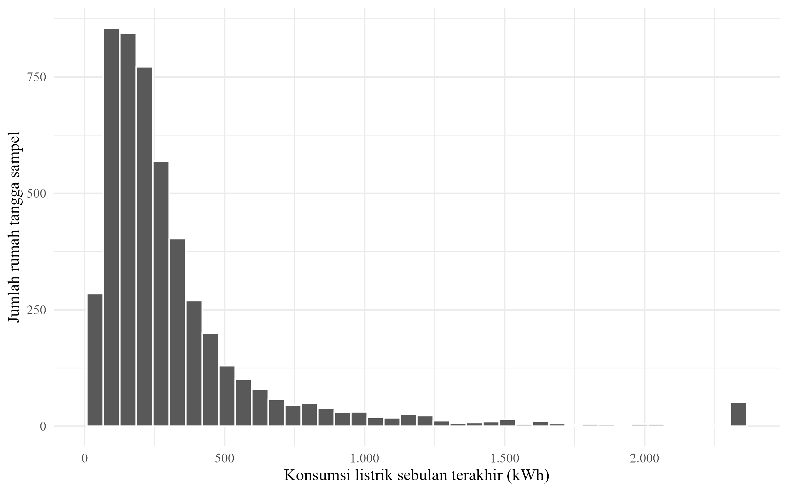
<!-- keluaran R: gambar-07-distribusi-konsumsi.png -->

**Gambar 7 Distribusi Konsumsi Listrik Rumah Tangga, DKI Jakarta, Maret 2025**

Sumber: Susenas Maret 2025 (Diolah).

Gambar 7 menunjukkan sebaran yang menceng kuat ke kanan. Frekuensi tertinggi berada pada konsumsi di bawah 250 kWh per bulan, lalu menurun tajam dan menyisakan ekor panjang yang menipis hingga melewati 1.500 kWh. Dengan bentuk sebaran seperti ini, rata-rata bukan ukuran pemusatan yang memadai, sehingga konsumsi listrik perlu ditransformasi dengan logaritma sebelum pengelompokan. Batang yang tampak terpisah di ujung kanan gambar merupakan akibat *winsorizing*, yaitu sekitar satu persen rumah tangga berkonsumsi tertinggi yang nilainya disamakan pada batas 2.335,43 kWh. Jadi, batang tersebut tidak menunjukkan adanya kelompok rumah tangga yang benar-benar menumpuk pada satu tingkat konsumsi.

Pola serupa terlihat pada pengeluaran listrik. Rata-rata tertimbangnya sebesar Rp423.230 per bulan, sedangkan mediannya Rp204.000. Meskipun begitu, pengeluaran listrik hanya menyerap 7,28 persen dari pengeluaran nonmakanan rumah tangga. Pangsa ini relatif stabil antarrumah tangga dengan simpangan baku 0,0414, tetapi rentangnya cukup lebar karena ada rumah tangga yang mengalokasikan hingga 41 persen pengeluaran nonmakanannya untuk listrik. Rumah tangga di ujung atas rentang ini menanggung beban listrik yang jauh lebih berat daripada rumah tangga lain.

Kapasitas ekonomi rumah tangga diwakili oleh pengeluaran nonmakanan selain listrik. Rata-rata tertimbangnya mencapai Rp5.825.672 per bulan, sedangkan mediannya Rp2.714.820. Jarak antara rata-rata dan median pada variabel ini lebih lebar daripada pada konsumsi listrik, dan simpangan bakunya kembali melampaui rata-ratanya. Hal ini menunjukkan bahwa ketimpangan kapasitas ekonomi antarrumah tangga di Provinsi DKI Jakarta lebih tajam daripada ketimpangan konsumsi listriknya.

Keterkaitan antara kapasitas ekonomi dan konsumsi listrik rumah tangga ditampilkan pada Gambar 8.

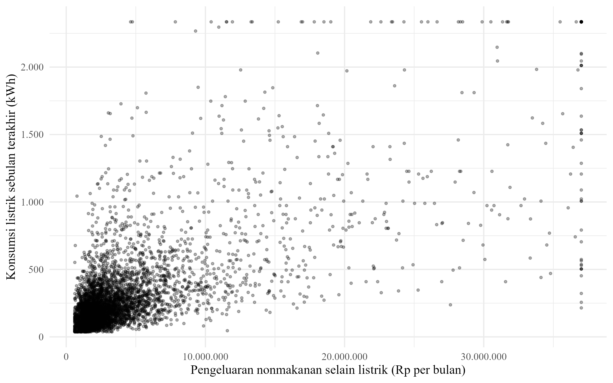
<!-- keluaran R: gambar-08-nonmakanan-konsumsi.png -->

**Gambar 8 Pengeluaran Nonmakanan selain Listrik dan Konsumsi Listrik Rumah Tangga, DKI Jakarta, Maret 2025**

Sumber: Susenas Maret 2025 (Diolah).

Gambar 8 menunjukkan hubungan yang positif. Rumah tangga dengan pengeluaran nonmakanan selain listrik yang lebih besar cenderung mengonsumsi listrik lebih banyak, tetapi hubungan tersebut tidak rapat. Titik-titik memusat padat di sudut kiri bawah, yaitu pada rumah tangga dengan pengeluaran nonmakanan di bawah Rp10.000.000 dan konsumsi listrik di bawah 500 kWh. Di atas rentang itu, titik-titik menyebar lebar sehingga rumah tangga dengan kapasitas ekonomi serupa dapat memiliki konsumsi listrik yang jauh berbeda. Artinya, kapasitas ekonomi merupakan penjelas yang penting, tetapi bukan satu-satunya penjelas konsumsi listrik rumah tangga, sehingga pengelompokan yang hanya bersandar pada satu dimensi ekonomi tidak akan memadai. Deretan titik yang membentuk garis lurus di tepi kanan dan tepi atas gambar merupakan akibat *winsorizing* pada kedua variabel.

Karakteristik sosial rumah tangga memberikan gambaran yang berbeda. Rata-rata lama sekolah KRT sebesar 11,39 tahun, artinya telah melampaui jenjang sekolah menengah pertama dan mendekati tamat sekolah menengah atas, dengan simpangan baku 3,37 tahun. Rata-rata ukuran rumah tangga sebesar 3,68 orang dengan rentang satu hingga enam orang. Kedua variabel ini bersebaran jauh lebih rapat daripada variabel moneter karena simpangan bakunya hanya sebagian kecil dari rata-ratanya.

Ada dua temuan pada Tabel 3 yang berpengaruh langsung pada tahap pengelompokan. Pertama, konsumsi listrik dan pengeluaran nonmakanan selain listrik bersebaran menceng ke kanan dengan simpangan baku melebihi rata-ratanya. Oleh karena itu, keduanya ditransformasi dengan logaritma sebelum dipakai sebagai variabel pembentuk klaster agar jarak antarrumah tangga tidak ditentukan oleh sekelompok kecil rumah tangga bernilai ekstrem. Kedua, variabel pembentuk klaster diukur dalam tiga satuan yang berbeda, yaitu kWh, rupiah, dan tahun, dengan rentang nilai yang terpaut jauh. Tanpa penyeragaman skala, variabel bersatuan rupiah akan mendominasi perhitungan jarak semata-mata karena angkanya lebih besar. Karena itu, seluruh variabel pembentuk klaster distandardisasi menjadi *Z-score* setelah transformasi logaritma diterapkan.

## 4.2 Pembentukan Klaster Rumah Tangga

Setelah gambaran umum rumah tangga diketahui, analisis berikutnya adalah mengelompokkan rumah tangga dengan metode *K-Means*. Pengelompokan dilakukan atas tiga variabel pembentuk klaster, yaitu konsumsi listrik hasil konversi, pengeluaran nonmakanan selain listrik, dan lama sekolah KRT. Konsumsi listrik dan pengeluaran nonmakanan selain listrik telah ditransformasi dengan logaritma natural, lalu ketiga variabel distandardisasi menjadi *Z-score*. Langkah pertama pengelompokan adalah menentukan jumlah klaster.

**Penentuan Jumlah Klaster**

Jumlah klaster ditentukan dengan membandingkan dua kriteria kuantitatif, yaitu WCSS melalui metode *elbow* dan rata-rata koefisien *silhouette*. Kedua kriteria dihitung untuk satu hingga delapan klaster, dan hasilnya disajikan pada Tabel 4.

**Tabel 4 Nilai WCSS dan Rata-Rata Koefisien *Silhouette* menurut Jumlah Klaster, DKI Jakarta, Maret 2025 (n = 5.001)**

| Jumlah klaster (K) | WCSS | Penurunan WCSS dari K sebelumnya | Rata-rata koefisien *silhouette* |
|---|---|---|---|
| 1 | 15.000,00 | — | tidak terdefinisi |
| 2 | 8.806,23 | 6.193,77 | 0,3640 |
| 3 | 6.578,36 | 2.227,88 | 0,3149 |
| 4 | 5.362,93 | 1.215,43 | 0,2907 |
| 5 | 4.643,41 | 719,52 | 0,2848 |
| 6 | 4.162,75 | 480,66 | 0,2643 |
| 7 | 3.751,59 | 411,17 | 0,2728 |
| 8 | 3.433,24 | 318,35 | 0,2786 |

Sumber: Susenas Maret 2025 (Diolah). Koefisien *silhouette* tidak terdefinisi pada satu klaster karena tidak terdapat klaster pembanding.

Berdasarkan Tabel 4, nilai WCSS pada satu klaster tepat sebesar 15.000, yaitu hasil kali 5.000 derajat bebas dengan tiga variabel pembentuk klaster. Angka ini menegaskan bahwa standardisasi *Z-score* berjalan sebagaimana mestinya, sehingga setiap nilai WCSS pada Tabel 4 dapat dibaca sebagai bagian dari keragaman baku yang masih tersisa di dalam klaster. Penambahan klaster dari satu menjadi dua menurunkan WCSS sebesar 6.193,77, atau lebih dari empat puluh persen keragaman total. Penambahan berikutnya hanya menurunkan 2.227,88, dan penurunannya terus mengecil sesudahnya.

Bentuk penurunan tersebut ditampilkan pada Gambar 9.

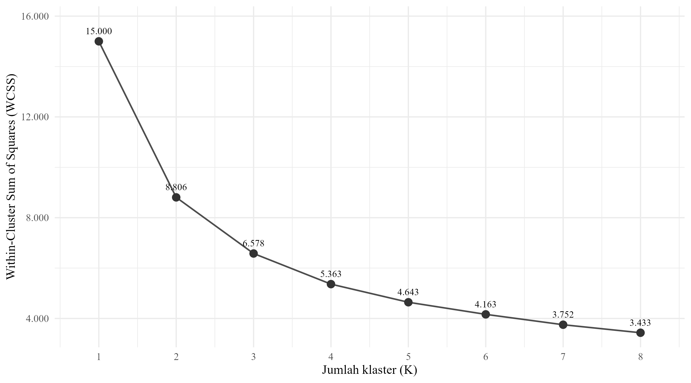
<!-- keluaran R: gambar-09-elbow.png -->

**Gambar 9 Kurva *Elbow* untuk Penentuan Jumlah Klaster, DKI Jakarta, Maret 2025**

Sumber: Susenas Maret 2025 (Diolah).

Gambar 9 menunjukkan penurunan yang sangat curam pada segmen pertama, mulai melandai setelah tiga klaster, dan hampir menjadi garis lurus pada lima klaster ke atas. Dengan pola tersebut, titik siku terbaca pada rentang dua hingga tiga klaster. Karena metode *elbow* bersandar pada penilaian visual atas perubahan kemiringan kurva, metode ini tidak menghasilkan satu jawaban tunggal. Oleh karena itu, hasilnya dibandingkan dengan kriteria kedua.

Perbandingan rata-rata koefisien *silhouette* ditampilkan pada Gambar 10.

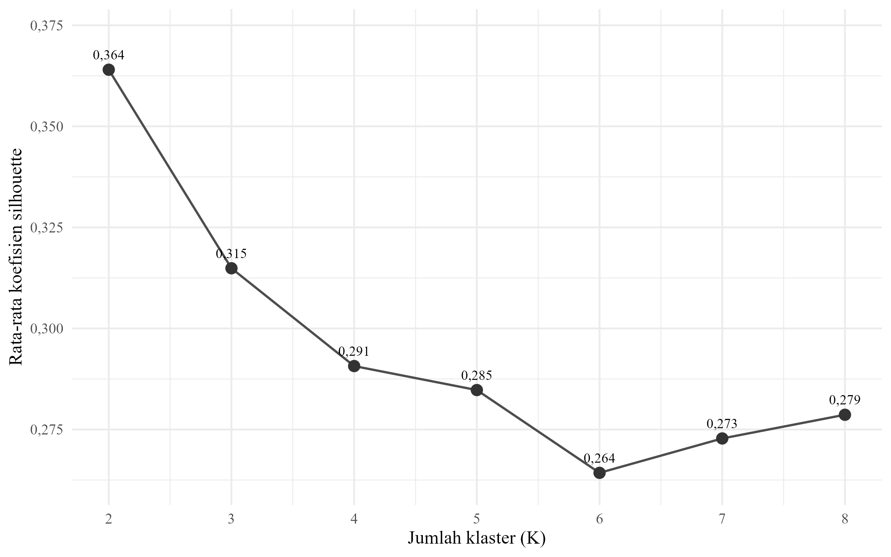
<!-- keluaran R: gambar-10-silhouette.png -->

**Gambar 10 Rata-Rata Koefisien *Silhouette* menurut Jumlah Klaster, DKI Jakarta, Maret 2025**

Sumber: Susenas Maret 2025 (Diolah).

Berdasarkan Gambar 10, rata-rata koefisien *silhouette* tertinggi diperoleh pada dua klaster, yaitu 0,3640. Nilainya kemudian terus menurun hingga titik terendah 0,2643 pada enam klaster, lalu naik tipis pada tujuh dan delapan klaster. Kenaikan tipis ini tidak mengubah kesimpulan karena nilainya tetap jauh di bawah nilai pada dua klaster. Kenaikan tersebut juga menandakan bahwa penambahan klaster pada rentang itu hanya memecah kelompok yang sudah terbentuk tanpa memperbaiki pemisahannya. Selain itu, sumbu tegak Gambar 10 dipotong pada rentang yang sempit sehingga selisih antartitik tampak lebih tajam daripada besaran sebenarnya.

Dengan demikian, kedua kriteria menunjuk arah yang sama, dan penelitian ini menetapkan dua klaster sebagai solusi akhir. Meskipun begitu, besaran koefisiennya perlu diperhatikan. Kaufman dan Rousseeuw (1990) memandang klasifikasi yang memadai dicirikan oleh koefisien *silhouette* di atas 0,5, sedangkan koefisien rata-rata di bawah 0,2 ditafsirkan sebagai ketiadaan struktur klaster yang berarti (Everitt et al., 2011, hlm. 129). Koefisien 0,3640 yang diperoleh berada di antara kedua ambang tersebut. Artinya, struktur klaster pada data ini nyata tetapi lemah. Rumah tangga di Provinsi DKI Jakarta tidak terpisah menjadi kelompok-kelompok yang berbatas tegas, tetapi membentuk sebaran menerus yang kemudian dibagi oleh algoritme. Oleh karena itu, penafsiran hasil selanjutnya diarahkan pada perbedaan kecenderungan antarkelompok, bukan pada penggolongan rumah tangga secara tegas.

Pilihan dua klaster juga diperiksa terhadap pilihan transformasi variabel. Tanpa transformasi logaritma, pengelompokan menghasilkan koefisien *silhouette* yang jauh lebih tinggi, yaitu 0,6548. Namun, kenaikan itu berasal dari terpisahnya satu klaster kecil berisi 408 rumah tangga atau 8,16 persen sampel yang merupakan ekor atas sebaran pengeluaran. Pada saat yang sama, keeratan hubungan antara klaster dan kepemilikan *air conditioner* justru melemah, ditunjukkan oleh *Cramér's V* yang turun dari 0,5530 menjadi 0,3759. Lebih dari sembilan puluh persen rumah tangga juga melebur dalam satu klaster sehingga karakter sosial ekonominya tidak lagi dapat dibedakan. Jadi, koefisien *silhouette* yang lebih tinggi pada versi tanpa transformasi hanya mencerminkan terpisahnya pencilan, bukan struktur sosial ekonomi yang lebih tajam. Hasil lengkap pembandingan tersebut disajikan pada Lampiran 1.

**Hasil Pembentukan Klaster**

Pengelompokan dengan metode *K-Means* atas 5.001 rumah tangga menghasilkan dua klaster dengan ukuran yang timpang. Klaster 1 memuat 3.329 rumah tangga atau 66,57 persen sampel, sedangkan Klaster 2 memuat 1.672 rumah tangga atau 33,43 persen sampel. Setelah penimbang rumah tangga Susenas diterapkan, komposisinya menjadi 60,11 persen untuk Klaster 1 dan 39,89 persen untuk Klaster 2. Pembentukan klaster sendiri dijalankan tanpa penimbang. Analisis klaster bersifat eksploratif, yaitu bertujuan menemukan pengelompokan alami di antara objek berdasarkan kemiripan karakteristik yang terukur, dan keluarannya hanya menyarankan hipotesis (Jain, 2010, hlm. 651–652, 663). Oleh karena itu, tahap pengelompokan diarahkan untuk menemukan kemiripan antarrumah tangga sampel, sedangkan penimbang baru diterapkan pada tahap pelaporan komposisi dan penciri agar angka yang disajikan menggambarkan seluruh rumah tangga di Provinsi DKI Jakarta. Selisih antara persentase sampel dan persentase tertimbang menunjukkan bahwa rumah tangga berkarakter Klaster 1 terwakili lebih besar dalam sampel daripada dalam populasi, sedangkan rumah tangga berkarakter Klaster 2 terwakili lebih kecil.

*Centroid* kedua klaster pada skala *Z-score* disajikan pada Tabel 5.

**Tabel 5 Ukuran dan *Centroid* Klaster pada Skala *Z-score*, DKI Jakarta, Maret 2025**

| Klaster | n sampel | Persen sampel | Persen tertimbang | z ln konsumsi listrik | z ln pengeluaran nonmakanan selain listrik | z lama sekolah KRT |
|---|---|---|---|---|---|---|
| 1 | 3.329 | 66,57 | 60,11 | −0,4548 | −0,5099 | −0,3939 |
| 2 | 1.672 | 33,43 | 39,89 | 0,9055 | 1,0152 | 0,7843 |

Sumber: Susenas Maret 2025 (Diolah). Penomoran klaster diurutkan menaik menurut *centroid* konsumsi listrik, sehingga Klaster 1 selalu bermakna kelompok berkonsumsi lebih rendah.

Berdasarkan Tabel 5, arah pemisahan kedua klaster seragam. Ketiga *centroid* Klaster 1 berada di bawah rata-rata seluruh rumah tangga, sedangkan ketiga *centroid* Klaster 2 berada di atasnya, dan tidak ada satu pun variabel yang berlawanan arah. Artinya, kedua klaster terpisah menurut tingkat, yaitu tinggi rendahnya ketiga variabel secara bersamaan, bukan menurut komposisi, yaitu kombinasi satu variabel yang tinggi dengan variabel lain yang rendah. Jarak terbesar antara kedua *centroid* terdapat pada pengeluaran nonmakanan selain listrik, yaitu 1,5251 simpangan baku, disusul konsumsi listrik sebesar 1,3603 dan lama sekolah KRT sebesar 1,1782. Dengan demikian, kapasitas ekonomi menjadi sumbu pemisah yang paling kuat, sedangkan pendidikan kepala rumah tangga ikut membedakan kedua kelompok dengan jarak yang lebih pendek.

Sebaran kedua klaster pada dua komponen utama ditampilkan pada Gambar 11.

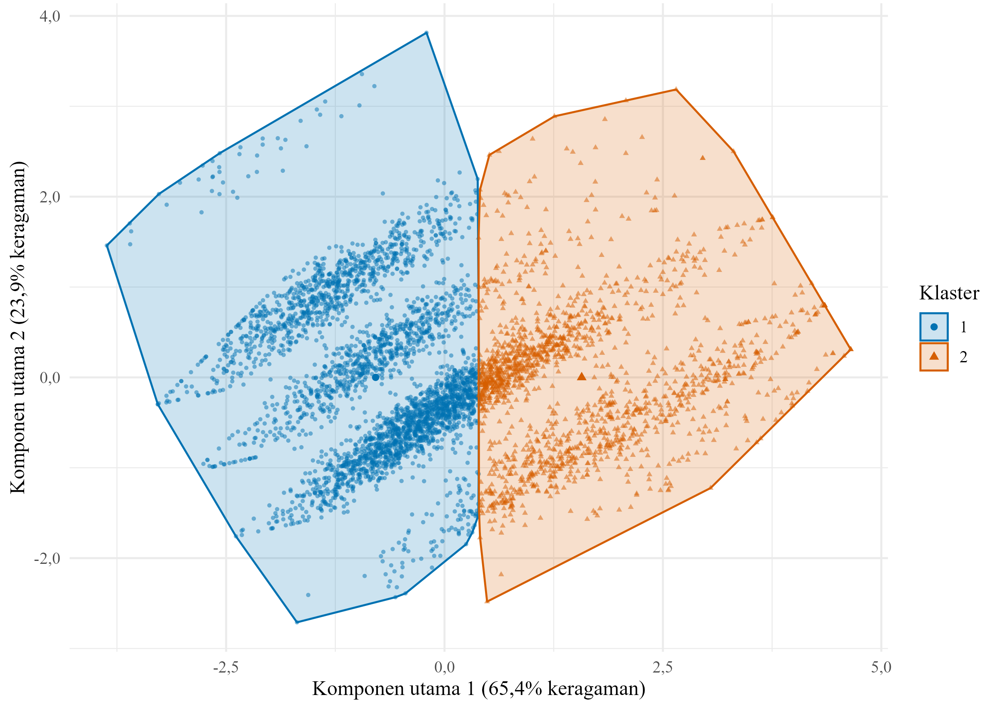
<!-- keluaran R: gambar-11-klaster-komponen-utama.png -->

**Gambar 11 Visualisasi Klaster Rumah Tangga pada Dua Komponen Utama, DKI Jakarta, Maret 2025**

Sumber: Susenas Maret 2025 (Diolah).

Gambar 11 dibuat dengan memproyeksikan ketiga variabel pembentuk klaster yang telah distandardisasi ke dalam dua komponen utama. Proyeksi ini hanya bertujuan agar sebaran tiga dimensi dapat ditampilkan pada bidang datar. Muatan variabel dan keragaman yang dijelaskan oleh kedua sumbu disajikan pada Tabel 6.

**Tabel 6 Muatan Variabel Pembentuk Klaster pada Dua Komponen Utama**

| Variabel | Komponen 1 | Komponen 2 |
|---|---|---|
| ln konsumsi listrik | 0,5822 | 0,5566 |
| ln pengeluaran nonmakanan selain listrik | 0,6397 | 0,1363 |
| Lama sekolah KRT | 0,5018 | −0,8195 |
| Keragaman yang dijelaskan (persen) | 65,42 | 23,88 |

Sumber: Susenas Maret 2025 (Diolah). Keragaman kumulatif kedua komponen sebesar 89,31 persen.

Berdasarkan Tabel 6, kedua komponen bersama-sama menjelaskan 89,31 persen keragaman data, sehingga pemisahan klaster yang terlihat pada Gambar 11 cukup mewakili sebaran yang sebenarnya. Komponen pertama memuat ketiga variabel dengan tanda positif dan besaran yang berdekatan, yaitu antara 0,50 dan 0,64. Oleh karena itu, sumbu mendatar dapat dibaca sebagai tingkat konsumsi listrik dan sosial ekonomi rumah tangga secara umum. Makin ke kanan, konsumsi listrik, pengeluaran nonmakanan, dan lama sekolah KRT sama-sama makin tinggi. Komponen kedua mempertentangkan lama sekolah KRT yang bermuatan negatif dengan konsumsi listrik yang bermuatan positif. Dengan begitu, sumbu tegak menangkap rumah tangga yang konsumsi listriknya tinggi meskipun pendidikan kepala rumah tangganya relatif rendah, dan sebaliknya.

Gambar 11 memperlihatkan dua poligon yang menempati sisi kiri dan sisi kanan bidang. Pada sumbu mendatar, batas keduanya tegas dan hampir tanpa tumpang tindih, sedangkan pada sumbu tegak keduanya menempati rentang yang sama. *Centroid* Klaster 1 berada pada −0,7887 dan *centroid* Klaster 2 pada 1,5703 untuk komponen pertama, sementara pada komponen kedua keduanya praktis berimpit di angka nol, yaitu 0,0002 dan −0,0004. Temuan ini memperkuat hasil Tabel 5, yaitu bahwa seluruh pemisahan kedua klaster terjadi pada satu sumbu tingkat konsumsi listrik dan sosial ekonomi. Tidak ada kelompok yang terbentuk karena perbedaan komposisi antara pendidikan dan konsumsi listrik. Pemisahan yang hanya bertumpu pada satu sumbu ini juga menjelaskan lemahnya koefisien *silhouette* yang diperoleh, karena rumah tangga tersebar menerus di sepanjang sumbu tersebut tanpa celah yang memisahkan kedua kelompok.

## 4.3 Perbedaan Karakteristik Sosial Ekonomi Antarklaster

Setelah dua klaster terbentuk, analisis dilanjutkan dengan melihat perbedaan karakteristik sosial ekonomi antarklaster. Profil kedua klaster, termasuk pada ketiga variabel pembentuk, diuraikan lebih dahulu secara deskriptif tanpa uji statistik karena teknik pengelompokan dengan sendirinya memaksimalkan perbedaan antarklaster pada variabel tersebut (Everitt et al., 2011, hlm. 262). Setelah itu, perbedaan kedua klaster diuji pada lima variabel penciri yang tidak dipakai algoritme dalam menentukan keanggotaan klaster, yaitu luas lantai, kepemilikan AC, kepemilikan lemari es, golongan daya terpasang, dan ukuran rumah tangga. Pada tahap inilah hipotesis penelitian diuji.

**Profil Klaster**

Profil kedua klaster disajikan pada Tabel 7 dalam bentuk nilai rata-rata dan median sejumlah indikator. Seluruh rata-rata dihitung dengan penimbang rumah tangga Susenas agar menggambarkan rumah tangga di Provinsi DKI Jakarta, bukan hanya rumah tangga terpilih dalam sampel. Median disajikan tanpa penimbang sebagai pembanding untuk menunjukkan seberapa jauh rata-rata tertarik oleh rumah tangga berkonsumsi sangat tinggi. Karena klaster dibentuk tanpa penimbang, penimbang di sini hanya berperan pada tahap pelaporan, bukan pada tahap pengelompokan.

**Tabel 7 Profil Tertimbang Rumah Tangga menurut Klaster**

| Indikator | Klaster 1 | Klaster 2 |
|---|---|---|
| Jumlah rumah tangga sampel | 3.329 | 1.672 |
| Jumlah rumah tangga tertimbang | 1.744.440 | 1.157.822 |
| Persentase tertimbang (persen) | 60,11 | 39,89 |
| Rata-rata konsumsi listrik (kWh per bulan) | 186,61 | 645,34 |
| Median konsumsi listrik (kWh per bulan) | 163,36 | 435,05 |
| Rata-rata konsumsi listrik per kapita (kWh per bulan) | 60,08 | 198,88 |
| Median konsumsi listrik per kapita (kWh per bulan) | 58,26 | 152,67 |
| Rata-rata pengeluaran listrik (rupiah per bulan) | 180.146 | 789.474 |
| Median pengeluaran listrik (rupiah per bulan) | 145.000 | 486.000 |
| Rata-rata pengeluaran nonmakanan selain listrik (rupiah per bulan) | 2.509.606 | 10.821.847 |
| Median pengeluaran nonmakanan selain listrik (rupiah per bulan) | 2.030.833 | 6.140.250 |
| Rata-rata ukuran rumah tangga (orang) | 3,65 | 3,71 |
| Rata-rata lama sekolah KRT (tahun) | 9,83 | 13,74 |
| Proporsi memiliki AC (persen) | 17,02 | 76,07 |
| Rata-rata pangsa pengeluaran listrik terhadap pengeluaran nonmakanan (persen) | 7,05 | 7,63 |

Sumber: Susenas Maret 2025 (Diolah). Median dihitung tanpa penimbang.

Berdasarkan Tabel 7, Klaster 1 mencakup 3.329 rumah tangga sampel yang mewakili sekitar 1.744.440 rumah tangga atau 60,11 persen rumah tangga di Provinsi DKI Jakarta, sedangkan Klaster 2 mencakup 1.672 rumah tangga sampel yang mewakili sekitar 1.157.822 rumah tangga atau 39,89 persen. Dengan kata lain, kelompok yang lebih besar adalah kelompok berkonsumsi listrik lebih rendah, sedangkan kelompok berkonsumsi tinggi merupakan minoritas yang cukup besar, yaitu sekitar dua dari setiap lima rumah tangga.

Perbedaan paling mencolok terletak pada konsumsi listrik, seperti terlihat pada Gambar 12. Rata-rata konsumsi Klaster 2 sebesar 645,34 kWh per bulan, yaitu sekitar 3,46 kali rata-rata Klaster 1 yang sebesar 186,61 kWh per bulan. Perbedaan ini tetap terlihat ketika konsumsi dihitung per anggota rumah tangga, yaitu 198,88 kWh per kapita pada Klaster 2 berbanding 60,08 kWh per kapita pada Klaster 1, atau sekitar 3,31 kali. Artinya, kesenjangan konsumsi antara kedua klaster tidak dapat dijelaskan oleh perbedaan jumlah penghuni, tetapi oleh perbedaan intensitas penggunaan listrik per orang. Pada kedua klaster, rata-rata tetap lebih tinggi daripada median. Hal ini menunjukkan bahwa sebaran yang menceng ke kanan tidak hilang setelah pengelompokan, tetapi tetap ada di dalam masing-masing kelompok.

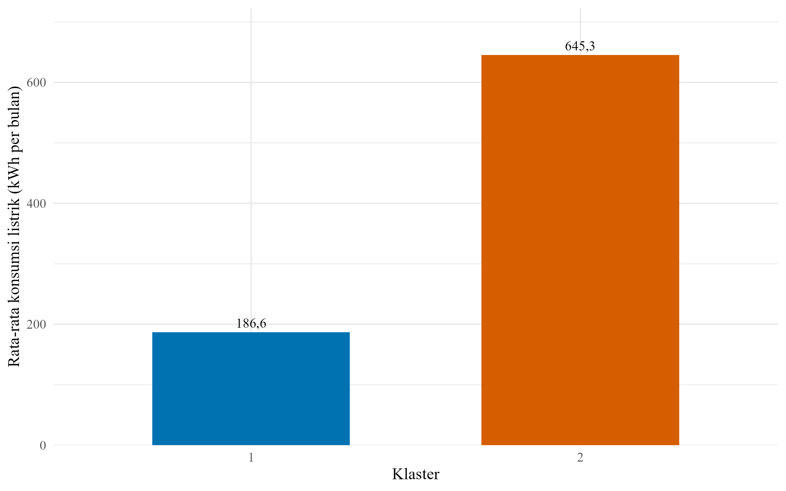
<!-- keluaran R: gambar-12-rata-rata-konsumsi-klaster.png -->

**Gambar 12 Rata-Rata Tertimbang Konsumsi Listrik Rumah Tangga menurut Klaster**

Sumber: Susenas Maret 2025 (Diolah).

Perbedaan konsumsi listrik tersebut tidak sebanding dengan perbedaan pengeluaran listriknya. Rata-rata pengeluaran listrik Klaster 2 sebesar Rp789.474 per bulan, sekitar 4,38 kali rata-rata Klaster 1 yang sebesar Rp180.146 per bulan, sedangkan rasio konsumsinya hanya 3,46 kali. Selisih kedua rasio ini muncul dari struktur tarif tenaga listrik yang berjenjang menurut golongan daya terpasang (Kementerian Energi dan Sumber Daya Mineral, 2024; PT PLN (Persero), 2025). Sebagian besar rumah tangga Klaster 2 berada pada golongan daya 1.300 VA ke atas (Tabel 8) sehingga membayar tarif per kWh yang lebih tinggi daripada rumah tangga bersubsidi. Temuan ini juga menunjukkan bahwa tarif berjenjang memang perlu dipakai dalam konversi pengeluaran menjadi kWh. Bila hanya satu tarif rata-rata yang dipakai, konsumsi listrik hasil konversi akan menjadi kelipatan tetap dari pengeluaran listrik sehingga kedua rasio tersebut dipaksa sama. Sebaran konsumsi listrik kedua klaster secara lebih rinci disajikan pada Gambar 13.

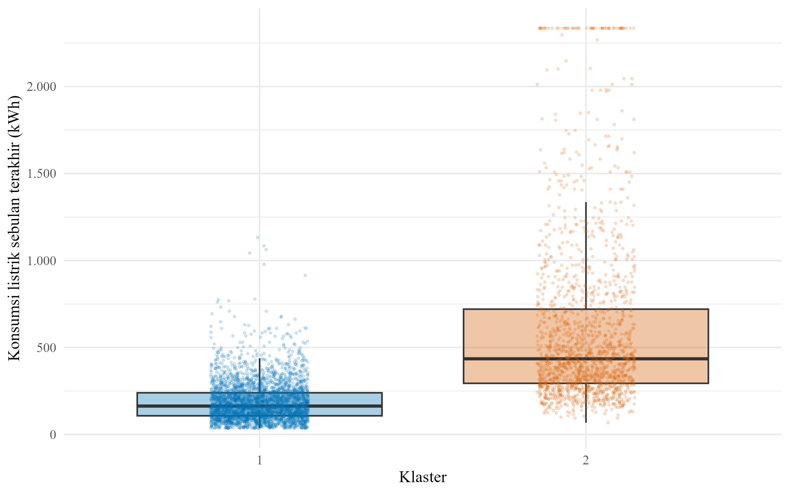
<!-- keluaran R: gambar-13-sebaran-konsumsi-klaster.png -->

**Gambar 13 Sebaran Konsumsi Listrik Rumah Tangga menurut Klaster**

Sumber: Susenas Maret 2025 (Diolah). Deretan titik mendatar pada nilai tertinggi merupakan akibat pembatasan nilai ekstrem pada persentil ke-99 (*winsorizing*), bukan penumpukan rumah tangga pada satu nilai konsumsi yang sama.

Kesenjangan serupa terlihat pada kapasitas ekonomi rumah tangga. Rata-rata pengeluaran nonmakanan selain listrik pada Klaster 2 sebesar Rp10.821.847 per bulan, sekitar 4,31 kali rata-rata Klaster 1 yang sebesar Rp2.509.606 per bulan. Meskipun begitu, pangsa pengeluaran listrik terhadap pengeluaran nonmakanan pada kedua kelompok hampir sama, yaitu 7,05 persen pada Klaster 1 dan 7,63 persen pada Klaster 2. Kedua angka ini menunjukkan bahwa perbedaan antara kedua klaster bukan terletak pada porsi anggaran untuk listrik, melainkan pada besarnya anggaran itu sendiri. Rumah tangga di kedua kelompok membelanjakan porsi yang kurang lebih sama dari pengeluaran nonmakanannya untuk listrik, tetapi dengan skala anggaran yang jauh berbeda. Hubungan pengeluaran nonmakanan selain listrik dengan konsumsi listrik pada masing-masing klaster ditampilkan pada Gambar 14.

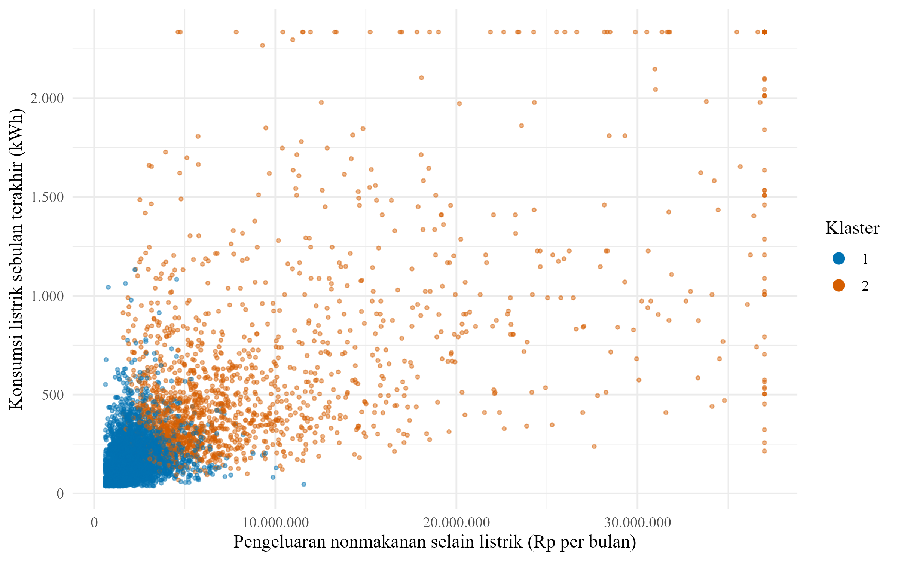
<!-- keluaran R: gambar-14-nonmakanan-konsumsi-klaster.png -->

**Gambar 14 Pengeluaran Nonmakanan selain Listrik dan Konsumsi Listrik menurut Klaster**

Sumber: Susenas Maret 2025 (Diolah). Deretan titik pada tepi grafik merupakan akibat pembatasan nilai ekstrem pada persentil ke-99 (*winsorizing*).

Lama sekolah KRT juga bergerak searah dengan kedua indikator tersebut. Rata-rata lama sekolah KRT pada Klaster 1 sebesar 9,83 tahun, sedangkan pada Klaster 2 sebesar 13,74 tahun, sehingga selisihnya mencapai 3,90 tahun. Secara jenjang, rata-rata Klaster 1 berada di sekitar tamat sekolah menengah pertama, sementara rata-rata Klaster 2 telah melampaui tamat sekolah menengah atas. Gambar 15 memperjelas perbedaan tersebut melalui komposisi jenjang pendidikan KRT. Pada Klaster 1, KRT berpendidikan dasar dan menengah hampir sama besar, yaitu 48,59 persen dan 48,50 persen, sedangkan KRT berpendidikan tinggi hanya 2,91 persen. Pola tersebut berbalik pada Klaster 2: KRT berpendidikan tinggi menjadi kelompok terbesar dengan 50,44 persen, diikuti KRT berpendidikan menengah sebesar 41,73 persen, sementara KRT berpendidikan dasar hanya 7,83 persen. Dengan demikian, ketiga variabel pembentuk klaster bergerak ke arah yang sama, dan pengelompokan yang dihasilkan mencerminkan satu sumbu tingkat konsumsi listrik dan sosial ekonomi, sejalan dengan muatan komponen utama pada Tabel 6.

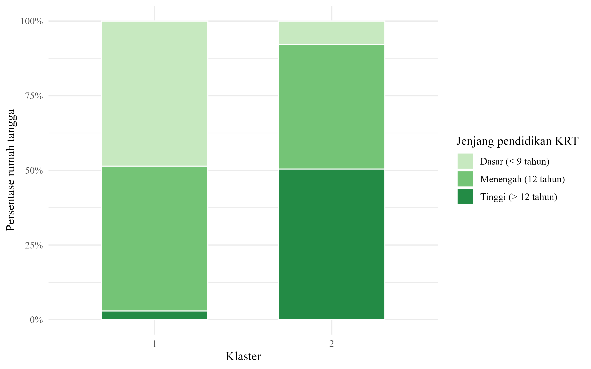
<!-- keluaran R: gambar-15-pendidikan-krt-klaster.png -->

**Gambar 15 Komposisi Tertimbang Pendidikan Kepala Rumah Tangga menurut Klaster**

Sumber: Susenas Maret 2025 (Diolah). Jenjang dasar mencakup KRT dengan lama sekolah paling lama 9 tahun (tidak berijazah, SD/sederajat, dan SMP/sederajat), jenjang menengah 12 tahun (SMA/sederajat), dan jenjang tinggi lebih dari 12 tahun (perguruan tinggi).

Dua indikator terakhir pada Tabel 7 memiliki pola yang berbeda sehingga perlu dibaca terpisah. Rata-rata ukuran rumah tangga hampir sama pada kedua kelompok, yaitu 3,65 orang pada Klaster 1 dan 3,71 orang pada Klaster 2; signifikansi selisih sekecil itu diuji pada Tabel 9. Sebaliknya, proporsi rumah tangga yang memiliki AC berbeda sangat tajam, yaitu 17,02 persen pada Klaster 1 berbanding 76,07 persen pada Klaster 2. Kepemilikan AC tidak termasuk variabel pembentuk klaster, sehingga perbedaan tersebut tidak dihasilkan langsung oleh algoritme; kedudukannya sebagai bukti dibahas bersama variabel penciri lainnya.

Berdasarkan keseluruhan profil tersebut, Klaster 1 dapat dibaca sebagai kelompok rumah tangga dengan konsumsi listrik rendah, kapasitas pengeluaran terbatas, dan kepala rumah tangga yang hampir seluruhnya berpendidikan dasar atau menengah, yang mencakup mayoritas rumah tangga di Provinsi DKI Jakarta. Klaster 2 dapat dibaca sebagai kelompok rumah tangga dengan konsumsi listrik tinggi, kapasitas pengeluaran jauh lebih luas, dan kepala rumah tangga yang separuhnya berpendidikan tinggi, yang mencakup sekitar dua dari setiap lima rumah tangga. Penamaan kedua kelompok ini bersifat deskriptif dan tidak menyiratkan urutan nilai apa pun di antara keduanya.

**Pengujian Hipotesis pada Variabel Penciri**

Tabel 7 memperlihatkan perbedaan kedua klaster pada variabel pembentuknya, tetapi perbedaan itu tidak dapat dijadikan bukti karena variabel tersebutlah yang menentukan keanggotaan klaster. Bukti perlu dicari pada variabel yang tidak dipakai algoritme. Jika kedua kelompok yang terbentuk dari konsumsi listrik, pengeluaran nonmakanan selain listrik, dan lama sekolah KRT ternyata juga berbeda dalam kepemilikan peralatan rumah tangga dan kondisi hunian, perbedaan itu tidak dihasilkan langsung oleh algoritme dan dapat dibaca sebagai ciri kelompok. Lima variabel penciri diperiksa, yaitu luas lantai tempat tinggal, kepemilikan *air conditioner* (AC), kepemilikan lemari es, golongan daya terpasang, dan ukuran rumah tangga, tetapi hanya tiga variabel pertama yang menjadi dasar keputusan hipotesis. Profil kelima variabel tersebut disajikan pada Tabel 8.

**Tabel 8 Profil Variabel Penciri menurut Klaster**

| Variabel penciri | Satuan | Klaster 1 | Klaster 2 |
|---|---|---|---|
| Jumlah rumah tangga sampel | rumah tangga | 3.329 | 1.672 |
| Luas lantai, rata-rata tertimbang | m² | 42,52 | 106,17 |
| Luas lantai, median tidak tertimbang | m² | 30 | 80 |
| Kepemilikan AC | persen | 17,02 | 76,07 |
| Kepemilikan lemari es | persen | 87,27 | 98,25 |
| Golongan daya 450 VA | persen | 8,9 | 6,3 |
| Golongan daya 900 VA | persen | 37,1 | 15,6 |
| Golongan daya 1.300 VA atau lebih | persen | 53,9 | 78,1 |
| Ukuran rumah tangga, rata-rata tertimbang | orang | 3,65 | 3,71 |
| Ukuran rumah tangga, rata-rata tidak tertimbang | orang | 3,03 | 3,24 |

Sumber: Susenas Maret 2025 (Diolah).

Catatan: seluruh persentase dihitung dengan penimbang rumah tangga; median luas lantai disajikan tanpa penimbang. Luas lantai merupakan nilai setelah *winsorizing* pada persentil 1 dan 99. Persentase golongan daya merupakan persentase baris dan tidak selalu berjumlah tepat seratus akibat pembulatan.

Berdasarkan Tabel 8, perbedaan terbesar terdapat pada luas lantai dan kepemilikan AC. Rata-rata luas lantai Klaster 2 sekitar dua setengah kali rata-rata Klaster 1 dengan selisih sekitar 64 m², sedangkan mediannya berselisih 50 m². Karena rata-rata dan median bergerak searah, selisih ini tidak dapat dijelaskan oleh segelintir rumah tangga yang berhunian sangat luas. Nilai luas lantai yang dipakai merupakan hasil *winsorizing* pada persentil ke-1 dan ke-99. Pada kepemilikan AC, selisihnya mencapai 59 poin persentase. Tiga dari empat rumah tangga Klaster 2 memiliki AC, sedangkan pada Klaster 1 kepemilikan AC hanya dijumpai pada kurang dari seperlima rumah tangga. Perbandingan ini disajikan pada Gambar 16.

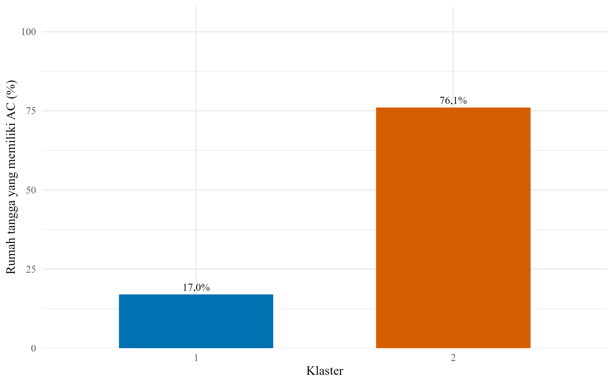
<!-- keluaran R: gambar-16-kepemilikan-ac-klaster.png -->

**Gambar 16 Proporsi Kepemilikan AC menurut Klaster**

Sumber: Susenas Maret 2025 (Diolah).

Kepemilikan lemari es menunjukkan pola yang berbeda. Selisihnya memang searah, yaitu 98,25 persen berbanding 87,27 persen, tetapi hanya sekitar sebelas poin persentase karena lemari es sudah dimiliki hampir seluruh rumah tangga di kedua kelompok. Dengan demikian, variabel ini tidak banyak memisahkan kedua klaster. Variabel ini justru menunjukkan bahwa perbedaan antarkelompok tidak terletak pada pemenuhan peralatan rumah tangga dasar, tetapi pada kepemilikan peralatan tambahan yang berdaya besar seperti AC.

Sebaran golongan daya terpasang juga searah dengan ketiga penciri sebelumnya. Sebanyak 78,1 persen rumah tangga Klaster 2 tersambung pada daya 1.300 VA atau lebih, berbanding 53,9 persen pada Klaster 1. Sebaliknya, golongan 900 VA jauh lebih banyak dijumpai pada Klaster 1, yaitu 37,1 persen berbanding 15,6 persen. Namun, hasil ini perlu dibaca dengan hati-hati. Golongan daya terpasang dipakai pada tahap persiapan data untuk menetapkan tarif konversi pengeluaran listrik menjadi konsumsi listrik, sehingga variabel ini ikut menentukan nilai variabel pembentuk pertama. Oleh karena itu, sebaran golongan daya pada Tabel 8 hanya disajikan sebagai deskripsi karakteristik kelistrikan kedua kelompok, bukan sebagai bukti bebas yang memvalidasi pemisahan klaster. Penilaian atas pemisahan klaster tetap bersandar pada luas lantai, kepemilikan AC, dan kepemilikan lemari es, yang tidak dipakai dalam pembentukan klaster maupun dalam penyusunan nilai variabel pembentuknya.

Pada ukuran rumah tangga, rata-rata tertimbangnya sebesar 3,71 orang pada Klaster 2 dan 3,65 orang pada Klaster 1, sehingga selisihnya hanya 0,06 orang. Kedua versi pengujian pada Tabel 9 memberikan kesimpulan yang berbeda untuk variabel ini. Uji tanpa penimbang menghasilkan *p-value* di bawah 0,001, sedangkan uji berbasis desain menghasilkan *p-value* sebesar 0,362, sehingga perbedaan ukuran rumah tangga antarklaster tidak signifikan (gagal tolak H₀) setelah rancangan sampel diperhitungkan. Uji tanpa penimbang memperlakukan 5.001 rumah tangga sebagai pengamatan yang saling bebas, sedangkan uji berbasis desain memperhitungkan bahwa rumah tangga sampel terkumpul di dalam 512 PSU pada 6 strata. Hasil uji berbasis desain juga sejalan dengan besaran selisihnya, yaitu kedua kelompok praktis memiliki ukuran rumah tangga yang sama. Oleh karena itu, ukuran rumah tangga tidak ditetapkan sebagai penciri kedua klaster. Selain itu, rata-rata tertimbang pada kedua kelompok konsisten lebih besar daripada rata-rata tidak tertimbangnya, yaitu 3,65 berbanding 3,03 orang pada Klaster 1 dan 3,71 berbanding 3,24 orang pada Klaster 2. Pola ini menunjukkan bahwa penimbang rumah tangga Susenas tidak bebas terhadap ukuran rumah tangga, sehingga kedua versi angka dilaporkan berdampingan alih-alih memilih salah satunya.

Perbedaan kelima variabel di atas diuji secara formal dengan dua versi perhitungan, yaitu tanpa penimbang dan dengan penimbang berbasis desain survei. Hasil keduanya disajikan pada Tabel 9.

**Tabel 9 Uji Beda dan Ukuran Asosiasi Variabel Penciri Antarklaster**

| Variabel penciri | Uji tanpa penimbang | Statistik | *p-value* | Uji berbasis desain | Statistik | *p-value* | *Cramér's V* |
|---|---|---|---|---|---|---|---|
| Luas lantai | Kruskal–Wallis | H = 1.154,5859 (db 1) | < 0,001 | Kruskal–Wallis berbasis desain | t = 24,356 (db 505) | < 0,001 | – |
| Kepemilikan AC | *Chi-square* Pearson | χ² = 1.529,4057 (db 1) | < 0,001 | Rao–Scott orde kedua | F = 733,40 (db 1; 506) | < 0,001 | 0,553 |
| Kepemilikan lemari es | *Chi-square* Pearson | χ² = 229,8040 (db 1) | < 0,001 | Rao–Scott orde kedua | F = 91,593 (db 1; 506) | < 0,001 | 0,214 |
| Golongan daya terpasang | *Chi-square* Pearson | χ² = 292,96 (db 2) | < 0,001 | Rao–Scott orde kedua | F = 62,124 (db 1,99; 1.008,05) | < 0,001 | 0,242 |
| Ukuran rumah tangga | Kruskal–Wallis | H = 24,2546 (db 1) | < 0,001 | Kruskal–Wallis berbasis desain | t = 0,912 (db 505) | 0,362 | – |

Sumber: Susenas Maret 2025 (Diolah).

Catatan: *chi-square* Pearson dihitung tanpa koreksi Yates. Uji berbasis desain memperhitungkan penimbang, PSU, dan strata Susenas; derajat bebas uji F ditulis sebagai (db pembilang; db penyebut). *Cramér's V* dihitung dari statistik *chi-square* tanpa penimbang. Luas lantai dan ukuran rumah tangga bersifat numerik sehingga tidak memiliki *Cramér's V*. Uji golongan daya terpasang mencakup 5.001 rumah tangga yang seluruhnya memiliki kode golongan daya.

Ada dua hal yang dapat dibaca dari Tabel 9. Pertama, empat dari lima variabel penciri, yaitu luas lantai, kepemilikan AC, kepemilikan lemari es, dan golongan daya terpasang, berbeda signifikan antarklaster pada taraf nyata 1 persen, dan kesimpulan itu tidak berubah ketika perhitungan dilakukan tanpa penimbang maupun dengan memperhitungkan rancangan sampel. Keselarasan kedua versi perhitungan ini penting karena pembentukan klaster dilakukan tanpa penimbang, sedangkan pelaporan profilnya menggunakan penimbang. Ukuran rumah tangga menjadi satu-satunya pengecualian: perbedaannya signifikan pada uji tanpa penimbang tetapi tidak signifikan pada uji berbasis desain, sehingga variabel ini tidak diperlakukan sebagai pembeda antarklaster.

Kedua, besaran hubungan antarvariabel penciri berbeda jauh. Kepemilikan AC memiliki *Cramér's V* sebesar 0,553, yaitu lebih dari dua kali nilai pada golongan daya terpasang (0,242) dan kepemilikan lemari es (0,214). Urutan ini sejalan dengan selisih persentase pada Tabel 8 dan menegaskan bahwa kepemilikan AC merupakan penciri terkuat di antara variabel yang tidak dipakai membentuk klaster.

Hasil tersebut menjadi dasar keputusan hipotesis penelitian. Sesuai kriteria keputusan yang ditetapkan pada Bab III, ketiga variabel penciri yang dirumuskan dalam hipotesis berbeda signifikan pada taraf nyata 1 persen pada uji dengan penimbang, dan ketiganya menunjukkan arah yang dinyatakan dalam hipotesis: Klaster 2, yaitu klaster dengan konsumsi listrik lebih tinggi, memiliki persentase kepemilikan AC dan lemari es yang lebih tinggi serta rata-rata luas lantai yang lebih besar daripada Klaster 1 (Tabel 8). Dengan demikian, hipotesis penelitian didukung. Meskipun begitu, kekuatan dukungan dari ketiga variabel tersebut tidak sama. Kepemilikan AC dipakai sebagai kriteria pemilihan spesifikasi variabel pembentuk, sehingga perbedaannya tidak sepenuhnya bebas dari proses pembentukan klaster. Kepemilikan lemari es dan luas lantai tidak dipakai pada tahap mana pun sebelum *profiling* dan menunjukkan arah yang sama, sehingga dukungan terhadap hipotesis tidak bertumpu pada kepemilikan AC saja. Di antara keduanya, luas lantai memberi dukungan yang lebih tegas, sedangkan selisih kepemilikan lemari es tipis karena peralatan tersebut telah dimiliki hampir seluruh rumah tangga pada kedua klaster.

Pola tersebut sejalan dengan penelitian terdahulu. Kubota et al. (2014) menemukan bahwa AC merupakan penentu utama konsumsi listrik rumah tangga di Jakarta dan bahwa konsumsi energi AC di Jakarta dapat dijelaskan oleh luas lantai bersama pendapatan rumah tangga, sedangkan kepemilikan lemari es tetap tinggi pada seluruh klaster rumah tangga di Jakarta dan Bandung. De Cian et al. (2025) juga menemukan bahwa kepemilikan AC menaikkan konsumsi listrik rumah tangga rata-rata sebesar 36 persen.

Perbedaan kepemilikan AC tersebut juga memberi indikasi mengenai kelompok rumah tangga yang berpotensi mengalami *adaptation cooling deficit*, yaitu keadaan rumah tangga yang membutuhkan pendinginan tetapi tidak mampu memperoleh AC (Pavanello et al., 2021). Indikasi tersebut mengarah pada Klaster 1: lebih dari empat dari setiap lima rumah tangga dalam kelompok ini tidak memiliki AC, dan rata-rata pengeluaran nonmakanan selain listriknya kurang dari seperempat rata-rata Klaster 2. Indikasi ini dibaca dari rendahnya kepemilikan AC dan kapasitas ekonomi, bukan dari pengukuran paparan suhu pada tingkat rumah tangga, sehingga tidak dimaknai sebagai besaran *adaptation cooling deficit* itu sendiri.

---

# BAB V KESIMPULAN DAN SARAN

## 5.1 Kesimpulan

Berdasarkan hasil dan pembahasan, kesimpulan penelitian ini adalah sebagai berikut.

Pertama, konsumsi listrik rumah tangga di Provinsi DKI Jakarta pada Maret 2025 tinggi sekaligus sangat timpang. Rata-rata tertimbangnya mencapai 369,61 kWh per bulan, tetapi median sampelnya hanya 222,19 kWh, jauh di bawah rata-rata sampel sebesar 327,45 kWh. Artinya, sebagian besar rumah tangga berkonsumsi rendah, sementara sekelompok kecil rumah tangga berkonsumsi sangat tinggi. Kondisi sosial ekonomi rumah tangga juga beragam, dengan rata-rata tertimbang pengeluaran nonmakanan selain listrik sebesar Rp5.825.672 per bulan dan rata-rata lama sekolah KRT sebesar 11,39 tahun. Keragaman tersebut menunjukkan bahwa rumah tangga di Provinsi DKI Jakarta tidak dapat diperlakukan sebagai satu kelompok yang seragam.

Kedua, rumah tangga di Provinsi DKI Jakarta terkelompok menjadi dua klaster berdasarkan konsumsi listrik, pengeluaran nonmakanan selain listrik, dan lama sekolah KRT. Metode *elbow* dan rata-rata koefisien *silhouette* sama-sama menunjuk dua klaster sebagai jumlah terbaik. Klaster 1 mewakili 60,11 persen rumah tangga dengan nilai ketiga variabel pembentuk di bawah rata-rata, sedangkan Klaster 2 mewakili 39,89 persen rumah tangga dengan nilai ketiganya di atas rata-rata, sehingga kedua klaster berbeda pada tingkat konsumsi listrik dan sosial ekonomi secara bersamaan. Rata-rata koefisien *silhouette* sebesar 0,3640 menunjukkan struktur klaster yang nyata tetapi lemah, sehingga kedua klaster lebih tepat dibaca sebagai pembagian atas sebaran yang menerus daripada sebagai kelompok yang berbatas tegas.

Ketiga, kedua klaster berbeda jelas pada karakteristik sosial ekonominya. Rata-rata konsumsi listrik Klaster 2 sebesar 645,34 kWh per bulan, atau sekitar 3,46 kali Klaster 1 yang sebesar 186,61 kWh per bulan, dan perbedaan tersebut bertahan pada ukuran per kapita. Rata-rata pengeluaran nonmakanan selain listrik Klaster 2 mencapai Rp10.821.847 berbanding Rp2.509.606 pada Klaster 1, dan rata-rata lama sekolah KRT-nya 13,74 tahun berbanding 9,83 tahun; separuh KRT Klaster 2 berpendidikan tinggi, sedangkan KRT Klaster 1 hampir seluruhnya berpendidikan dasar atau menengah. Pada variabel penciri, Klaster 2 memiliki rata-rata luas lantai 106,17 m² berbanding 42,52 m², kepemilikan AC 76,07 persen berbanding 17,02 persen, dan kepemilikan lemari es 98,25 persen berbanding 87,27 persen. Ketiga perbedaan tersebut signifikan pada taraf nyata 1 persen dan searah dengan hipotesis, sehingga hipotesis penelitian didukung; luas lantai dan kepemilikan lemari es memberikan dukungan yang lebih bebas karena keduanya tidak dipakai pada tahap pemilihan variabel pembentuk. Sebaliknya, ukuran rumah tangga tidak berbeda signifikan antarklaster setelah rancangan sampel Susenas diperhitungkan. Rendahnya kepemilikan AC dan kapasitas ekonomi pada Klaster 1 mengindikasikan bahwa kelompok inilah yang berpotensi mengalami *adaptation cooling deficit*, meskipun paparan suhu pada tingkat rumah tangga tidak diukur dalam penelitian ini.

## 5.2 Saran

Berdasarkan temuan penelitian, saran yang dapat diberikan adalah sebagai berikut.

Bagi PT PLN (Persero) dan pemerintah Provinsi DKI Jakarta. Program efisiensi energi rumah tangga perlu dibedakan sasarannya menurut kedua kelompok yang terbentuk, bukan diterapkan seragam. Klaster 2, yang mencakup sekitar dua dari setiap lima rumah tangga, memiliki rata-rata konsumsi listrik lebih dari tiga kali lipat Klaster 1 dan tingkat kepemilikan AC sebesar 76,07 persen. Oleh karena itu, intervensi pada kelompok ini lebih tepat diarahkan pada efisiensi peralatan pendingin dan peralatan berdaya besar. Sebaliknya, konsumsi Klaster 1 sudah berada pada tingkat rendah, sehingga penghematan bukan sasaran yang wajar bagi kelompok ini. Selain itu, karena luas lantai, kepemilikan AC, dan golongan daya terpasang terbukti memisahkan kedua kelompok secara tajam dan ketiganya relatif mudah diamati di lapangan, ketiga variabel tersebut dapat dipertimbangkan sebagai indikator penyasaran program yang lebih praktis daripada variabel pengeluaran.

Bagi Badan Pusat Statistik. Isian konsumsi listrik dalam satuan kWh pada kuesioner Susenas Maret 2025 tidak terisi pada seluruh rumah tangga sampel di Provinsi DKI Jakarta, sehingga konsumsi listrik dalam penelitian ini harus diperoleh melalui konversi pengeluaran listrik dengan tarif menurut golongan daya. Pemeriksaan kelengkapan isian tersebut pada pengumpulan data berikutnya akan memungkinkan analisis konsumsi listrik rumah tangga dilakukan langsung pada besaran fisiknya tanpa asumsi tarif.

Bagi penelitian selanjutnya. Keterbatasan penelitian ini membuka tiga arah pengembangan. Pertama, pemakaian data konsumsi listrik hasil pencatatan meteran akan menghilangkan ketergantungan pada asumsi tarif dalam memperoleh besaran kWh. Kedua, rata-rata koefisien *silhouette* yang menunjukkan struktur lemah mengindikasikan bahwa rumah tangga tersebar menerus pada satu sumbu tingkat konsumsi listrik dan sosial ekonomi, sehingga metode pengelompokan yang tidak memaksakan batas tegas antarkelompok layak dicobakan sebagai pembanding bagi *K-Means*. Ketiga, penelitian ini membentuk klaster tanpa penimbang dan memakai penimbang hanya pada tahap pelaporan; penelaahan atas cara memasukkan desain penarikan sampel ke dalam proses pengelompokan itu sendiri masih terbuka untuk dikerjakan.

---

# DAFTAR PUSTAKA

Ali, S. S. S., Razman, M. R., Awang, A., Asyraf, M. R. M., Ishak, M. R., Ilyas, R. A., & Lawrence, R. J. (2021). Critical determinants of household electricity consumption in a rapidly growing city. *Sustainability*, *13*(8), 4441. https://doi.org/10.3390/su13084441

Badan Pusat Statistik. (2014, 18 Februari). *Persentase penduduk daerah perkotaan hasil proyeksi penduduk menurut provinsi, 2015–2035* [Tabel statistik]. Diakses 3 Oktober 2026, dari https://www.bps.go.id/id/statistics-table/1/MTI3NiMx/persentase-penduduk-daerah-perkotaan-hasil-proyeksi-penduduk-menurut-provinsi--2015---2035.html

Badan Pusat Statistik. (2025a). *Indikator perumahan dan kesehatan lingkungan 2025* (Vol. 11; No. Publikasi 04200.25024).

Badan Pusat Statistik. (2025b). *Survei Sosial Ekonomi Nasional (Susenas) Maret 2025: Kuesioner VSEN25.K dan VSEN25.KP* [Data set].

Badan Pusat Statistik. (2026). *Produk domestik regional bruto provinsi-provinsi di Indonesia menurut pengeluaran 2021–2025* (Vol. 12; No. Publikasi 07200.26003). Badan Pusat Statistik.

Badan Pusat Statistik, & Kementerian PPN/Bappenas. (2025). *Indikator tujuan pembangunan berkelanjutan Indonesia 2025* (Vol. 9; No. Publikasi 07300.25034). Badan Pusat Statistik.

Badan Pusat Statistik Kota Yogyakarta. (2026). *Indeks pembangunan manusia Kota Yogyakarta 2025* (Vol. 12; No. Publikasi 34710.26006).

<!-- Lengkapi Vol. dan No. Publikasi edisi 2019–2025 dari dokumen masing-masing. -->
Badan Pusat Statistik Provinsi DKI Jakarta. (2019). *Provinsi DKI Jakarta dalam angka 2019* (No. Publikasi 31000.1901).

Badan Pusat Statistik Provinsi DKI Jakarta. (2020). *Provinsi DKI Jakarta dalam angka 2020* (No. Publikasi 31560.2003).

Badan Pusat Statistik Provinsi DKI Jakarta. (2021). *Provinsi DKI Jakarta dalam angka 2021* (No. Publikasi 31560.2101).

Badan Pusat Statistik Provinsi DKI Jakarta. (2022). *Provinsi DKI Jakarta dalam angka 2022* (No. Publikasi 31000.2203).

Badan Pusat Statistik Provinsi DKI Jakarta. (2023). *Provinsi DKI Jakarta dalam angka 2023* (No. Publikasi 31000.2305).

Badan Pusat Statistik Provinsi DKI Jakarta. (2024). *Provinsi DKI Jakarta dalam angka 2024* (Vol. 54; No. Publikasi 31000.24005).

Badan Pusat Statistik Provinsi DKI Jakarta. (2025). *Provinsi DKI Jakarta dalam angka 2025* (Vol. 55; No. Publikasi 31000.25006).

Badan Pusat Statistik Provinsi DKI Jakarta. (2026). *Provinsi DKI Jakarta dalam angka 2026* (Vol. 56; No. Publikasi 31000.26005).

Bergsma, W. (2013). A bias-correction for Cramér's V and Tschuprow's T. *Journal of the Korean Statistical Society*, *42*(3), 323–328. https://doi.org/10.1016/j.jkss.2012.10.002

Christono, A. B., & Putri, D. D. (2021). Pengaruh konsumsi dan investasi terhadap produk domestik regional bruto (PDRB) di Provinsi DKI Jakarta periode 2010–2019. *Journal of Economics and Business UBS*.

De Cian, E., Falchetta, G., Pavanello, F., Romitti, Y., & Wing, I. S. (2025). The impact of air conditioning on residential electricity consumption across world countries. *Journal of Environmental Economics and Management*, *131*, 103122. https://doi.org/10.1016/j.jeem.2025.103122

Dinas Lingkungan Hidup Provinsi DKI Jakarta. (2024). *Laporan akhir inventarisasi profil emisi dan pelaporan penurunan emisi gas rumah kaca Provinsi DKI Jakarta*.

Dixon, W. J. (1960). Simplified estimation from censored normal samples. *The Annals of Mathematical Statistics*, *31*(2), 385–391. https://doi.org/10.1214/aoms/1177705900

Everitt, B. S., Landau, S., Leese, M., & Stahl, D. (2011). *Cluster analysis* (5th ed.). John Wiley & Sons.

Fisher, R. A. (1922). On the interpretation of χ² from contingency tables, and the calculation of P. *Journal of the Royal Statistical Society*, *85*(1), 87–94. https://doi.org/10.1111/j.2397-2335.1922.tb00768.x

Handayani, K., Krozer, Y., & Filatova, T. (2017). Trade-offs between electrification and climate change mitigation: An analysis of the Java-Bali power system in Indonesia. *Applied Energy*, *208*, 1020–1037. https://doi.org/10.1016/j.apenergy.2017.09.048

Haughton, J., & Khandker, S. R. (2009). *Handbook on poverty and inequality*. World Bank. https://doi.org/10.1596/978-0-8213-7613-3

Hassan, I. H., Abdullahi, M., Ahmad, B. I., & Yusuf, S. A. (2021). Analysis of techniques for selecting appropriate number of clusters in k-means clustering algorithm. In *Proceedings of the International Conference on Computing and Advances in Information Technology (ICCAIT 2021)* (pp. 90–96). Department of Computer Science, Ahmadu Bello University.

Jain, A. K. (2010). Data clustering: 50 years beyond K-means. *Pattern Recognition Letters*, *31*(8), 651–666. https://doi.org/10.1016/j.patrec.2009.09.011

Johnson, R. A., & Wichern, D. W. (2014). *Applied multivariate statistical analysis* (6th ed.). Pearson Education Limited.

Kementerian Energi dan Sumber Daya Mineral. (2024). *Peraturan Menteri Energi dan Sumber Daya Mineral Nomor 7 Tahun 2024 tentang Tarif Tenaga Listrik yang Disediakan oleh PT Perusahaan Listrik Negara (Persero)*. Berita Negara Republik Indonesia Tahun 2024.

Kementerian Lingkungan Hidup dan Kehutanan. (2024). *Laporan inventarisasi gas rumah kaca (GRK) dan monitoring, pelaporan, verifikasi (MPV) tahun 2024* (Vol. 10). Direktorat Jenderal Pengendalian Perubahan Iklim.

Kementerian PPN/Bappenas. (2019). *Background study Visi Indonesia 2045: Indonesia 2045 berdaulat, maju, adil, dan makmur*.

Kementerian PPN/Bappenas. (2024). *Rancangan teknokratik RPJMN tahun 2025–2029: Penguatan fondasi transformasi*.

Kementerian PPN/Bappenas. (2025). *Rencana pembangunan jangka menengah nasional tahun 2025–2029*.

Kruskal, W. H., & Wallis, W. A. (1952). Use of ranks in one-criterion variance analysis. *Journal of the American Statistical Association*, *47*(260), 583–621. https://doi.org/10.1080/01621459.1952.10483441

Kubota, T., Surahman, U., & Higashi, O. (2014). A comparative analysis of household energy consumption in Jakarta and Bandung. *Proceedings of the 30th International PLEA Conference*, Ahmedabad, India.

Leach, G. (1992). The energy transition. *Energy Policy*, *20*(2), 116–123. https://doi.org/10.1016/0301-4215(92)90105-B

Lumley, T. (2024). *survey: Analysis of complex survey samples* (R package version 4.5) [Computer software].

Lumley, T., & Scott, A. (2012). *Two-sample rank tests under complex sampling* [Technical report]. Department of Statistics, University of Auckland.

MacQueen, J. (1967). Some methods for classification and analysis of multivariate observations. In L. Le Cam & J. Neyman (Eds.), *Proceedings of the Fifth Berkeley Symposium on Mathematical Statistics and Probability* (Vol. 1, pp. 281–297). University of California Press.

Mair, P., & Wilcox, R. (2020). Robust statistical methods in R using the WRS2 package. *Behavior Research Methods*, *52*, 464–488. https://doi.org/10.3758/s13428-019-01246-w

Mills, B., & Schleich, J. (2012). Residential energy-efficient technology adoption, energy conservation, knowledge, and attitudes: An analysis of European countries. *Energy Policy*, *49*, 616–628. https://doi.org/10.1016/j.enpol.2012.07.008

Nazer, M., & Handra, H. (2016). Analisis konsumsi energi rumah tangga perkotaan di Indonesia. *Jurnal Ekonomi dan Pembangunan Indonesia*.

Oktasandira, A. (2025). *Analisis klaster pelanggan listrik berdasarkan perilaku konsumsi di Kota Sukabumi menggunakan metode K-Means clustering* [Skripsi, Universitas Nusa Putra Sukabumi]. https://repository.nusaputra.ac.id/id/eprint/1737/

Pasaribu, N. G., Wulandari, F. W., & Wulandari, S. P. (2024). Pengelompokan indikator kemiskinan di kabupaten/kota Aceh tahun 2021 menggunakan analisis klaster. *Bilangan: Jurnal Ilmiah Matematika, Kebumian dan Angkasa*, *2*(6).

Pavanello, F., De Cian, E., Davide, M., Mistry, M., Cruz, T., Bezerra, P., Jagu, D., Renner, S., Schaeffer, R., & Lucena, A. F. P. (2021). Air-conditioning and the adaptation cooling deficit in emerging economies. *Nature Communications*, *12*, 6460. https://doi.org/10.1038/s41467-021-26592-2

Prastika, A. (2023). Hubungan antara tingkat konsumsi energi listrik dengan pertumbuhan ekonomi di Indonesia. *Jurnal Ilmu Ekonomi (JIE)*.

Presiden Republik Indonesia. (2017). *Peraturan Presiden Republik Indonesia Nomor 22 Tahun 2017 tentang Rencana Umum Energi Nasional*. Lembaran Negara Republik Indonesia Tahun 2017 Nomor 43.

PT PLN (Persero). (2025). *Penetapan tarif tenaga listrik PT PLN (Persero) periode triwulan I tahun 2025*.

Rao, J. N. K., & Scott, A. J. (1984). On chi-squared tests for multiway contingency tables with cell proportions estimated from survey data. *The Annals of Statistics*, *12*(1), 46–60.

Rencher, A. C. (2002). *Methods of multivariate analysis* (2nd ed.). John Wiley & Sons.

Rousseeuw, P. J. (1987). Silhouettes: A graphical aid to the interpretation and validation of cluster analysis. *Journal of Computational and Applied Mathematics*, *20*, 53–65. https://doi.org/10.1016/0377-0427(87)90125-7

Sari, A. A., & Triani, M. (2026). Pengaruh sosial ekonomi terhadap kemiskinan energi rumah tangga di Indonesia. *Media Riset Ekonomi Pembangunan (MedREP)*, *3*(4), 1086–1094.

Siswanto, S., Nuryanto, D. E., Ferdiansyah, M. R., Prastiwi, A. D., Dewi, O. C., Gamal, A., & Dimyati, M. (2023). Spatio-temporal characteristics of urban heat island of Jakarta metropolitan. *Remote Sensing Applications: Society and Environment*, *32*, 101062. https://doi.org/10.1016/j.rsase.2023.101062

Takata, Y., Kubota, T., Pratiwi, S. N., & Sani, H. A. (2025). Classification of daily lifestyle patterns and their relationships with household energy consumption in apartment buildings: A case study of Indonesia. *Journal of Asian Architecture and Building Engineering*. https://doi.org/10.1080/13467581.2025.2574558

van der Kroon, B., Brouwer, R., & van Beukering, P. J. H. (2013). The energy ladder: Theoretical myth or empirical truth? Results from a meta-analysis. *Renewable and Sustainable Energy Reviews*, *20*, 504–513. https://doi.org/10.1016/j.rser.2012.11.045

---

# LAMPIRAN

## Lampiran 1 Hasil Pembandingan Spesifikasi Variabel Pembentuk dan Transformasi

**Tabel L1.1 Pembandingan Tiga Spesifikasi Variabel Pembentuk Klaster, DKI Jakarta, Maret 2025 (n = 5.001)**

| No. | Spesifikasi | *Winsorizing* | K | Rata-rata *silhouette* | Ukuran klaster | Klaster terkecil (%) | Cramér's V (AC) |
|---|---|---|---|---|---|---|---|
| 1 | S0 | Ya | 2 | 0,2807 | 1.746 / 3.255 | 34,91 | 0,5454 |
| 2 | S0 | Ya | 3 | 0,2447 | 1.179 / 1.720 / 2.102 | 23,58 | 0,5520 |
| 3 | S0 | Ya | 4 | 0,2325 | 980 / 1.238 / 1.318 / 1.465 | 19,60 | 0,5420 |
| 4 | S0 | Ya | 5 | 0,2169 | 607 / 821 / 1.045 / 1.183 / 1.345 | 12,14 | 0,5635 |
| 5 | S0 | Tidak | 2 | 0,2786 | 1.733 / 3.268 | 34,65 | 0,5442 |
| 6 | S0 | Tidak | 3 | 0,2442 | 1.158 / 1.738 / 2.105 | 23,16 | 0,5514 |
| 7 | S0 | Tidak | 4 | 0,2330 | 913 / 1.240 / 1.362 / 1.486 | 18,26 | 0,5336 |
| 8 | S0 | Tidak | 5 | 0,2169 | 567 / 807 / 1.052 / 1.223 / 1.352 | 11,34 | 0,5587 |
| 9 | S1 | Ya | 2 | 0,3666 | 1.797 / 3.204 | 35,93 | 0,4364 |
| 10 | S1 | Ya | 3 | 0,3285 | 1.421 / 1.457 / 2.123 | 28,41 | 0,4465 |
| 11 | S1 | Ya | 4 | 0,3043 | 843 / 1.196 / 1.404 / 1.558 | 16,86 | 0,4886 |
| 12 | S1 | Ya | 5 | 0,3046 | 673 / 752 / 1.028 / 1.171 / 1.377 | 13,46 | 0,5011 |
| 13 | S1 | Tidak | 2 | 0,3651 | 1.764 / 3.237 | 35,27 | 0,4414 |
| 14 | S1 | Tidak | 3 | 0,3264 | 1.431 / 1.448 / 2.122 | 28,61 | 0,4460 |
| 15 | S1 | Tidak | 4 | 0,3024 | 814 / 1.205 / 1.404 / 1.578 | 16,28 | 0,4913 |
| 16 | S1 | Tidak | 5 | 0,3022 | 645 / 782 / 1.001 / 1.179 / 1.394 | 12,90 | 0,5006 |
| **17** | **S2** | Ya | 2 | 0,3640 | 1.672 / 3.329 | 33,43 | 0,5530 |
| 18 | S2 | Ya | 3 | 0,3149 | 1.159 / 1.701 / 2.141 | 23,18 | 0,5567 |
| 19 | S2 | Ya | 4 | 0,2907 | 648 / 1.273 / 1.379 / 1.701 | 12,96 | 0,5741 |
| 20 | S2 | Ya | 5 | 0,2848 | 565 / 799 / 967 / 1.241 / 1.429 | 11,30 | 0,5736 |
| 21 | S2 | Tidak | 2 | 0,3627 | 1.658 / 3.343 | 33,15 | 0,5515 |
| 22 | S2 | Tidak | 3 | 0,3157 | 1.117 / 1.708 / 2.176 | 22,34 | 0,5554 |
| 23 | S2 | Tidak | 4 | 0,2923 | 566 / 1.304 / 1.408 / 1.723 | 11,32 | 0,5687 |
| 24 | S2 | Tidak | 5 | 0,2832 | 528 / 821 / 948 / 1.296 / 1.408 | 10,56 | 0,5755 |

Sumber: Susenas Maret 2025 (Diolah).
Keterangan: S0 = konsumsi listrik, pengeluaran nonmakanan selain listrik, ukuran rumah tangga, dan lama sekolah KRT; S1 = konsumsi listrik per kapita, pengeluaran nonmakanan selain listrik per kapita, dan lama sekolah KRT; S2 = konsumsi listrik, pengeluaran nonmakanan selain listrik, dan lama sekolah KRT. Variabel moneter pada ketiga spesifikasi ditransformasi ln(1 + x) lalu distandardisasi. Ukuran klaster diurutkan dari yang terkecil, bukan menurut nomor klaster. Kepemilikan AC tidak ikut membentuk klaster pada spesifikasi mana pun. Baris 17 adalah spesifikasi yang dipakai.

**Tabel L1.2 Pembandingan Spesifikasi S2 dengan dan tanpa Transformasi Logaritma, DKI Jakarta, Maret 2025 (n = 5.001)**

| K | Transformasi | Rata-rata *silhouette* | Ukuran klaster | Klaster terkecil (%) | Cramér's V (AC) |
|---|---|---|---|---|---|
| 2 | ln + *winsorizing* (dipakai) | 0,3640 | 1.672 / 3.329 | 33,43 | 0,5530 |
| 2 | *Winsorizing* tanpa ln | 0,6548 | 408 / 4.593 | 8,16 | 0,3759 |
| 3 | ln + *winsorizing* (dipakai) | 0,3149 | 1.159 / 1.701 / 2.141 | 23,18 | 0,5567 |
| 3 | *Winsorizing* tanpa ln | 0,4602 | 350 / 1.775 / 2.876 | 7,00 | 0,4262 |
| 4 | ln + *winsorizing* (dipakai) | 0,2907 | 648 / 1.273 / 1.379 / 1.701 | 12,96 | 0,5741 |
| 4 | *Winsorizing* tanpa ln | 0,4585 | 211 / 609 / 1.758 / 2.423 | 4,22 | 0,5114 |
| 5 | ln + *winsorizing* (dipakai) | 0,2848 | 565 / 799 / 967 / 1.241 / 1.429 | 11,30 | 0,5736 |
| 5 | *Winsorizing* tanpa ln | 0,4575 | 96 / 157 / 622 / 1.755 / 2.371 | 1,92 | 0,5191 |

Sumber: Susenas Maret 2025 (Diolah).

---

# RIWAYAT HIDUP

> **Catatan repo (bukan isi naskah).** Versi final yang disepakati Rafli (7 Oktober 2026). `.docx` masih menulis "anak ke-2 dari 3 bersaudara".

Penulis dilahirkan di Jakarta pada tanggal 26 Desember 2003. Penulis merupakan anak kedua dari tiga bersaudara. Pada tahun 2016 penulis menyelesaikan pendidikan dasar di SDN Sukasari 5 Tangerang, kemudian pada tahun 2019 menyelesaikan pendidikan menengah pertama di SMPN 2 Tangerang. Pada tahun 2022, penulis lulus dari SMAN 7 Tangerang dan pada tahun 2023 mendapat kesempatan untuk menempuh pendidikan di Politeknik Statistika STIS.

Akhirnya pada tahun ketiga (tahun 2026), atas izin Allah Swt., dukungan dan doa orang tua, serta dukungan teman-teman, penulis berhasil menyelesaikan pendidikan Program Studi Statistika Program Diploma III di Politeknik Statistika STIS.
